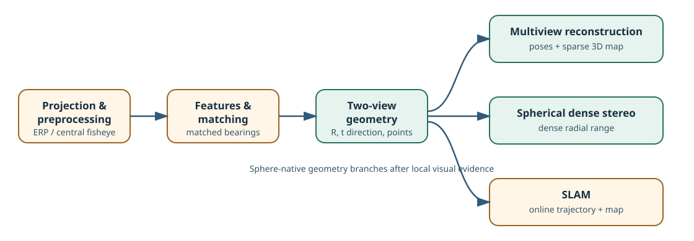
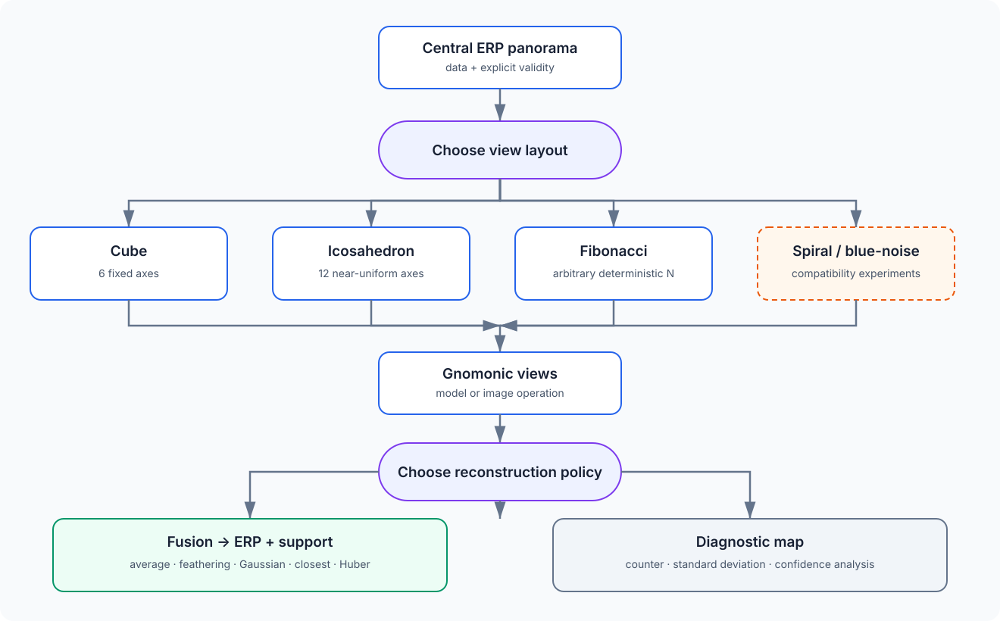
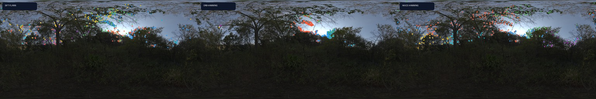
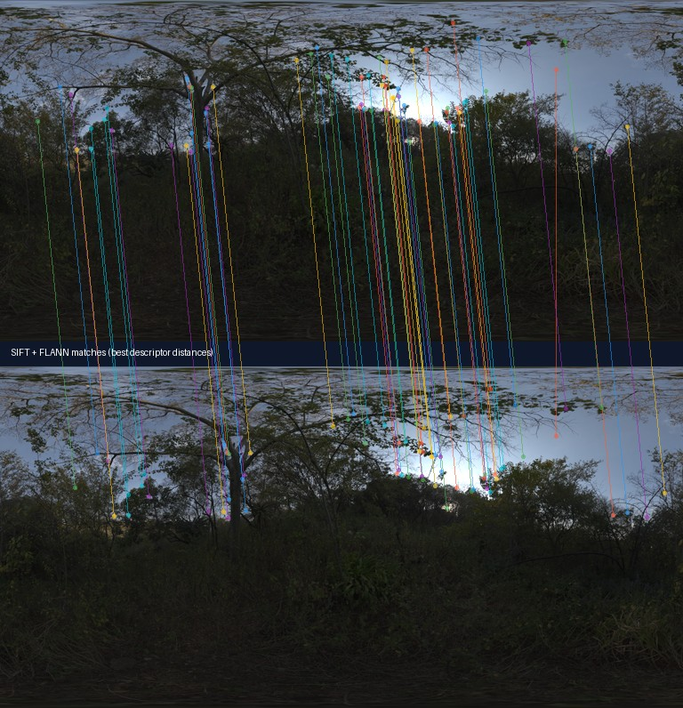

# PanorAi

**Convention-safe projection and computer vision for central spherical images.**

PanorAi connects equirectangular panoramas (ERPs), local perspective views,
unit rays, features, camera poses, and 3D structure without hiding coordinate,
sampling, validity, or scale conventions. Use it as a geometry layer around
existing planar models, or use its sphere-native image-processing and geometry
algorithms when projection would be the wrong abstraction.



## Install

```bash
pip install panorai
```

PanorAi supports Python 3.11–3.14 and OpenCV `>=4.9,<5`. Install only the
integrations you need:

```bash
pip install "panorai[torch]"      # Torch sampling and tensor workflows
pip install "panorai[deep-learning]"  # Experimental pretrained spherical FCN/CAM
pip install "panorai[deep-learning-depth]"  # Experimental spherical Metric3D CNN
pip install "panorai[pycolmap]"  # COLMAP database/reconstruction bridge
pip install "panorai[slam]"      # SLAM dependencies
pip install "panorai[pcd]"       # point-cloud I/O
```

Stable 3.x contracts center on `panorai.geometry`, modality-aware objects,
sampling, blending, and the face-based feature core. Sphere-native image
processing, spherical DoG, relative pose, dense stereo, native multiview, and
SLAM are public but **Experimental**; their result models expose diagnostics so
callers can reject unreliable outputs.

## Choose a route

| Goal | Route | Start here |
| --- | --- | --- |
| Convert ERP pixels, tangent views, cubemaps, and rays | projection | [Projection foundations](docs/tutorials/02_projection_foundations.md) |
| Filter directly on the sphere or through projected views | image processing | [Spherical image processing](docs/tutorials/spherical_image_processing.md) |
| Port pretrained ImageNet classifiers to spherical FCN/CAM inference | experimental deep learning | [Pretrained spherical FCN/CAM](docs/tutorials/09_spherical_fcn_cam.md) |
| Estimate radial range with a ported monocular CNN | experimental deep learning depth | [Resize-free spherical monocular depth](docs/tutorials/10_spherical_monocular_depth.md) |
| Detect and match SIFT, ORB, or AKAZE features | features | [Features and matching](docs/tutorials/03_features_and_matching.md) |
| Estimate relative rotation and translation direction | two-view geometry | [Two-view geometry](docs/tutorials/04_two_view_geometry.md) |
| Estimate dense radial range from a posed pair | dense stereo | [Spherical dense stereo](docs/tutorials/06_spherical_dense_stereo.md) |
| Feed a two-view visible Gaussian surface back into monocular depth | research benchmark | [Gaussian depth feedback](docs/tutorials/12_two_view_gaussian_depth.md) |
| Reconstruct cameras and sparse points from 3+ panoramas | multiview | [Multiview reconstruction](docs/tutorials/05_multiview_reconstruction.md) |
| Track a sequence and maintain a local map | SLAM | [Spherical visual SLAM](docs/tutorials/07_spherical_slam.md) |
| Reproduce speed and accuracy evidence | benchmarks | [Benchmarks and performance](docs/benchmarks.rst) |

---

## 1. Projection

An ERP pixel is a sample of a ray, not a point on a flat image plane. PanorAi
uses one explicit right-handed frame (`+X` right, `+Y` up, `+Z` front) and
pixel-center convention across:

- ERP pixel ↔ longitude/latitude ↔ unit ray;
- sphere ↔ one gnomonic view with explicit center, FOV, roll, and resolution;
- ERP ↔ six-face cubemap or arbitrary-N overlapping face sets;
- nearest and bilinear sampling with seam wrapping and declared pole rules;
- overwrite, average, feather, Gaussian, and multiband blending;
- separate geometric support, source-data validity, and interpolation weight.



```python
import numpy as np
from panorai.geometry import GnomonicProjector, GnomonicSpec

erp = np.zeros((512, 1024, 3), dtype=np.float32)
spec = GnomonicSpec(
    center_lat_deg=10,
    center_lon_deg=30,
    hfov_deg=90,
    vfov_deg=70,
    output_shape_hw=(256, 320),
)
projector = GnomonicProjector(spec, interpolation="bilinear")
view = projector.project(erp)
restored = projector.back_project(view, output_shape_hw=erp.shape[:2])

assert view.data.shape == (256, 320, 3)
assert restored.support_mask.shape == erp.shape[:2]
```

RGB, range, labels, and masks can share the same geometric grid while choosing
the interpolation and invalid-data rule appropriate to each modality. Zero is
data; it is never an implicit invalid marker.

Read: [projection tutorial](docs/tutorials/02_projection_foundations.md),
[custom projection pipeline](docs/tutorials/01_custom_pipeline.md), and the
[exact geometry v1 contract](docs/geometry-v1.md).

---

## 2. Image Processing

PanorAi exposes two intentionally different routes:

```text
sphere-native: ERP ── spherical neighbourhood/filter ──► ERP

multiface:     ERP ── project ──► tangent faces ── planar operation ──►
               faces ── back-project + blend ──► ERP
```

| Property | Direct spherical route | Forward/backward multiface route |
| --- | --- | --- |
| neighbourhood | constant-angle tangent neighbourhood on the sphere | rectangular neighbourhood inside each projected face |
| seams and poles | handled by spherical sampling | handled through overlap plus blending |
| operation | spherical Gaussian/custom convolution, Sobel, Scharr, median, Canny, pyramids | any caller-owned planar operator or model through `process_views` |
| reconstruction | none | required, including a declared blender |
| best fit | filters whose geometry should remain spherical | established planar algorithms and neural networks |

The public APIs make that choice visible rather than implicit:

```text
direct = spherical_gaussian_blur(erp, ksize=5, sigma=1.2, backend="auto")

multiface = EquirectangularImage(erp).process_views(
    lambda view: cv2.GaussianBlur(view, (5, 5), 1.2),
    layout="cube", size=256, fov=95, blend="gaussian",
)
```


On the bundled CC0 panorama resized to 512×1024, a 5×5 Gaussian
(`sigma=1.2`) took **7.99 ms** after warm-up through the direct native route
and **104.25 ms** through six 256² cube faces, OpenCV filtering,
back-projection, and Gaussian blending. In a fixed 37° yaw-equivariance probe,
MAE was **0.00113** and **0.00328**, respectively. These routes are not
bit-identical operators; see the [full protocol and limitations](docs/benchmarks.rst)
and reproduce it with `scripts/benchmark_image_processing_routes.py`.

### Histogram equalization and CLAHE

`spherical_equalize_histogram` is a first-party global equalizer. Its optional
solid-angle weighting avoids over-counting the densely sampled polar rows of an
ERP. PanorAi does **not** currently claim a sphere-native CLAHE implementation.
You can apply OpenCV CLAHE to projected views through `process_views`, but the
result depends on the face layout, FOV, overlap, and blender and is not
equivalent to geodesic contextual equalization. A future spherical CLAHE needs
seam- and pole-safe contextual regions, reproducible interpolation between
regions, and evaluation on downstream feature/pose quality—not only visual
contrast.

Read: [image-processing tutorial](docs/tutorials/spherical_image_processing.md)
and [projection workflow how-to](docs/how_to/index.rst).

### Pretrained spherical FCN/CAM

The opt-in `panorai.experimental.deep_learning` namespace converts AlexNet,
VGG16, and ResNet18 classification heads to fully convolutional form, replaces
their spatial convolutions and pools with differentiable spherical operators,
and reuses the exact Torchvision parameters without fine-tuning. First use
automatically downloads the official `DEFAULT` checkpoints to the external
Torch cache and verifies their URL hash prefix; PanorAi never packages those
weights. An explicit prefetch command is also available:

```bash
python benchmarks/spherical_fcn_cam/download_models.py
```

Fully convolutional does not mean one output per input pixel: the original
network stride and classifier kernel still determine the dense lattice. Read
the [tutorial](docs/tutorials/09_spherical_fcn_cam.md) for native-resolution
inference, map interpretation, automatic model acquisition, and the planned
output-stride/tangent-oracle comparison.

For the high-capacity ImageNet control, the same Experimental namespace loads the official 3-billion-parameter InternImage-G checkpoint (reported 90.1% ImageNet-1K top-1) from an external checksum-verified cache. Its 56 learned DCNv3 samplers become differentiable local-tangent spherical samplers, and its attention head yields a dense class-evidence map whose spatial mean reconstructs the global logits. Install `.[deep-learning-internimage]`; no model bytes are bundled with PanorAi.

The same Experimental namespace now provides a checksum-pinned, adapter-only
Metric3D-v1 ConvNeXt-Tiny/Hourglass loader. It requires explicit acceptance of
upstream terms before downloading external source and weights, ports all
learned spatial layers with exact parameter identity, and performs resize-free
2:1 ERP inference as radial range. Because the checkpoint has no separate
published model-card license, PanorAi never redistributes it. See the
[spherical monocular-depth tutorial](docs/tutorials/10_spherical_monocular_depth.md).

---

## 3. Detection and Feature Extraction

PanorAi separates *where a keypoint is detected* from *how its local appearance
is described*.

| Frontend | Detection | Description | Status |
| --- | --- | --- | --- |
| overlapping faces | OpenCV SIFT, ORB, or AKAZE on gnomonic faces | same OpenCV backend | Stable core |
| spherical DoG | Gaussian/DoG extrema directly on the sphere | one oriented tangent patch per accepted keypoint, then OpenCV SIFT/ORB/AKAZE | Experimental |
| coarse-to-fine spherical DoG | low-resolution proposals followed by full-resolution localization | descriptor-neutral tangent-patch adapter | Experimental |

For relative pose, `SphericalFeaturePipeline.for_relative_pose()` remains the
canonical validated default. Direct spherical DoG is an explicit opt-in while
its public-dataset detection, matching, and pose evaluation is completed.



The spherical detector avoids duplicate detections created by overlapping full
faces and carries position, unit bearing, angular scale, response, octave,
level, and localization validity. It refines discrete DoG extrema in position
and scale using the second-order Taylor/Hessian step, rejects low-contrast and
edge-like responses, assigns one or more tangent orientations, and only then
materializes descriptor patches.

The contracts are deliberately descriptor-neutral:

- `panorai-tangent-patches/v1` declares bearing/scale, angular context,
  projection, resolution, mask, and orientation;
- `panorai-tangent-opencv-descriptor/v2` adapts the same geometric patch
  contract to SIFT, ORB, or AKAZE without making the detector “a SIFT detector.”

First-party C++ kernels accelerate compatible spherical convolutions and fuse
the 3D tangent-neighbour extrema search without materializing a large neighbour
tensor. OpenCV's own C++ implementations still own descriptor semantics and
BF/FLANN distance search. The NumPy paths remain references for parity tests;
native acceleration does not change the spherical geometry.



Read: [features and matching](docs/tutorials/03_features_and_matching.md),
[spherical feature how-to](docs/how_to/spherical_features.rst), and
[feature API](docs/reference/features.rst).

---

## 4. Two-View Geometry

PanorAi can estimate a relative pose directly from matched unit bearings—no
COLMAP process is involved:

```text
ERP pair → features → descriptor matches → bearing pairs
         → 5-point Essential hypotheses → spherical MSAC/refit
         → cheirality + degeneracy/quality gates → R₂₁, direction(t₂₁)
```


The estimator scores tangent-Sampson residuals on the sphere, evaluates the
four Essential decompositions, selects translation orientation using
cheirality/parallax evidence, optionally refines rotation and translation
direction, and reports rejection reasons. A returned hypothesis is not
automatically a trustworthy pose: consume `quality_report.accepted`.

Monocular two-view geometry recovers the **direction** of translation, not its
metric magnitude. Metric scale needs an external premise such as a known
baseline, calibrated rig, depth, or a justified scene constraint.

Read: [two-view geometry](docs/tutorials/04_two_view_geometry.md) and the
[public-dataset benchmark](docs/benchmarks.rst).

---

## 5. Stereo Dense Reconstruction

Given two aligned central ERPs and a **known metric** relative pose, the
Experimental stereo route searches inverse radial range directly along
spherical epipolar geometry. It uses angular appearance support, optional
coarse-to-fine search, cost aggregation, sub-hypothesis refinement, and
bidirectional consistency.


The result keeps radial range, confidence, validity, selected cost, and
consistency diagnostics separate. The supplied `R,t` is never silently
re-estimated. If `t` has arbitrary unit length, the reconstructed range has the
same arbitrary scale.

Read: [dense-stereo tutorial](docs/tutorials/06_spherical_dense_stereo.md),
[algorithm derivation](docs/explanation/spherical_dense_stereo.md), and
[current evidence](docs/benchmarks.rst).

A separate development benchmark combines two posed ERPs, a monocular radial
prior, sparse BA landmarks, and visible-surface Gaussian splatting. The fused
Gaussian centres can be exported as a dense RGB point cloud and projected back
as confidence-weighted depth anchors. The edge-aware correction stays at the
native prior resolution and does not synthesize surfaces unseen by both views.
See the [Gaussian depth-feedback tutorial](docs/tutorials/12_two_view_gaussian_depth.md).

---

## 6. Multi-View Geometry

For three or more panoramas, PanorAi offers two routes:

| Route | PanorAi owns | External owner |
| --- | --- | --- |
| native `SphericalGlobalMapper` | quality-gated pose graph, bearing tracks, rotation/position initialization, triangulation, spherical bundle adjustment, diagnostics | none for geometry |
| PyCOLMAP/COLMAP bridge | virtual-camera geometry, IDs, observations, and database/export contract | PyCOLMAP/COLMAP mapping and optimization |


The native mapper optimizes angular tangent residuals without reconstructing
ERP pixels during bundle adjustment. Its map is arbitrary-scale unless a metric
prior is supplied. The PyCOLMAP route is useful when COLMAP interoperability is
more important than keeping spherical equations first-party; it is an
alternative pipeline, not a hidden dependency of the native mapper.

For registered metric cameras, the Experimental [metric landmark BA](docs/tutorials/11_metric_landmark_ba.md) refines supplied spherical landmarks with a baseline gauge and soft radial-range priors.
benchmark AbsRel improved from ``0.80721`` to ``0.11585`` at 69 landmark locations only; the later dense propagation was rejected.
Read: [multiview reconstruction](docs/tutorials/05_multiview_reconstruction.md) and [public-dataset benchmark](docs/benchmarks.rst).

---

## Other essential capabilities

The six sections above cover the offline core. Two additional areas should not
be forgotten:

- **Visual SLAM:** incremental ERP or calibrated fisheye tracking,
  keyframes, local mapping, relocalization, and loop correction. Start with the
  [SLAM tutorial](docs/tutorials/07_spherical_slam.md).
- **Contracts and reproducibility:** coordinate frames, units, pixel centers,
  interpolation, invalid-data rules, resolved configuration, provenance, and
  quality gates are part of the result—not incidental metadata. Read the
  [geometry contract](docs/geometry-v1.md), [stability tiers](docs/reference/stability.rst),
  and [benchmark policy](docs/benchmarks.rst).

## Evidence and project boundaries

The [benchmarks and performance page](docs/benchmarks.rst) separates
microbenchmarks from end-to-end accuracy, reports Matterport3D and
Stanford2D3D independently, and distinguishes accepted-result precision from
coverage. Dataset licenses apply; PanorAi does not redistribute those datasets.

PanorAi owns spherical coordinates, projection, masks, provenance, spherical
image-processing kernels, bearing geometry, and its native estimators. OpenCV
owns SIFT/ORB/AKAZE descriptors and standard matchers; optional PyCOLMAP/COLMAP
owns its downstream reconstruction route. See the
[capability map](docs/tutorials/spherical_capability_map.md) for the complete
sphere-native, projection-domain, and hybrid boundary.

## Reference

- [Documentation home](docs/index.rst)
- [Tutorials in workflow order](docs/tutorials/index.rst)
- [API reference](docs/reference/index.rst)
- [Changelog](CHANGELOG.md)
- [License](LICENSE)

PanorAi's distributed source is MIT licensed. Optional upstream projects,
models, and datasets retain their own terms.

## Experimental spherical semantic segmentation

`panorai.experimental.deep_learning.segmentation` combines direct-spherical
classifier evidence with streamed SAM 2.1 gnomonic prompts. The semantic CNN
runs once on the ERP—without cube faces or multiface classification—while SAM
receives one temporary tangent image and one reusable embedding at a time. The
result preserves all three SAM alternatives, a two-of-three consensus, an
uncertainty envelope, solid-angle-aware instance fusion, and a deterministic
panoptic map. Discovery prompts are decoded in batches of 16 from one embedding,
and the continuation budget is applied once per provisionally fused instance.

For the complete pretrained workflow, the public convenience object is
`SphericalbenchmarkSegmenter`:

```python
from panorai.experimental.deep_learning.segmentation import (
    SphericalbenchmarkSegmenter,
)

with SphericalbenchmarkSegmenter.from_pretrained(
    semantic_model="internimage-g",
    mask_model="sam2.1-hiera-large",
    device="mps",  # use "cpu" on hosts without Apple Silicon
    accept_upstream_terms=True,
) as segmenter:
    result = segmenter.predict(
        panorama,                         # canonical uint8 HWC ERP
        support_mask=observed_support,    # omit only for a complete sphere
    )

panoptic_ids = result.panoptic_map
instances = result.segments
unknown = result.unknown_segments
```

The first `predict` automatically acquires the two pinned checkpoints in an
external cache. InternImage-G is loaded, ported, evaluated directly on one ERP,
and released before SAM is loaded. No cube map or multiface classifier is used.
SAM alone sees transient gnomonic charts. The default result lattice preserves
the panorama aspect ratio and is capped at 1024 rows to bound the proposal-mask
catalogue; pass `output_shape_hw=panorama.shape[:2]` for source-resolution
masks. `result.diagnostics["facade"]` records both shapes and the model
lifecycle. Native polar or camera-specific rasters must first be converted to a
canonical ERP outside this generic API.

Install both optional model groups with
`pip install "panorai[deep-learning-internimage,deep-learning-sam]"`. Checkpoints
remain in external verified caches. The built-in benchmark vocabulary reports
both the readable concept and its exact ImageNet proxies; unsupported regions
remain `unknown`. This API is Experimental, performs no training, and does not
turn ImageNet proxies or SAM confidence into semantic ground truth.
