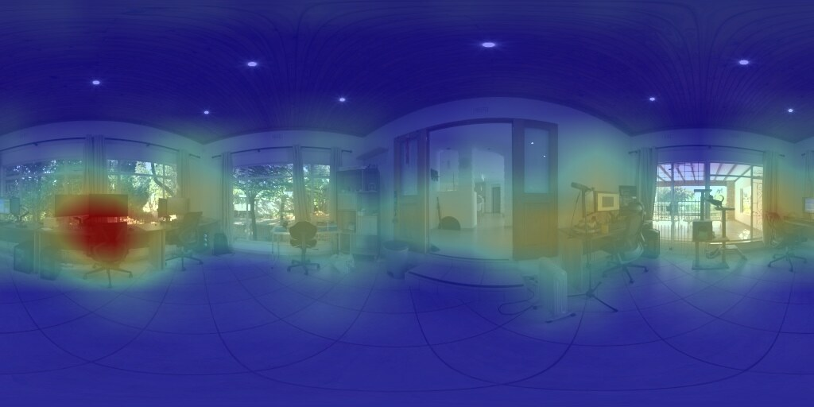

# Pretrained spherical FCN/CAM experiment

This isolated experiment asks whether a conventional ImageNet classifier can
produce a dense class-evidence map directly on an equirectangular panorama
without tiling it into perspective views.

It has three deliberately separate steps:

1. reinterpret the classifier head as convolutions (FCN);
2. verify that the planar FCN reproduces the original classifier logits at its
   canonical input crop;
3. call ``panorai.experimental.deep_learning`` to port every
   spatial layer and reuse the exact learned weights with tangent-sampled,
   seam-wrapped, differentiable convolution and max-pooling on the ERP sphere.

The tested Torchvision `DEFAULT` weights are:

| model | documented inference resize | documented crop | FCN conversion |
|---|---:|---:|---|
| AlexNet | 256 | 224 × 224 | `6×6` first MLP layer → convolution; later linear layers → `1×1` |
| VGG16 | 256 | 224 × 224 | `7×7` first MLP layer → convolution; later linear layers → `1×1` |
| ResNet18 | 256 | 224 × 224 | final linear layer → `1×1`; spatial logits precede global pooling |

## Three semantic sources, three different claims

ImageNet, Places365, and OpenCLIP are complementary experimental instruments;
their scores are not interchangeable measurements from three equivalent
classifiers.

| semantic source | inference vocabulary | dense output | what it enables here | what it does not establish |
| --- | --- | --- | --- | --- |
| ImageNet-1K AlexNet/VGG16/ResNet18 | 1,000 fixed object-oriented labels | one learned class-evidence channel per ImageNet label | strongest controlled test of classical FC-to-convolution conversion; comparison of three architectures with the same ontology; frozen ImageNet-to-Stanford semantic pairs for object-direction evaluation | concepts outside ImageNet; pixel segmentation; scene-level recognition |
| Places365 ResNet18 | 365 fixed scene/place labels | one learned class-evidence channel per Places365 scene | tests whether the same weight-porting strategy extends beyond ImageNet objects; supplies directional evidence for environments such as forest, corridor, bedroom, or plaza | arbitrary object queries; direct equivalence to an ImageNet class score |
| OpenCLIP RN50 | prompts chosen at inference; no fixed class list | one local image-text similarity channel per supplied prompt | queries concepts absent from both closed vocabularies and tests open-vocabulary directional retrieval without retraining | a conventional fixed-label classifier; equality with the original global CLIP logit; prompt-independent probabilities |

The intended division of labour is therefore:

1. **ImageNet is the primary portability and localization control.** Its fixed
   classifier weights support exact planar FCN parity, architecture comparison,
   and the predeclared Stanford semantic-pair evaluation.
2. **Places365 is the closed-vocabulary scene extension.** It tests whether the
   result is specific to ImageNet's object taxonomy and adds whole-environment
   directions that ImageNet often represents poorly.
3. **OpenCLIP is the exploratory open-vocabulary extension.** It allows a
   prompt such as `a fire extinguisher` or `a hospital corridor` to define a
   channel at inference time, but the result must be reported as local
   image-text similarity and evaluated with prompt controls.

All three retain frozen pretrained weights and replace spatial sampling with
the same spherical core. A successful result across them supports **model
portability and semantic directional evidence**, not semantic segmentation.
Raw logits, softmax values, and ranks must not be compared across families:
the label spaces, training objectives, calibrations, and dense heads differ.
Cross-family comparisons should use common downstream quantities such as peak
direction, solid-angle concentration, rotation consistency, latency, or a
shared independently defined presence/localization label.

The classifier-facing API boundary is exclusively
`panorai.experimental.deep_learning` (with the underscore). ImageNet,
Places365, and OpenCLIP loaders/adapters are not re-exported by `panorai` or
`panorai.experimental`. The Experimental namespace delegates sampling to the
reusable Torch operator implementation in `panorai.image_processing.torch`;
that implementation detail does not promote the classifier APIs to the stable
top-level package.

### Visual comparison on two native ERPs

These are intentionally cherry-picked real outputs from tracked outdoor and
indoor CC0 `512×1024` panoramas. They demonstrate visually informative success
cases and must not be used as an accuracy estimate. Each backbone produced a
native `16×32` lattice, subsequently interpolated to the ERP only for display.
Red is larger min-max-normalized evidence for the named channel; the colors
are not calibrated probabilities and do not form a segmentation mask.

| ImageNet ResNet18 | Places365 ResNet18 | OpenCLIP RN50 |
| --- | --- | --- |
| Outdoor: `lakeside` | Outdoor: `forest/broadleaf` | Outdoor: `a photo of a path` |
|  |  |  |
| Indoor: `desk` (requested, rank 95) | Indoor: `lobby` (rank 1) | Indoor: `a photo of a desk` (rank 3/7 prompts) |
|  |  |  |

The examples deliberately illustrate different semantic roles rather than a
raw-score competition. `lakeside` is an ImageNet class, `forest/broadleaf` is
a Places365 scene, and `a photo of a path` is a caller-provided OpenCLIP
prompt. The indoor ImageNet `desk` map was selected for its visually strong
localization even though the requested channel ranked only 95th; it is not
presented as a top prediction. The scene-oriented Places365 model ranked
`lobby` first.

## Install and acquire the models

From a source checkout, install the dedicated optional dependencies:

```bash
pip install -e ".[deep-learning]"
```

The inference runner downloads a missing official checkpoint automatically on
first use, verifies the hash prefix encoded by its Torchvision URL, and records
the full SHA-256 in `result.json`. To download and verify all three before an
offline experiment, run:

```bash
python benchmarks/spherical_fcn_cam/download_models.py
```

Pass `--model alexnet`, `--model vgg16`, or `--model resnet18` one or more
times to prefetch a subset. Checkpoints remain in the user-controlled
`torch.hub` cache, normally below `~/.cache/torch/hub/checkpoints`; the command
prints the resolved paths, URLs, sizes, and hashes. PanorAi does not redistribute
the checkpoint bytes, and each upstream model retains its own terms.

The adapter is not implemented in this benchmark. The extensible public
experiment surface is ``panorai.experimental.deep_learning``; it delegates its
geometric operator to the optional ``panorai.image_processing.torch`` core and
uses the PanorAi frame and ERP pixel-centre convention.
For every output ray, its planar kernel offsets are interpreted in the local
east/north tangent basis, mapped with the spherical exponential map, sampled
bilinearly with longitude wrapping, and contracted with the original learned
kernel. Gradients reach both inputs and weights through `grid_sample` and the
kernel contraction.

The port report in each ``result.json`` inventories every replacement path.
It requires ``Conv2d → SphericalConv2d`` and
``MaxPool2d → SphericalMaxPool2d`` throughout the feature extractor and dense
head, records whether each parameter identity was preserved, and fails if any
conventional spatial layer remains. Batch normalization, ReLU, dropout and
residual addition remain unchanged because they are pointwise or topological;
they do not define a planar sampling neighbourhood. Adaptive/global planar
pooling is removed from the FCN path and final scores use spherical-area
averaging instead.

Run one model per fresh process so runtime and peak RSS remain attributable:

```bash
python benchmarks/spherical_fcn_cam/run_experiment.py \
  --model resnet18 \
  --output-dir /private/tmp/panorai-spherical-fcn-cam
```

Custom inputs must also pass `--input-license`; only the tracked tutorial ERP
is recognized as CC0 automatically. This prevents a custom dataset image from
silently inheriting the tutorial asset's provenance.

Repeat with `alexnet` and `vgg16`. Weights are downloaded by Torchvision into
its external cache. They are never copied into the repository, wheel, or
sdist. The default image is the checksum-pinned CC0 Poly Haven ERP already
used by the PanorAi tutorials.

For a licensed local Matterport360/Stanford2D3D prepared manifest, run the
group-distinct development slice without copying corpus bytes into the tree:

```bash
python benchmarks/spherical_fcn_cam/run_public_datasets.py \
  --inputs /private/tmp/panorai-val010-full-public/pairs-method-inputs.jsonl \
  --output-dir /private/tmp/panorai-spherical-fcn-public-datasets-native \
  --preserve-input-resolution \
  --include-semantic-pair-classes
```

The dataset runner selects at most one source panorama per spatial group,
executes all three models in fresh subprocesses, records solid-angle-weighted
CAM concentration, saves each normalized CAM as a compact 16-bit heatmap,
resumes verified per-view JSON outputs, and creates
per-dataset/per-model contact sheets. Never use
held-out groups for model or threshold selection. Matterport3D and Stanford
2D-3D-S retain their own terms; inputs and derived visualizations must remain
outside source and release artifacts unless redistribution is separately
authorized.

Native resolution is the primary dataset protocol. `--erp-height 224` remains
available only as an explicitly resized scale-control run. Because convolution
weights are reused geometrically, spherical fine-tuning is not required to
claim weight portability; any later training would address semantic domain or
scale adaptation, not define the spherical operator.

## Primary evaluation: ImageNet/Stanford semantic pairs

The primary correctness check uses the dataset's own per-pixel labels.
`semantic_pairs.json` freezes the correspondence before evaluation. Its
primary tier contains five Stanford coarse classes (`bookcase`, `chair`,
`door`, `sofa`, and `table`) represented by nine ImageNet-1K exact or subtype
classes. The exploratory related tier adds `window screen` and `window shade`
for Stanford `window`; these are components or coverings rather than strict
class equivalents and are excluded by default.

`--include-semantic-pair-classes` keeps the ordinary top-k outputs and also
saves CAMs for every primary mapped ImageNet class. This is necessary: testing
only whichever classes happened to enter top-3 would condition localization on
the model's prediction and leave most frozen pairs unmeasured. Add
`--include-related-pairs` only for the separately reported exploratory tier.

The Stanford input must include the official `pano_semantic` modality and the
matching official `assets/semantic_labels.json`. Semantic images encode a
big-endian 24-bit base-256 label index (`R*256^2 + G*256 + B`). The evaluator
verifies the pinned label-file hash and never infers ground truth from RGB,
depth, black pixels, or room names. Run a preflight before any metric:

```bash
python benchmarks/spherical_fcn_cam/evaluate_semantic_pairs.py \
  --summary /private/tmp/panorai-spherical-fcn-public-datasets-native/summary.json \
  --semantic-root /path/to/stanford2d3d/raw \
  --semantic-labels /path/to/stanford2d3d/assets/semantic_labels.json \
  --output /private/tmp/panorai-semantic-preflight.json \
  --preflight-only
```

When `ready` is true, omit `--preflight-only` and choose a new output path.
For every mapped class/panorama/model record, the evaluator retains the global
score, probability, and rank; records whether the Stanford class is present;
and, for positive examples, measures CAM mass inside the mask, lift over a
uniform-solid-angle baseline, global-peak hit, geodesic peak-to-mask distance,
and solid-angle top-area IoU. AUROC and average precision assess presence only
when both positive and negative panoramas exist. These metrics evaluate weak
localization and ranking; they do not reinterpret a CAM as semantic
segmentation.

If rectification leaves a requested class with zero positive CAM mass, its
score, probability, rank, and target presence are retained, while peak, mass,
and IoU are recorded as undefined. The evaluator never turns the row-major
first pixel of an all-zero array into a fabricated direction.

The prepared local Stanford copy used by the first pilot contains RGB, depth,
and pose but no `pano_semantic` directory. Its real-data preflight is therefore
expected to be `ready: false`; no Stanford IoU or localization number may be
reported until the licensed semantic modality is supplied. Dataset bytes and
decoded masks remain outside the repository.

## What the output means

`spherical_feature_shape` is the final backbone feature lattice. The
`spherical_logit_map_shape` is the dense 1,000-class score lattice. Global
scores use a cosine-latitude solid-angle average, then softmax. Each overlay is
the positive, normalized dense score for one class, upsampled to the ERP.
The adjacent 16-bit grayscale heatmap stores that same normalized map without
the display color map for quantitative evaluation.

These overlays are weak localization evidence, not semantic segmentation.
ImageNet provides image-level labels, not per-pixel supervision; a bright
region indicates evidence used by the converted classifier, not a calibrated
class probability for that pixel.

## Why a large ERP still produces a smaller class map

FCN conversion accepts arbitrary input sizes, but it does not remove the
backbone's stride. ResNet18 has output stride 32, so a `1024×2048` ERP yields a
`32×64` class lattice and a `2048×4096` ERP yields `64×128`. AlexNet and VGG16
reduce the input similarly and then apply the valid `6×6` or `7×7`
convolution converted from their first fully connected layer. VGG16 therefore
maps a `32×64` terminal feature grid to `26×58` logits. Upsampling a CAM to the
ERP makes it viewable but does not invent missing spatial evidence.

Native input resolution also changes the angular footprint of a fixed
pixel-sampled kernel. A reproducible comparison must declare both raster
resolution and angular support rather than treating them as interchangeable.

## Three-scenario study

The current runner implements the first scenario and provides infrastructure
for the following controlled comparison with identical source weights:

1. spherical FCN with the original output stride 32;
2. spherical FCN with output stride 8, replacing late strides by spherical
   dilation to retain the receptive field;
3. an independent gnomonic oracle that evaluates the unmodified perspective
   network on `224×224` tangent views and reprojects its responses.

A planar FCN applied directly to the ERP is the distortion-unaware control.
Maps must be compared before display interpolation with solid-angle-weighted
errors, top-fraction overlap, peak geodesic distance, class-rank agreement,
rotation-equivariance error, time, and memory. The study should additionally
hold angular support fixed across multiple ERP resolutions. The current
exponential-map operator must not be described as exactly equivalent to the
gnomonic oracle until that comparison is implemented.

## Primary references

- Long, Shelhamer, and Darrell, *Fully Convolutional Networks for Semantic
  Segmentation*, CVPR 2015: classification fully connected layers can be
  reinterpreted as convolutions to obtain dense output.
- Zhou et al., *Learning Deep Features for Discriminative Localization*, CVPR
  2016: global average pooling and class weights expose class activation maps.
- Simonyan, Vedaldi, and Zisserman, *Deep Inside Convolutional Networks*, ICLR
  Workshop 2014: image-specific class saliency from score gradients.
- Selvaraju et al., *Grad-CAM*, ICCV 2017: gradient-weighted localization for
  CNN families including VGG and ResNet.
- Su and Grauman, *Learning Spherical Convolution for Fast Features from 360°
  Imagery*, NeurIPS 2017: transfer perspective-network features to ERP-aware
  spherical convolution.
- Coors, Condurache, and Geiger, *SphereNet*, ECCV 2018: adapt convolution
  sampling locations to undo ERP distortion while leveraging existing models.

## Explicit limitations

- No ImageNet or panoramic fine-tuning is performed.
- Fine-tuning is not required for the weight-portability claim. It would be an
  optional semantic/domain adaptation experiment only.
- Batch-normalization statistics remain those learned on perspective crops.
- Kernel weights remain perspective-trained; only their sampling geometry is
  changed. This is closest to SphereNet-style weight transfer, not the learned
  response distillation of Su and Grauman.
- Planar FCN equivalence is directly verified, but equivalence between the
  spherical stack and independently rendered rectilinear tangent views is not
  yet a closed oracle. The current core uses an azimuthal-equidistant
  exponential-map neighbourhood. Exact perspective-camera equivalence would
  require a gnomonic tangent-view oracle and explicit angular-scale contract.
- The MLP-derived VGG/AlexNet logit maps are coarser than ResNet CAMs at a
  224-pixel ERP height because their first classifier convolutions have large
  valid kernels.
- The benchmark is CPU/reference code and makes no throughput claim.
- The namespace is Experimental: it is opt-in, Torch-dependent, outside the
  frozen stable API, and may change before promotion. It is not a release input.

## Places365 ResNet18 and OpenCLIP RN50

Two additional frozen model families exercise the same portability mechanism
without adding checkpoints to the repository or package artifacts. Their
scientific roles are defined by the comparison above:

- **Places365 ResNet18** is an ordinary 365-way scene classifier. Its final
  linear layer is reused as a `1x1` classifier, so averaging the planar dense
  logits reproduces the unchanged classifier at its canonical `224x224` input.
- **OpenCLIP RN50** supplies an open-vocabulary comparison. The visual tower is
  made fully convolutional and the trained attention-pool `v_proj` and `c_proj`
  weights are applied pointwise before cosine similarity with text embeddings.
  The query/key attention and fixed `7x7` positional embedding are deliberately
  omitted. Consequently this is a local CLIP similarity map, not an assertion
  of equality with the original global CLIP logit.

The OpenCLIP modified ResNet contains antialiased `AvgPool2d` operations.
PanorAi ports these to differentiable `SphericalAvgPool2d` layers in addition
to replacing every spatial convolution. Both model families keep the learned
parameters unchanged; no spherical fine-tuning is performed.

Install the optional dependency set, review the upstream terms, and populate
the user-controlled cache:

```bash
python -m pip install -e '.[deep-learning-openclip]'
python benchmarks/spherical_fcn_cam/download_selected_classifiers.py \
  --accept-upstream-terms
```

Acquisition is automatic when either runner first needs a missing file. Each
download is pinned by complete SHA-256 and byte count and is written outside
the source tree under
`$PANORAI_CACHE_HOME/experimental/classification`,
`$XDG_CACHE_HOME/panorai/experimental/classification`, or
`~/.cache/panorai/experimental/classification`. The explicit terms flag is
still required; PanorAi does not grant or redistribute the upstream licenses.

Run both models at the source panorama resolution:

```bash
python benchmarks/spherical_fcn_cam/run_selected_classifier.py \
  --model places365-resnet18 \
  --output-dir /private/tmp/panorai-selected-classifiers \
  --preserve-input-resolution \
  --accept-upstream-terms

python benchmarks/spherical_fcn_cam/run_selected_classifier.py \
  --model openclip-rn50 \
  --output-dir /private/tmp/panorai-selected-classifiers \
  --preserve-input-resolution \
  --prompt 'a photo of a forest' \
  --prompt 'a photo of a tree' \
  --prompt 'a photo of a path' \
  --accept-upstream-terms
```

For the tracked `512x1024` CC0 ERP, both backbones produce a native `16x32`
logit lattice (output stride 32), which is then interpolated only for display.
The JSON record distinguishes input, feature, and display resolutions and
contains a complete layer-port report. In the verified CPU smoke run,
Places365 ported 21 convolutions and one max-pool; OpenCLIP ported 55
convolutions and eight average-pools. No planar spatial layer remained.
