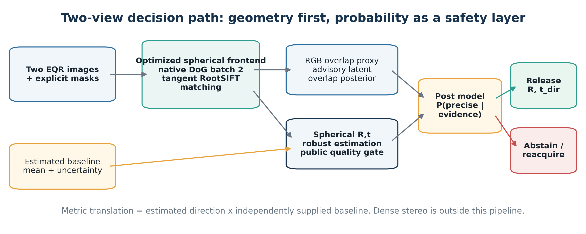
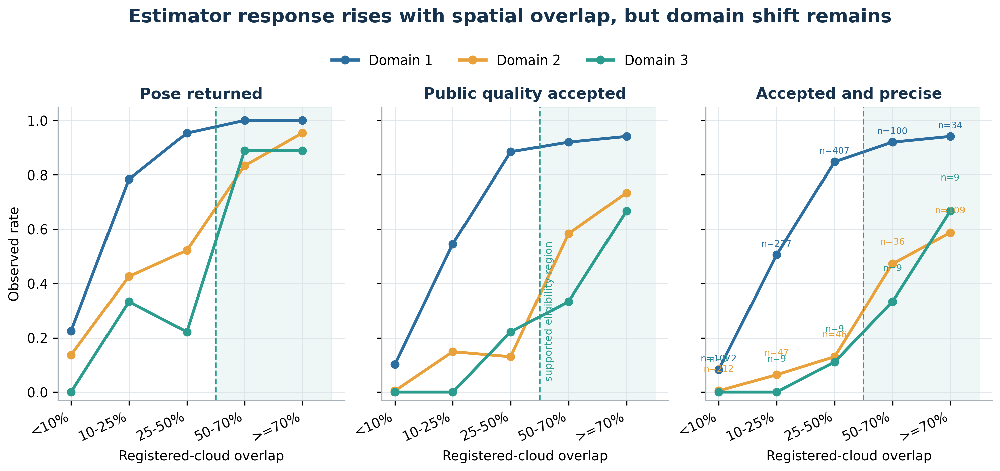
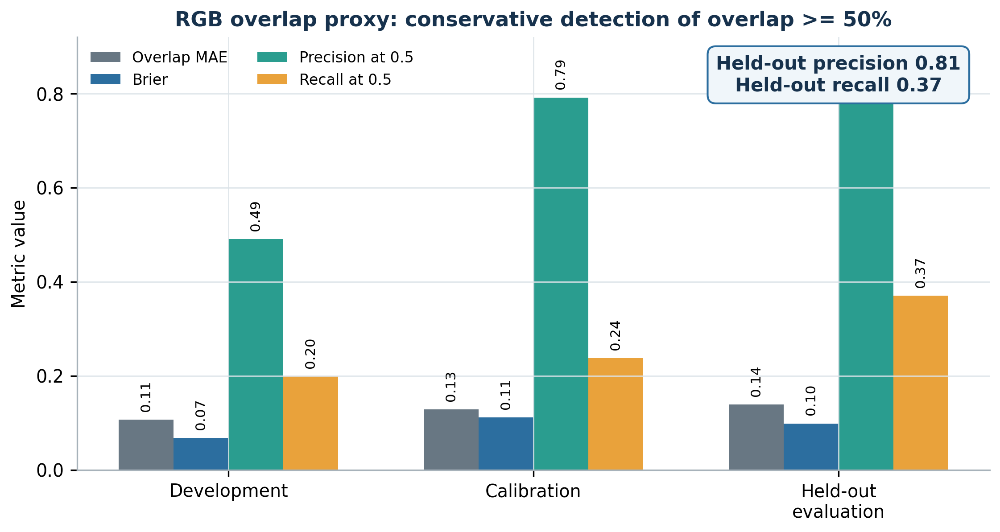
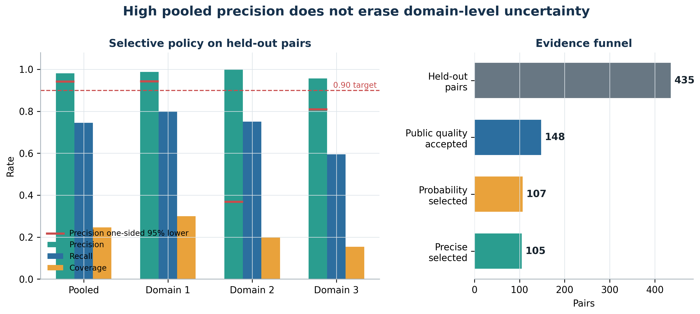
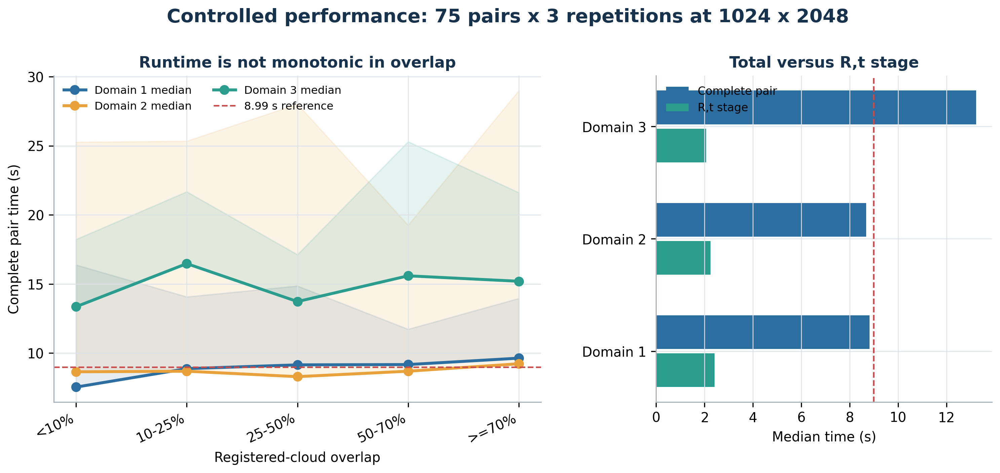

# Probabilistic Reliability Boundaries for Spherical Two-View Relative Pose Estimation in PanorAi

Robinson Luiz Souza Garcia
Technical evidence manuscript, 9 October 2026

## Abstract

This paper studies when a spherical two-view estimator can return a reliable relative rotation and translation direction from two central equirectangular panoramas. The evaluated PanorAi 3.5.0 route combines native spherical Difference-of-Gaussians detection, tangent-plane RootSIFT description, robust matching, essential-matrix estimation, public geometric quality checks, and a post-estimation probability of pose precision. Registered depth clouds are used only offline to define spatial overlap; they are not runtime inputs. The frozen retrospective census contains 4,017 unique panoramas, 2,385 unordered pairs, and 69 independence components across three anonymized domains. Precision is defined as rotation error at most 1 degree and oriented translation-direction error at most 5 degrees. Estimator usability rises sharply with registered-cloud overlap: in the largest domain, the usable rate increases from 8.3% below 10% overlap to 92.0% at 50-70% and 94.1% above 70%. On 435 held-out pairs, the rule "public quality accepted and post probability at least 0.90" selects 107 pairs, of which 105 are precise: precision 98.1%, recall 74.5%, coverage 24.6%, and exact one-sided 95% precision lower bound 94.2%. However, the two smaller domains have lower confidence bounds of 36.8% and 81.0%, so the result is not yet a release-reliability claim. A separate RGB overlap proxy reaches 81.1% precision but only 37.0% recall for detecting overlap of at least 50%, which supports advisory use but not a hard capture gate. Controlled timing over 75 pairs and three repetitions gives median complete-pair times of 8.82 s, 8.68 s, and 13.23 s by domain at 1024 x 2048 pixels. Runtime is not monotonic in overlap. The evidence supports a capture eligibility boundary of 50% registered overlap when available, a preferred target of at least 70%, and a baseline inside the calibrated 0.162-2.155 m envelope, always combined with post-estimation abstention. Prospective confirmation on new independent groups remains mandatory.

**Keywords:** spherical vision; equirectangular panorama; relative pose; essential matrix; selective prediction; overlap; calibration; capture protocol.

## 1. Introduction

Relative pose from two images is not a single continuous optimization problem with a uniform failure rate. It is a sequence of conditional events: useful structure must be visible in both views, repeatable keypoints must be detected, descriptors must identify a sufficiently distributed set of correspondences, a robust estimator must find a geometrically consistent model, and the resulting rotation and translation direction must be precise enough for the downstream task. Equirectangular images add seam, pole, and sampling-density effects that invalidate a naive planar interpretation.

The practical question is therefore not only whether an estimator can return R and t, but under which capture conditions a returned estimate should be trusted. This study addresses three questions:

1. How does spherical two-view response change with measured spatial overlap?
2. Can image and algorithm evidence support calibrated probabilities before and after R,t estimation?
3. Which capture and post-processing boundaries are justified by the current evidence?

The scope is deliberately narrow. Every estimate uses exactly two central equirectangular panoramas. Translation direction is observable, while metric translation magnitude is not; the latter requires an independently measured or planned baseline. Dense stereo, bundle adjustment, and multiview estimation are excluded.

## 2. Geometry and estimator

Let b1 and b2 be unit bearing vectors obtained from matched pixels under the canonical equirectangular model. For relative rotation R and translation direction t, valid correspondences satisfy the spherical epipolar constraint

`b2^T [t]x R b1 = 0`,

where `[t]x` is the skew-symmetric cross-product matrix. The essential matrix is `E = [t]x R`. Robust estimation identifies an inlier subset, decomposes E into pose hypotheses, and resolves orientation and cheirality according to the public estimator contract. Because both views are central, scaling t does not alter the constraint. If the independently supplied baseline magnitude is B, metric translation is `t_metric = B * t_dir`.

The evaluated frontend is frozen to PanorAi 3.5.0 and uses:

- native spherical convolution;
- `SphericalDoGDetector.detect_batch()` on the two equally sized panoramas;
- at most 4,096 keypoints per panorama;
- 48 x 48 tangent patches with radius six scales and four patch workers;
- fixed-orientation, locally normalized RootSIFT descriptors;
- explicit validity masks, never validity inferred from black pixels;
- robust spherical matching and the public relative-pose quality decision.

Figure 1 separates the geometric estimator from the probabilistic safety layer. The RGB overlap proxy is advisory. Final release requires a returned pose, public quality acceptance, and a sufficiently high post-estimation probability.

## 3. Two probabilistic models

### 3.1 Capture and overlap model

The capture model represents conditions visible or controlled at acquisition time. Baseline is controllable or externally tracked. Spatial overlap is explicit when registered depth clouds and their transforms are available. In pure-RGB deployment, overlap is latent and is approximated by a separate ordinal model using keypoint count, match count, match rate, descriptor-distance quantiles, ratio-test evidence, and explicit mask-valid fractions.

The capture decomposition is

`P(usable | capture) = P(accepted | capture) * P(precise | accepted, capture)`.

It supports capture planning and reacquisition advice. It does not override the geometric estimator. The current RGB proxy is intentionally conservative: its held-out precision for detecting overlap at least 50% is 81.1%, while recall is only 37.0%. A negative proxy result therefore cannot prove that the scene overlap is low.

### 3.2 Post-estimation model

The post model is evaluated only after the two-view route runs. It consumes estimator evidence such as match and inlier counts, inlier ratio, residual statistics, spatial occupancy, and quality flags. It estimates

`P(precise | returned pose, algorithm evidence)`.

The operational rule evaluated here is:

`release = pose returned AND public quality accepted AND P_post >= 0.90`.

Baseline uncertainty is propagated separately when a metric translation vector is requested. It does not create scale observability from the images.

## 4. Experimental design

### 4.1 Population and independence

The frozen population contains 4,017 unique panoramas and 2,385 unordered pairs. Pair formation produces 4,770 image observations because each pair contributes two observations. The portable overlap-model file preserves the observation count but not both source panorama identifiers; therefore the unique-image count is independently sealed in the experiment census rather than re-derived from the model artifact.

| Domain | Unique images | Pairs | Independence groups | Evaluation groups |
| --- | ---: | ---: | ---: | ---: |
| Domain 1 | 3,305 | 1,890 | 63 | 9 |
| Domain 2 | 638 | 450 | 3 | 1 |
| Domain 3 | 74 | 45 | 3 | 1 |
| **Total** | **4,017** | **2,385** | **69** | **11** |

The development, calibration, and held-out partitions contain 1,515, 435, and 435 pairs. Splits are disjoint by independence component. Duplicate or reversed pairs, shared-image split leakage, component leakage, and group leakage are all zero.

### 4.2 Reference quantities and outcomes

The reference relative pose determines rotation error and oriented translation-direction error. A pose is **precise** when rotation error is at most 1 degree and oriented translation-direction error is at most 5 degrees. A pose is **usable** when it is both publicly accepted and precise. Translation magnitude is not scored.

Spatial overlap is the minimum of the two directional registered-cloud overlap fractions after both clouds are placed in a shared coordinate system. This is an offline reference label. The five analysis bins are below 10%, 10-25%, 25-50%, 50-70%, and at least 70%.

### 4.3 Metrics

The study reports return rate, public acceptance rate, usable rate, precision, recall, coverage, Brier score, log loss, expected calibration error, and exact one-sided 95% lower confidence bounds for selected precision. Runtime is measured separately and is not a predictor in either probability model.

## 5. Results

### 5.1 Raw R,t response versus spatial overlap

Across the full 2,385-pair population, the estimator returned a pose for 980/1,890 pairs in Domain 1, 207/450 in Domain 2, and 21/45 in Domain 3. The corresponding usable counts were 698, 91, and 10. Aggregate performance alone hides the principal boundary: response changes strongly with spatial overlap.

In Domain 1, usable rate rises from 8.3% below 10% overlap to 50.5% at 10-25%, 84.8% at 25-50%, 92.0% at 50-70%, and 94.1% at or above 70%. The other domains show the same broad direction but lower absolute performance and much weaker group support. In Domain 2, the usable rate at at least 70% overlap is 58.7%, with nine catastrophic public accepts in that bin. High overlap is therefore helpful but not sufficient; repetitive or ambiguous structure can still support a wrong translation direction.

The evidence justifies 50% as a supported eligibility boundary when a trustworthy overlap measurement exists. It does not justify treating 50% or 70% as a guarantee.

### 5.2 RGB overlap proxy

The proxy predicts the overlap distribution from the two panoramas and optimized match evidence. On held-out evaluation, expected overlap MAE is 0.139 and the Brier score for overlap at least 50% is 0.099. At probability threshold 0.5, precision is 0.811 and recall is 0.370.

This operating point is useful for high-confidence positive advice: many predicted-positive pairs do have at least 50% registered overlap. It is not suitable for rejecting capture pairs on its own because it misses 63% of the true high-overlap pairs. The proxy should remain explicit and visible to the caller, together with its posterior distribution and support warning.

### 5.3 Post-estimation selective policy

On 435 held-out pairs, 148 pass the existing public quality gate. The 0.90 post-probability threshold selects 107 pairs. Of those, 105 are precise and two are false positives. There are 36 false negatives and 292 true negatives relative to the precise-pose outcome.

| Evaluation scope | Selected / pairs | Precision | Recall | Coverage | Exact one-sided 95% lower precision |
| --- | ---: | ---: | ---: | ---: | ---: |
| Pooled | 107 / 435 | 0.981 | 0.745 | 0.246 | 0.942 |
| Domain 1 | 81 / 270 | 0.988 | 0.800 | 0.300 | 0.943 |
| Domain 2 | 3 / 15 | 1.000 | 0.750 | 0.200 | 0.368 |
| Domain 3 | 23 / 150 | 0.957 | 0.595 | 0.153 | 0.810 |

The pooled result exceeds the 90% precision target even at the exact one-sided lower bound. Domain 1 independently does the same. Domains 2 and 3 do not: their point estimates are high, but their lower bounds are below 90%. This distinction is the main release conclusion. Pooled retrospective success is evidence for prospective confirmation, not permission to advertise uniform release reliability.

The primary post model has Brier scores of 0.053, 0.120, and 0.032 in the three domains. However, Domains 2 and 3 each contribute only one evaluation group to the calibration assessment. Their low nominal scores cannot substitute for independent support.

### 5.4 Controlled runtime

The controlled protocol uses 75 outcome-blind pairs: five pairs in each domain-by-overlap cell, three repetitions each, for 225 observations. All images are 1024 x 2048. The host is an Apple M3 Max with 16 cores and 64 GiB RAM, Python 3.12.4, NumPy 1.26.4, OpenCV 4.11.0, and four tangent-patch workers.

| Domain | Detection pair median / P95 | Image-ready per image median / P95 | R,t median / P95 | Complete pair median / P95 | RSS median / P95 MiB |
| --- | ---: | ---: | ---: | ---: | ---: |
| Domain 1 | 4.315 / 5.129 s | 3.210 / 4.145 s | 2.420 / 3.233 s | 8.820 / 11.285 s | 659.9 / 710.4 |
| Domain 2 | 4.666 / 5.327 s | 3.155 / 4.179 s | 2.249 / 2.736 s | 8.676 / 10.368 s | 706.3 / 748.9 |
| Domain 3 | 5.731 / 6.584 s | 5.607 / 7.869 s | 2.065 / 2.608 s | 13.225 / 15.829 s | 1,739.0 / 2,625.9 |

The 1024 x 2048 reference is 4.22 s detection per pair, 3.44 s image-ready per image, and 8.99 s complete pair. Domains 1 and 2 remain within the reference order of magnitude. Domain 3 takes 1.47 times the complete-pair reference and 1.63 times the image-ready reference. The excess is in tangent patch and descriptor work, driven by a larger retained-keypoint load, not in R,t estimation. Within every domain, median runtime is not monotonic in overlap. Overlap must therefore not be used as a causal runtime predictor.

## 6. Operational capture and decision standard

The current evidence supports the following two-view standard:

1. Capture exactly two calibrated central equirectangular panoramas with explicit validity masks.
2. Plan or measure baseline independently. Stay inside the calibrated 0.162-2.155 m envelope unless a new calibration supports extrapolation.
3. If registered clouds are available, require at least 50% minimum bidirectional overlap for eligibility and prefer at least 70% when practical.
4. If only RGB is available, report the overlap proxy as a posterior, not as measured overlap. A negative proxy result is not a proof of low overlap.
5. Favor static, textured structure distributed across the sphere, depth variation, and non-negligible parallax. Avoid pairs dominated by repetitive or dynamic content.
6. Run the public geometric quality gate unchanged. Do not replace geometry with the probability model.
7. Release R and translation direction only when the public gate and the 0.90 post-probability gate agree. Otherwise abstain and reacquire.
8. Form a metric translation vector only from an independently supplied baseline and propagate its uncertainty.

This standard is conservative by design. It optimizes reliability of released poses, not the fraction of pairs that produce an answer.

## 7. Threats to validity

First, the study is retrospective. The post threshold and model family require confirmation on genuinely new groups with predictions sealed before opening references. Second, the three domains are imbalanced: Domain 1 has 63 groups, while Domains 2 and 3 have only three each. Pair count does not repair weak group independence. Third, registered-cloud overlap is unavailable in a pure-RGB capture unless another sensing or registration process provides it. Fourth, the RGB overlap proxy has low recall. Fifth, baseline is a retrospective surrogate in archived data and must be independently measured in deployment. Sixth, the result concerns rotation and translation direction only; it does not validate metric scale, dense stereo, bundle adjustment, or multiview reconstruction. Finally, controlled runtime is hardware- and scene-load-dependent.

## 8. Release boundary and prospective experiment

The retrospective evidence supports a candidate policy, not a release claim. Release reliability requires at least 40 new independent groups and 120 prospectively selected pairs, with at most three selected pairs per group. Predictions must be sealed before reference poses are opened. The acceptance gate requires observed selected-pose precision at least 95%, an exact one-sided 95% lower bound at least 90%, and zero catastrophic accepts. Domain-level evidence must also be reported; a pooled pass cannot hide a failed deployment domain.

Until that experiment is complete, the correct status is: **promising retrospective reliability, prospective confirmation pending**.

## 9. Conclusion

Spatial overlap is the dominant observable boundary in the current spherical two-view evidence, but it is neither sufficient for correctness nor reliably known from RGB alone. The PanorAi estimator becomes operationally useful around the 50% registered-overlap boundary and is preferable above 70%, provided the baseline lies inside the calibrated envelope and the scene supplies distributed, non-ambiguous structure. The post-estimation model substantially improves the reliability of released poses: pooled held-out precision is 98.1% with a 94.2% exact lower bound. The same guarantee is not yet supported in all domains. The scientifically defensible deployment is therefore selective: estimate, test public geometry, score post evidence, release only high-confidence R and translation direction, and abstain otherwise.

## Reproducibility statement

The evaluated distribution is PanorAi 3.5.0, source commit `03c5b36b28225b24d3909286bf53250d7b532aa3`, wheel SHA-256 `e861dafbaa5991aef77dd512b3ef1bf6fdc7967d10fbd236d850bab5c1a5f8a7`. The overlap proxy SHA-256 is `e72a53d17c303361503777a38eb986132a2340ae2b86b7e24043557da71c7e60`. The controlled timing summary SHA-256 is `80aaeabe9e8da9d78003af38482a514655e0aa057bc33874b0c2f49e8d4b97ee`. The paper evidence file and all figures are generated from anonymized aggregate data; no dataset media or registered clouds are distributed with the manuscript.

## References

1. D. Nister. An efficient solution to the five-point relative pose problem. IEEE Conference on Computer Vision and Pattern Recognition, 2004. DOI: 10.1109/CVPR.2004.1315099.
2. M. A. Fischler and R. C. Bolles. Random sample consensus: a paradigm for model fitting with applications to image analysis and automated cartography. Communications of the ACM, 24(6):381-395, 1981. DOI: 10.1145/358669.358692.
3. R. Arandjelovic and A. Zisserman. Three things everyone should know to improve object retrieval. IEEE Conference on Computer Vision and Pattern Recognition, 2012, pp. 2911-2918.
4. G. W. Brier. Verification of forecasts expressed in terms of probability. Monthly Weather Review, 78(1):1-3, 1950. DOI: 10.1175/1520-0493(1950)078<0001:VOFEIT>2.0.CO;2.
5. R. Hartley and A. Zisserman. Multiple View Geometry in Computer Vision. Second edition, Cambridge University Press, 2004.
