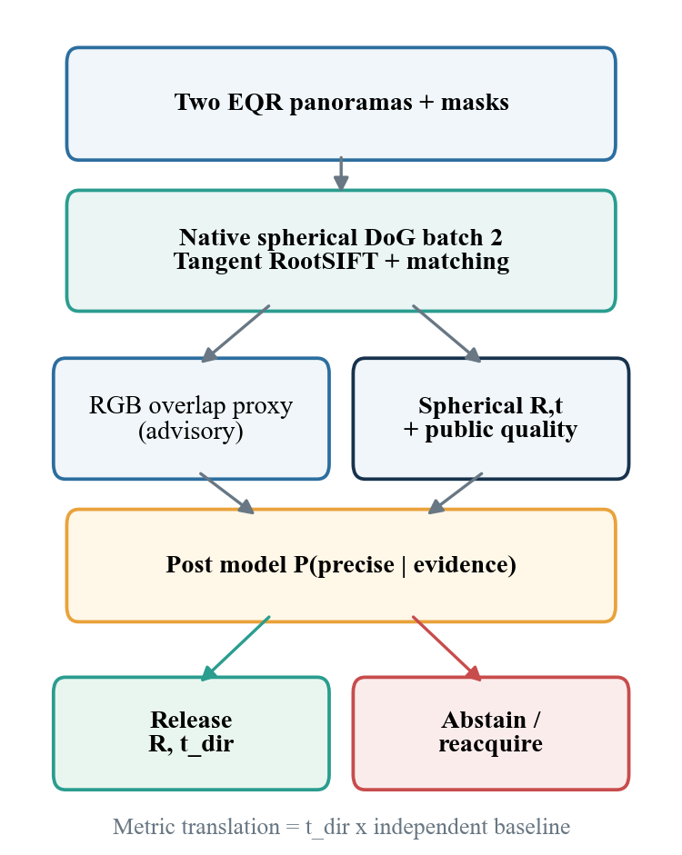
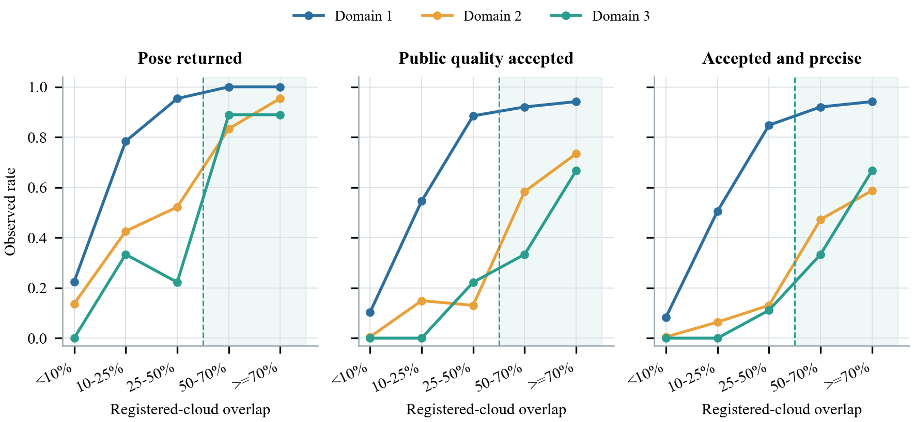
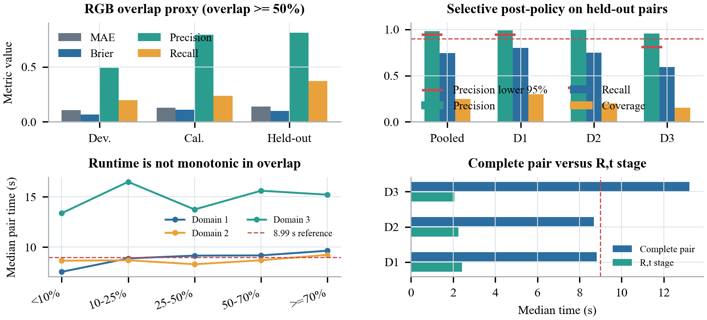

# Probabilistic Reliability Boundaries for Spherical Two-View Relative Pose Estimation in PanorAi

## 1. Introduction

Relative pose from two images is a sequence of conditional events rather than a uniform optimization problem. Useful structure must be visible in both views, repeatable keypoints must be detected, descriptors must identify distributed correspondences, and a robust estimator must recover a geometrically consistent model. Equirectangular panoramas add seam, pole, and sampling-density effects that make naive planar processing inappropriate.

The practical question is not only whether an estimator can return rotation and translation, but under which capture conditions a returned estimate should be trusted. This study asks how spherical two-view response changes with measured scene overlap, whether image and algorithm evidence support calibrated probabilities before and after pose estimation, and which capture boundaries are justified by the current evidence.

The scope is exactly two central equirectangular panoramas. Translation direction is observable, while metric magnitude requires an independently measured or planned baseline. Dense stereo, bundle adjustment, and multiview estimation are excluded.

## 2. Method

### 2.1 Spherical two-view geometry

Let b1 and b2 be unit bearing vectors obtained from matched pixels under the canonical equirectangular model. Valid correspondences satisfy the spherical epipolar constraint (Hartley and Zisserman, 2004):

EQUATION: b2^T [t]x R b1 = 0 | (1)

where R is the relative rotation, t is translation direction, and `[t]x` is the skew-symmetric cross-product matrix. The essential matrix is `E = [t]x R`. A robust sample-consensus stage (Fischler and Bolles, 1981) estimates E, after which pose hypotheses are decomposed and checked for orientation and cheirality. The five-point formulation supplies the minimal calibrated relative-pose model (Nister, 2004). Scaling t leaves Equation (1) unchanged. Given an independently supplied baseline B, metric translation is

EQUATION: t_metric = B t_dir . | (2)

### 2.2 Optimized spherical frontend

The evaluated route is frozen to PanorAi 3.5.0. It uses native spherical convolution, batch-two spherical Difference-of-Gaussians detection, at most 4,096 keypoints per panorama, 48 x 48 tangent patches with radius six scales, four patch workers, locally normalized RootSIFT descriptors (Arandjelovic and Zisserman, 2012), explicit validity masks, and robust spherical matching. Validity is never inferred from black pixels.

### 2.3 Capture and overlap probability

The capture model represents conditions visible or controlled at acquisition. Baseline is externally tracked. Spatial overlap is explicit when registered depth clouds and their transforms are available. In pure-RGB deployment, overlap is latent and approximated from keypoint count, match count, match rate, descriptor-distance quantiles, ratio-test evidence, and explicit mask-valid fractions.

The capture decomposition is

EQUATION: P(usable | capture) = P(accepted | capture) P(precise | accepted, capture). | (3)

It supports capture planning but does not override the geometric estimator.

### 2.4 Post-estimation probability

After the two-view route runs, a post model consumes match and inlier counts, inlier ratio, residual statistics, spatial occupancy, and quality flags. It estimates `P(precise | returned pose, algorithm evidence)`. The evaluated selective decision is

EQUATION: release = returned AND public_quality AND P_post >= 0.90 . | (4)

Baseline uncertainty is propagated separately for metric translation. It cannot create scale observability from the images.

## 3. Experimental Design

### 3.1 Population and independence

The frozen population contains 4,017 unique panoramas and 2,385 unordered pairs. Pair formation produces 4,770 image observations because each pair contributes two observations. The portable overlap-model artifact omits both source panorama identifiers, so the unique-image count is sealed separately in the experiment census.

| Domain | Images | Pairs | Groups |
| --- | ---: | ---: | ---: |
| Domain 1 | 3,305 | 1,890 | 63 |
| Domain 2 | 638 | 450 | 3 |
| Domain 3 | 74 | 45 | 3 |
| Total | 4,017 | 2,385 | 69 |

TABLECAPTION: Table 1. Frozen retrospective population.

The development, calibration, and held-out partitions contain 1,515, 435, and 435 pairs. Splits are disjoint by independence component. Duplicate or reversed pairs, shared-image leakage, component leakage, and group leakage are zero.

### 3.2 Reference quantities and outcomes

Reference relative poses define rotation error and oriented translation-direction error. A pose is precise when rotation error is at most 1 degree and oriented translation-direction error is at most 5 degrees. A pose is usable when it is both publicly accepted and precise. Translation magnitude is not scored.

Spatial overlap is the minimum of the two directional registered-cloud overlap fractions after both clouds are placed in a shared coordinate system. It is an offline reference label. The analysis bins are below 10%, 10-25%, 25-50%, 50-70%, and at least 70%.

### 3.3 Metrics

The study reports return, public acceptance, and usable rates; precision, recall, and coverage; Brier score (Brier, 1950), log loss, and expected calibration error; and exact one-sided 95% lower precision bounds. Runtime is measured separately and is not a probability-model input.

:::widepage

:::columns

## 4. Results

### 4.1 Response versus spatial overlap

Across the full population, the estimator returns a pose for 980/1,890 pairs in Domain 1, 207/450 in Domain 2, and 21/45 in Domain 3. Usable counts are 698, 91, and 10. Figure 2 exposes the main boundary hidden by those aggregates.

In Domain 1, usable rate rises from 8.3% below 10% overlap to 50.5% at 10-25%, 84.8% at 25-50%, 92.0% at 50-70%, and 94.1% at or above 70%. The smaller domains show the same broad direction but lower absolute performance and weaker independent support. Domain 2 reaches only 58.7% usability above 70% overlap and contains nine catastrophic public accepts in that bin. High overlap is helpful but not sufficient: repetitive or ambiguous structure can still support a wrong translation direction.

The evidence supports 50% registered overlap as an eligibility boundary when a trustworthy measurement exists. It does not justify treating 50% or 70% as a correctness guarantee.

### 4.2 RGB overlap proxy

The proxy predicts an overlap distribution from the two panoramas and optimized match evidence. On held-out evaluation, expected overlap mean absolute error is 0.139 and the Brier score for overlap at least 50% is 0.099. At probability threshold 0.5, precision is 0.811 and recall is 0.370.

This operating point is useful for positive advice but not for rejecting pairs: it misses 63% of true high-overlap pairs. The proxy must remain visible as an uncertain posterior rather than being presented as measured overlap.

### 4.3 Selective post-estimation policy

On 435 held-out pairs, 148 pass the existing public quality gate. The 0.90 post-probability threshold selects 107 pairs; 105 are precise and two are false positives. There are 36 false negatives and 292 true negatives relative to the precise-pose outcome.

The pooled precision is 0.981, recall is 0.745, and coverage is 0.246. Its exact one-sided 95% precision lower bound is 0.942. Domain 1 also clears the 0.90 lower-bound target. Domains 2 and 3 do not: their point estimates are high, but their lower bounds are 0.368 and 0.810. Pooled retrospective success therefore supports prospective confirmation but not uniform release reliability.

The primary post model has Brier scores of 0.053, 0.120, and 0.032 in the three domains. Domains 2 and 3 each contribute only one evaluation group, so nominal calibration scores cannot substitute for independent support.

:::widepage

| Scope | Selected / pairs | Precision | Recall | Coverage | Lower 95% |
| --- | ---: | ---: | ---: | ---: | ---: |
| Pooled | 107 / 435 | 0.981 | 0.745 | 0.246 | 0.942 |
| Domain 1 | 81 / 270 | 0.988 | 0.800 | 0.300 | 0.943 |
| Domain 2 | 3 / 15 | 1.000 | 0.750 | 0.200 | 0.368 |
| Domain 3 | 23 / 150 | 0.957 | 0.595 | 0.153 | 0.810 |

TABLECAPTION: Table 2. Held-out selective policy by domain.

:::columns

### 4.4 Controlled runtime

The controlled protocol contains 75 outcome-blind pairs: five in every domain-by-overlap cell and three repetitions, giving 225 observations at 1024 x 2048 pixels. The host is an Apple M3 Max with 16 cores and 64 GiB RAM, Python 3.12.4, NumPy 1.26.4, OpenCV 4.11.0, and four tangent-patch workers.

The reference is 4.22 s detection per pair, 3.44 s image-ready per image, and 8.99 s complete pair. Domains 1 and 2 remain within that order of magnitude. Domain 3 takes 1.47 times the complete-pair reference and 1.63 times the image-ready reference. Excess cost is localized to tangent-patch and descriptor work caused by a larger retained-keypoint load, not to R,t estimation. Median runtime is not monotonic in overlap within any domain; overlap must not be used as a causal runtime predictor.

## 5. Capture and Decision Standard

The evidence supports the following conservative two-view standard:

1. Capture two calibrated central equirectangular panoramas with explicit validity masks.
2. Plan or measure baseline independently and stay inside the calibrated 0.162-2.155 m envelope unless new evidence supports extrapolation.
3. When registered clouds are available, require at least 50% minimum bidirectional overlap and prefer at least 70% where practical.
4. With RGB only, report the overlap proxy as a posterior. A negative result is not proof of low overlap.
5. Favor static, textured structure distributed across the sphere, depth variation, and non-negligible parallax; avoid repetitive or dynamic content.
6. Preserve the public geometric quality gate and release pose only when it agrees with the 0.90 post-probability gate.
7. Form metric translation only from an independently supplied baseline and propagate its uncertainty.

The standard optimizes reliability of released poses rather than answer rate.

## 6. Discussion

### 6.1 Overlap is necessary evidence, not a sufficient oracle

The strongest repeatable response trend is the rise in return, acceptance, and usable rates as registered overlap increases. This supports using overlap as a capture boundary, but the domain-stratified results reject a universal overlap-only rule. Domain 2 contains nine catastrophic public accepts above 70% overlap, demonstrating that visibility of the same scene volume does not imply unique visual evidence. Repetitive structure, weak depth variation, dynamic content, and concentrated correspondences can preserve an apparently strong match set while yielding a wrong translation direction.

The calibrated capture surface reinforces this distinction. For the 0.10-1.83 m baseline band, the model estimates usable probability of 0.970 at 50-70% overlap and 0.948 above 70%, supported by 25 and 15 groups respectively. These values describe the retrospective population and capture model; they are not direct guarantees for a new deployment. The operational 0.162-2.155 m envelope is therefore a support boundary combined with abstention, not an assertion that every scene inside the rectangle is solvable.

### 6.2 Capture and post models answer different questions

The capture decomposition estimates whether a planned pair is likely to be accepted and precise before reference geometry is available. The post model asks whether a pose already returned by the algorithm is precise given its actual match, inlier, residual, and spatial-support evidence. Combining these quantities into one undocumented score would erase the distinction between capture feasibility and conditional pose reliability.

The final rule keeps that distinction explicit. The public geometric quality gate remains unchanged, and the post probability only narrows its output. This reduces coverage to 24.6% on the held-out set while retaining 74.5% of precise outcomes and raising selected precision to 98.1%. The two remaining false positives show why a probabilistic score is a risk-control layer rather than a proof of geometric correctness.

### 6.3 Scene content, not overlap, dominates runtime variation

The controlled experiment shows no monotonic runtime-overlap relationship. Domain 3 retains a median 5,430 combined keypoints per pair, compared with 2,045 and 1,666 in Domains 1 and 2. Its excess time and memory occur in tangent-patch and descriptor materialization, while median R,t estimation is 2.065 s, lower than in the other domains. Capture standards should therefore treat overlap as a reliability covariate and retained feature load as an engineering cost driver. Runtime, memory, and domain identity remain excluded from both probability models.

## 7. Limitations and Release Boundary

The study is retrospective. The domains are imbalanced: Domain 1 has 63 independence groups, while Domains 2 and 3 have only three each. Pair count cannot repair weak group independence. Registered-cloud overlap is unavailable in pure-RGB capture unless another sensing or registration process supplies it, and the RGB proxy has low recall. Baseline is a retrospective surrogate in archived data and must be measured independently at deployment. The result validates rotation and translation direction only, not metric scale, dense stereo, bundle adjustment, or multiview reconstruction. Runtime remains hardware- and scene-load-dependent.

Release reliability requires at least 40 new independent groups and 120 prospectively selected pairs, with at most three selected pairs per group. Predictions must be sealed before reference poses are opened. The acceptance gate requires observed selected-pose precision of at least 95%, an exact one-sided 95% lower bound of at least 90%, and zero catastrophic accepts. Domain-level evidence must be reported; a pooled pass cannot hide a failed deployment domain.

## 8. Conclusions

Spatial overlap is the dominant observable boundary in the current spherical two-view evidence, but it is neither sufficient for correctness nor reliably known from RGB alone. The estimator becomes operationally useful around 50% registered overlap and is preferable above 70%, provided baseline lies inside the calibrated envelope and the scene supplies distributed, non-ambiguous structure. The post model raises pooled held-out selected precision to 98.1% with a 94.2% exact lower bound, but the same guarantee is not yet supported in all domains. The defensible deployment is selective: estimate, test public geometry, score post evidence, release only high-confidence rotation and translation direction, and abstain otherwise.

## 9. Reproducibility

The evaluated distribution is PanorAi 3.5.0 at source commit `03c5b36b28225b24d3909286bf53250d7b532aa3`. The exact wheel SHA-256 is `e861dafbaa5991aef77dd512b3ef1bf6fdc7967d10fbd236d850bab5c1a5f8a7`. The RGB overlap-proxy SHA-256 is `e72a53d17c303361503777a38eb986132a2340ae2b86b7e24043557da71c7e60`, and the controlled-timing summary SHA-256 is `80aaeabe9e8da9d78003af38482a514655e0aa057bc33874b0c2f49e8d4b97ee`.

Every timed pair used native spherical convolution, batch-two detection, explicit validity masks, four tangent-patch workers, and a fresh process. The probability artifacts and this manuscript distribute aggregate features only; no dataset image, depth map, registered cloud, or reference pose is included.

:::newpage

## References

Arandjelovic, R., Zisserman, A., 2012. Three things everyone should know to improve object retrieval. Proc. IEEE Conf. Computer Vision and Pattern Recognition, 2911-2918.

Brier, G.W., 1950. Verification of forecasts expressed in terms of probability. Monthly Weather Review, 78(1), 1-3. doi.org/10.1175/1520-0493(1950)078<0001:VOFEIT>2.0.CO;2.

Fischler, M.A., Bolles, R.C., 1981. Random sample consensus: a paradigm for model fitting with applications to image analysis and automated cartography. Communications of the ACM, 24(6), 381-395. doi.org/10.1145/358669.358692.

Hartley, R., Zisserman, A., 2004. Multiple View Geometry in Computer Vision. Second edition, Cambridge University Press.

Nister, D., 2004. An efficient solution to the five-point relative pose problem. Proc. IEEE Conf. Computer Vision and Pattern Recognition. doi.org/10.1109/CVPR.2004.1315099.

## Appendix A. Model Inputs

The RGB overlap proxy uses the minimum keypoint count, match count, match rate, median and 90th-percentile descriptor distance, median ratio-test score, minimum explicit-valid fraction, and missingness indicators. It does not consume depth or cloud measurements at runtime.

The post model uses only evidence produced by the frozen two-view route, including match and inlier counts, inlier ratio, residual summaries, spatial occupancy, and public quality flags. Runtime, memory, dataset identity, and ground-truth pose are excluded from both probability models.

| Model | Runtime input families |
| --- | --- |
| Overlap proxy | keypoints, matches, descriptor distances, ratio scores, mask-valid fraction |
| Capture probability | explicit overlap posterior and independently supplied baseline distribution |
| Post precision | matches, inliers, residuals, occupancy, estimator quality evidence |
| Excluded | reference pose, registered depth at runtime, domain ID, time, memory |

TABLECAPTION: Table 3. Runtime probability-model input boundary.

## Appendix B. Prospective Confirmation Record

The confirmatory registry must preserve panorama and mask hashes, resolution, sensor and timestamp provenance, planned or measured baseline, independently measured capture conditions, and independence-group identity. Predictions and the selected set must be sealed before reference poses are opened. No more than three selected pairs per group can contribute to the primary gate.

The primary prospective report must publish the complete denominator, domain-specific selection coverage, exact selected precision, the one-sided 95% lower bound, catastrophic accepts, and every abstention reason. Failure to reach 120 selected pairs or 40 independent groups is an incomplete experiment, not a negative or positive release result.

| Prospective gate | Requirement |
| --- | --- |
| Independent support | at least 40 new groups |
| Selected sample | at least 120 pairs |
| Group cap | at most 3 selected pairs per group |
| Selected precision | at least 95% |
| Exact lower bound | at least 90%, one-sided 95% |
| Catastrophic accepts | zero |
| Leakage control | predictions sealed before opening references |

TABLECAPTION: Table 4. Prospective release-confirmation gate.
