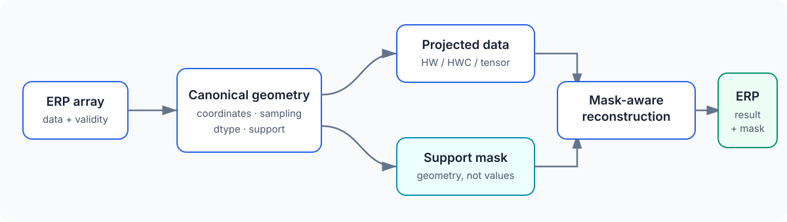

Architecture
============

PanorAi separates mathematical geometry from compatibility containers and
application-specific processing.

         explicit support mask that meet again in mask-aware reconstruction.
   :width: 100%

Canonical geometry
------------------

``panorai.geometry`` owns the coordinate frame, projection formulas, sampling,
layouts, dtype rules, and support masks. Functional calls and immutable
projector objects delegate to one engine so NumPy, Torch, cubemap, and
gnomonic paths do not redefine the mathematics independently.

Compatibility containers
------------------------

``EquirectangularImage``, ``GnomonicFace``, and ``GnomonicFaceSet`` retain the
3.0 object-oriented workflow. In 3.1 they can accept canonical geometry specs,
but they remain compatibility APIs rather than the source of new geometry
semantics.

Validity and blending
---------------------

Projection returns data together with geometric support. A valid black RGB
pixel, label zero, or radial range zero remains valid when its mask is true.
An unsupported non-zero value remains unsupported. Blenders consume those
explicit masks and never infer validity from numeric values.

Scope boundary
--------------

Training pipelines, datasets, checkpoints, research metrics, and vendored
model implementations are outside the projection core and are excluded from
the 3.1 wheel and sdist. ``panorai.depth`` contains only lazy compatibility
adapters to separately installed upstream projects; PCD remains an optional
compatibility surface. See
:doc:`../reference/stability` for the supported surface and
:doc:`../geometry-v1` for the mathematical contract.
