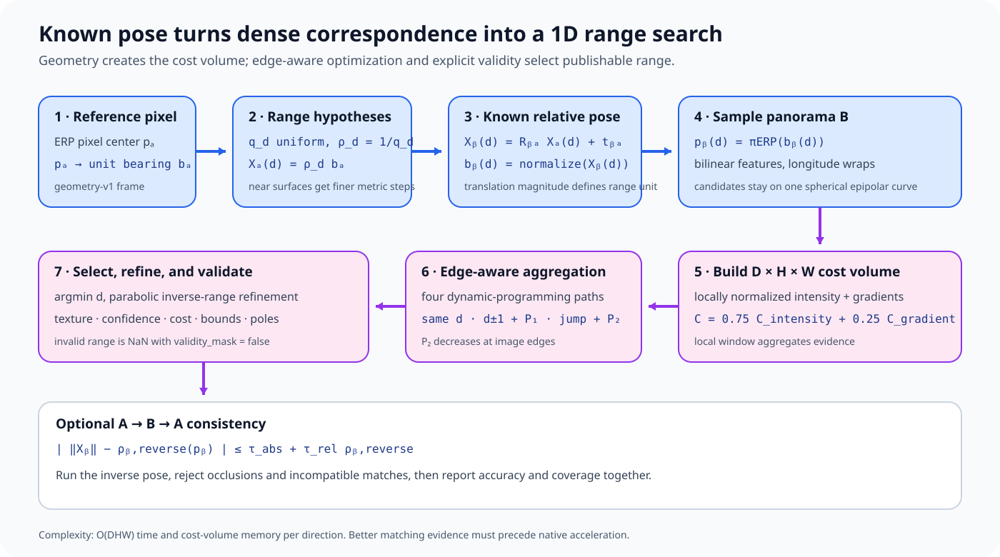

# Direct spherical dense stereo: geometry and optimization

This article derives the Experimental `panorai.stereo` method. It begins after
relative pose has already been obtained: rotation $R_{BA}$ and translation
$\mathbf t_{BA}$ are inputs, not variables optimized by dense stereo.

The implementation answers one question for every reference pixel:

> At what radial range along this known camera-A bearing does its transformed
> 3D point best agree with panorama B?

That turns an unconstrained two-dimensional correspondence search into a
one-dimensional search on a spherical epipolar curve.

## 1. Assumptions and output

The method assumes:

1. both images are central-camera ERPs with the same shape;
2. both use the canonical PanorAi frame: `+X` right, `+Y` up, `+Z` forward;
3. the scene is static during the two exposures;
4. $R_{BA},\mathbf t_{BA}$ obey
   $\mathbf X_B=R_{BA}\mathbf X_A+\mathbf t_{BA}$;
5. $\lVert\mathbf t_{BA}\rVert>0$ and carries the desired output unit; and
6. corresponding surfaces retain enough local appearance for direct matching.

The output is radial range $\rho_A$, measured from camera A's optical center:

$$
\mathbf X_A=\rho_A\mathbf b_A.
$$

It is not pinhole Z-depth. For a unit bearing
$\mathbf b_A=(b_x,b_y,b_z)^T$, Z-depth would be $\rho_A b_z$ and is not
globally meaningful over a full sphere.

## 2. ERP pixels become unit bearings

For an ERP of width $W$ and height $H$, PanorAi treats integer image
coordinates as pixel centers:

$$
\lambda = 2\pi\frac{x+0.5}{W}-\pi,
\qquad
\varphi = \frac{\pi}{2}-\pi\frac{y+0.5}{H}.
$$

Longitude $\lambda$ and latitude $\varphi$ produce

$$
\mathbf b_A(x,y)=
\begin{bmatrix}
\sin\lambda\cos\varphi\\
\sin\varphi\\
\cos\lambda\cos\varphi
\end{bmatrix}.
$$

The horizontal domain is periodic. The north and south poles lie on the image
boundary rather than at a pixel center. These details are inherited directly
from [geometry-v1](../geometry-v1.md); dense stereo does not define a second
spherical convention.

## 3. Known pose defines the candidate curve

For one reference bearing $\mathbf b_A$, choose a positive candidate range
$\rho$. The corresponding 3D point in A is

$$
\mathbf X_A(\rho)=\rho\mathbf b_A.
$$

Transform it into B:

$$
\mathbf X_B(\rho)
=R_{BA}\bigl(\rho\mathbf b_A\bigr)+\mathbf t_{BA}.
$$

Normalize and project it to B's ERP:

$$
\mathbf b_B(\rho)
=\frac{\mathbf X_B(\rho)}
       {\lVert\mathbf X_B(\rho)\rVert},
\qquad
p_B(\rho)=\pi_{\mathrm{ERP}}\bigl(\mathbf b_B(\rho)\bigr).
$$

The appearance objective for a pixel $p_A$ is conceptually

$$
\rho^*(p_A)=
\underset{\rho\in[\rho_{\min},\rho_{\max}]}{\operatorname{argmin}}\;
C\left(p_A,p_B(\rho)\right).
$$

It does **not** compare $p_A$ with every pixel in B.

### Why this is the spherical epipolar curve

The Essential matrix is

$$
E=[\mathbf t_{BA}]_\times R_{BA}.
$$

Every valid candidate satisfies

$$
\mathbf b_B(\rho)^T E\mathbf b_A=0.
$$

For fixed $\mathbf b_A$, this equation defines a plane through camera B's
origin. Its intersection with B's unit sphere is a great circle. Positive
range and the configured near/far bounds select only a segment of that circle.

At $\rho\rightarrow\infty$, translation becomes negligible and the candidate
bearing approaches $R_{BA}\mathbf b_A$. At very small range it tends toward
the translation direction. With zero translation every range maps to the same
bearing, so depth is unobservable; the API rejects a zero baseline.

## 4. Metric scale is inherited, not estimated

Suppose a five-point solver provides $R_{BA}$ and unit direction
$\widehat{\mathbf t}_{BA}$. Replacing it with

$$
\mathbf t_{BA}=s\widehat{\mathbf t}_{BA}
$$

chooses the baseline $s$. The recovered ranges scale with that choice.
Therefore:

- metric $\mathbf t$ produces metric range;
- unit $\mathbf t$ produces baseline-normalized range;
- a wrong baseline magnitude produces a correspondingly wrong scene scale.

Dense appearance cannot decide $s$ because calibrated two-view geometry is
scale invariant. A known baseline, rig calibration, surveyed camera centers,
or an observable known-height/floor constraint must supply it first.

## 5. The inverse-range lattice

PanorAi discretizes inverse range $q=1/\rho$:

$$
q_d=\frac{1}{\rho_{\max}}
+d\frac{1/\rho_{\min}-1/\rho_{\max}}{D-1},
\qquad d=0,\ldots,D-1.
$$

Each candidate is $\rho_d=1/q_d$. Uniform inverse range is useful because
two-view parallax changes approximately linearly with inverse distance for a
fixed baseline. It allocates more metric resolution to nearby surfaces, where
image motion is larger and depth changes matter most.

Its trade-off is explicit:

$$
\Delta\rho\approx\rho^2\Delta q.
$$

Far surfaces receive much coarser radial steps. Increasing only
`max_range` can make a previously adequate $D$ insufficient.

For every $d$, the implementation transforms the complete A-ray lattice,
projects it to B, bilinearly samples B, and stores one $H\times W$ cost plane.
The resulting volume has shape `(D, H, W)`.

### 5.1 Adaptive coarse-to-fine lattice

With `pyramid_levels > 1`, PanorAi evaluates the broad absolute lattice only
at the coarsest spatial level. It upsamples the selected inverse range and
confidence, then evaluates a smaller normalized offset lattice around each
pixel's prior at every finer level. Low-confidence and boundary winners receive
wider intervals. Before evaluation, each interval is shifted inside the global
near/far bounds; this keeps all local labels distinct instead of duplicating a
clipped endpoint.

For an 8192x4096 input and `pyramid_levels=3`, the levels are 2048x1024,
4096x2048, and 8192x4096. `num_hypotheses` controls the first broad sweep;
`refinement_hypotheses` controls both local sweeps. The public result records
`hypothesis_mode="normalized_inverse_range_offset"` plus per-pixel
`inverse_range_center` and `inverse_range_radius` maps, so the winning local
label remains interpretable.

This schedule never estimates pose. The caller-supplied $R,t$ is unchanged at
every level. A feature pipeline may therefore estimate pose from the original
high-resolution ERP and gnomonic faces while dense stereo uses a lower spatial
level only to initialize range.

## 6. Appearance representation

Both inputs are converted to grayscale float values in $[0,1]$. A local
window computes mean $\mu$ and standard deviation $\sigma$. The normalized
intensity feature is

$$
f_I(p)=\frac{1}{3}
\operatorname{clip}\left(
\frac{I(p)-\mu(p)}{\max(\sigma(p),0.02)},-3,3
\right).
$$

This suppresses affine local brightness changes while avoiding division by a
nearly zero variance.

Sphere-native Sobel derivatives $g_E,g_N$ in the local east/north tangent
frame add local structural evidence. Their common scale
is the larger of 0.05 and the image-wide 90th percentile gradient magnitude.
Each normalized derivative is clipped to $[-2,2]$ and divided by two. The
three-channel matching feature is

$$
\mathbf f(p)=\bigl(f_I(p),f_E(p),f_N(p)\bigr).
$$

For a warped B sample, the raw per-pixel cost is

$$
C_0 =
\alpha\min(|f_I^A-f_I^B|,1)
+(1-\alpha)\min\left(
\frac{|f_E^A-f_E^B|+|f_N^A-f_N^B|}{2},1
\right),
$$

with $\alpha=0.75$ by default. A local tangent-plane spherical box filter then
averages this cost over the configured angular window. The same spherical
neighbourhood defines the local mean and variance above, so support does not
shrink in longitude toward the poles as it would for a rectangular ERP window.

Horizontal remapping wraps across the ERP seam. Spherical filtering crosses
the seam and poles through unit-ray sampling. Warped target coordinates outside
the vertical raster have no support. The path aggregation
described next scans from the four raster boundaries; it does not close the
left/right scan into a cyclic recurrence.

## 7. Four-path edge-aware optimization

Independent winner-take-all matching is noisy. PanorAi therefore applies a
four-direction dynamic-programming approximation inspired by semi-global
matching: left-to-right, right-to-left, top-to-bottom, and bottom-to-top.

Let $C(p,d)$ be the local cost and $L_r(p,d)$ the accumulated cost along
direction $r$. With $p-r$ denoting the previous pixel on that path,

$$
\begin{aligned}
L_r(p,d)=C(p,d)+\min\{&
L_r(p-r,d),\\
&L_r(p-r,d-1)+P_1,\\
&L_r(p-r,d+1)+P_1,\\
&\min_k L_r(p-r,k)+P_2(p,r)\}\\
&-\min_k L_r(p-r,k).
\end{aligned}
$$

$P_1$ penalizes a one-index inverse-range change. $P_2$ penalizes a larger
jump, but is reduced at an intensity edge:

$$
P_2(p,r)=
\max\left(
P_1,\frac{P_{2,\mathrm{base}}}
{1+8|I(p)-I(p-r)|}
\right).
$$

The subtraction of the previous minimum prevents accumulated values from
growing without affecting the minimizer. The final volume is the average of
the four paths:

$$
\bar C(p,d)=\frac{1}{4}\sum_r L_r(p,d).
$$

This is a regularized discrete optimization, not a global surface proof. Four
paths are cheaper than full SGM and preserve discontinuities better than a
plain spatial blur, but repeated structures can still form a coherent false
minimum.

## 8. Winner, confidence, and sub-hypothesis refinement

The discrete winner is

$$
d^*(p)=\operatorname{argmin}_d \bar C(p,d).
$$

If $C_1$ and $C_2$ are the lowest and second-lowest aggregated costs,
confidence is

$$
\gamma(p)=
\operatorname{clip}\left(
\frac{C_2-C_1}{\max(C_2,\epsilon)},0,1
\right).
$$

This measures separation on the current cost lattice. It is not a posterior
probability and can be high for a repeated pattern that produces one sharp but
incorrect minimum.

For an interior winner, the costs at $d^*-1,d^*,d^*+1$ fit a local parabola.
The fractional inverse-range offset is

$$
\delta =
\operatorname{clip}\left(
\frac{1}{2}
\frac{\bar C_{d^*-1}-\bar C_{d^*+1}}
{\bar C_{d^*-1}-2\bar C_{d^*}+\bar C_{d^*+1}},
-0.5,0.5
\right).
$$

Refined inverse range and radial range are

$$
q^*=q_{d^*}+\delta\Delta q,
\qquad
\rho^*=\frac{1}{q^*}.
$$

Refinement is disabled when the denominator is not positive and well
conditioned. Boundary winners are not accepted because they cannot be
refined and often indicate a surface outside the configured interval.

## 9. Validity is part of the result

A forward estimate is valid only when all of the following hold:

- the pixel lies outside the configured pole margin;
- the winning hypothesis is not the first or last lattice entry;
- refined range is finite;
- local texture is at least `min_texture_std`;
- confidence is at least `min_confidence`; and
- winning cost is at most `max_matching_cost`.

Rejected ranges become `NaN` and are also identified by
`validity_mask=False`. A black pixel, zero label, or zero confidence is never
used as an implicit missing-data marker.

This creates an important evaluation rule: accuracy and coverage must always
be reported together. A stricter threshold can lower error simply by
discarding the difficult parts of the scene.

For Matterport3D and Stanford2D3D evaluation, `coverage` must name its reference
support: finite reference ranges inside the configured near/far interval and
outside the pole margin. `valid_fraction_of_full_erp` instead divides by every
ERP pixel. Both are serialized because partial panoramas make the distinction
material.

## 10. Bidirectional consistency

When enabled, PanorAi also estimates B-to-A range with the inverse pose:

$$
R_{AB}=R_{BA}^T,
\qquad
\mathbf t_{AB}=-R_{BA}^T\mathbf t_{BA}.
$$

For each accepted A pixel, its forward point is transformed to B. Let
$r_B^{\mathrm{forward}}=\lVert\mathbf X_B\rVert$ and let
$r_B^{\mathrm{reverse}}$ be B's reverse range sampled at the projected pixel.
The point survives only if

$$
\left|
r_B^{\mathrm{forward}}-r_B^{\mathrm{reverse}}
\right|
\le
\tau_{\mathrm{abs}}
+\tau_{\mathrm{rel}}r_B^{\mathrm{reverse}}.
$$

This rejects many occlusions and ambiguous matches, but it is not free:
runtime is roughly doubled, and a weak matcher can cause both estimates to
reject almost everything.

## 11. What $R,t$ error does to the search

The geometric constraint is valuable only when the supplied pose is accurate.
An error in $R$ shifts the entire epipolar curve. An error in translation
direction rotates the epipolar plane. A baseline-scale error changes the
mapping between parallax and range.

Sensitivity increases when:

- the baseline is small relative to scene distance;
- the point lies close to the translation direction;
- the surface is distant and the inverse-range cost is flat;
- the local appearance repeats along the epipolar curve; or
- the ERP is close to a pole, where many longitudes occupy little solid angle.

The dense stage does not currently refine $R,t$. Joint pose-depth
optimization would need a new objective, robust schedule, gauge treatment,
and acceptance policy; it should not be introduced as an implicit side effect
of the existing API.

## 12. Complexity and implementation boundary

For $D$ hypotheses and an $H\times W$ ERP:

- geometric warping and cost construction are $O(DHW)$;
- the stored cost volume is $O(DHW)$ memory;
- four-path aggregation is $O(DHW)$;
- bidirectional consistency runs two one-way estimations.

For adaptive levels $(H_l,W_l)$ and $D_r$ local labels, work and peak volume
storage become approximately

$$
O(DH_0W_0)+\sum_{l=1}^{L-1}O(D_rH_lW_l),
$$

where level zero is the coarse broad sweep and the last level is the original
ERP resolution. Peak memory is governed by the largest single level rather
than a full-resolution $D$ volume.

OpenCV supplies only the seam-safe bilinear/nearest ERP remapping. PanorAi's
``spherical_gradient`` and ``spherical_box_blur`` define east/north derivatives,
local normalization, and cost support in each ray's tangent plane. Compatible
NumPy arrays dispatch to the first-party C++17 spherical-convolution kernel by
default; ``filter_backend="numpy"`` selects the reference implementation and
``filter_backend="native"`` requires the compiled kernel. PanorAi also owns the
spherical ray lattice, pose-driven warp, inverse-range hypotheses, cost
definition, path recurrence, refinement, confidence, validity, and
bidirectional policy.

A future fused C++ cost-volume implementation could further reduce Python-loop
overhead, temporary allocations, and memory traffic. It cannot correct a weak
appearance model. The existing native convolution already accelerates the
angular local filters without changing their NumPy-visible contract.
Numerical parity would require preserving:

- candidate order and inverse-range spacing;
- pixel-center and pose conventions;
- horizontal seam wrapping and vertical support;
- interpolation and floating-point operation order;
- edge-aware penalties and tie behavior;
- refinement conditioning; and
- every validity and consistency decision.

## 13. Public validation evidence: why the method remains Experimental

The current real-data development evidence uses Matterport3D and Stanford2D3D.
It is post-hoc and does not establish metric-scale recovery, cross-building
generalization, or calibrated confidence. Dataset acquisition and licensing
remain the consumer's responsibility; no dataset imagery is redistributed.

Promotion requires preregistered, spatially disjoint Matterport buildings and
Stanford areas, with accuracy and accepted coverage reported together. Until
those gates pass, the dense stereo surface remains Experimental.

## 14. Accuracy roadmap before fused cost-volume acceleration

The next experiments should change evidence quality before execution speed:

1. **Robust descriptors:** compare Census, ZNCC, and learned spherical
   descriptors under exposure change and repetitive metal structures.
2. **Occlusion modeling:** reason about visibility explicitly instead of
   relying only on the final round-trip threshold.
3. **Adaptive uncertainty calibration:** calibrate confidence and local search
   radius on disjoint scenes, reporting reliability, accuracy, and coverage.
4. **Joint multi-level aggregation:** preserve absolute inverse-range
   discontinuities while regularizing normalized residual labels.
5. **Pose sensitivity sweeps:** perturb $R$, translation direction, and
   baseline scale independently.

After one of these routes establishes an acceptable accuracy/coverage
envelope, a streaming or fused C++ cost-volume kernel becomes worthwhile.
Acceptance should require an additional measured speedup over the optimized
NumPy/native reference and parity on seams, poles, ties, invalid pixels, and
bidirectional consistency.

## 15. Practical acceptance checklist

Before using a range map downstream, record:

- exact ERP provenance, shape, and frame convention;
- $R_{BA},\mathbf t_{BA}$ convention, source, unit, and uncertainty;
- near/far range and hypothesis count;
- one-way and bidirectional coverage;
- fractions rejected by pole, boundary, texture, confidence, cost, and
  consistency checks;
- accuracy against independent range where available;
- results stratified by distance, latitude, texture, and occlusion; and
- raw numeric maps, not only colorized images.

The operational API is shown in the
[dense stereo tutorial](../tutorials/06_spherical_dense_stereo.md). Exact
stability and promotion requirements remain in
[API stability](../reference/stability.rst).
