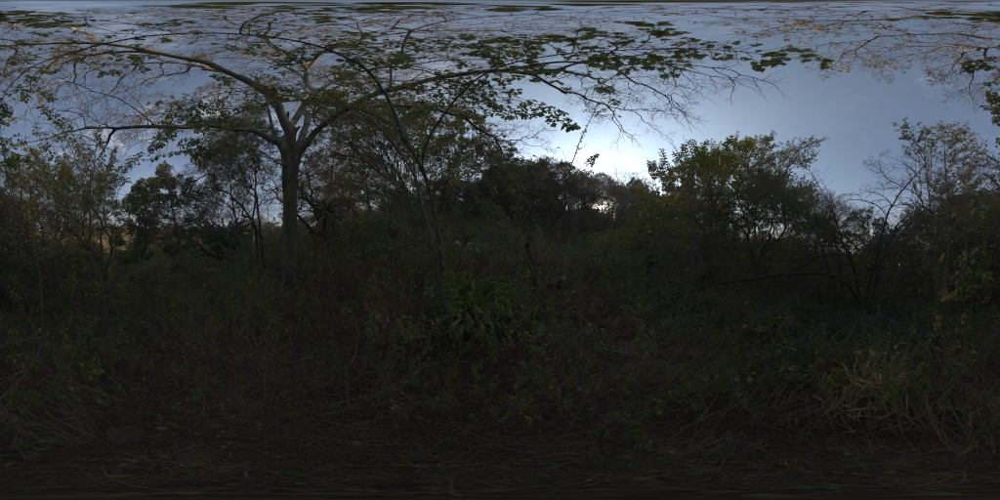
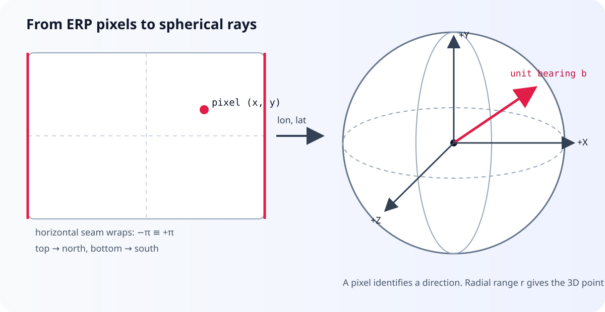

# Projection foundations: sphere, rays, views, samplers, and blenders

This tutorial builds the mental model behind every PanorAi projection. It uses
the Stable `panorai.geometry` contract first, then shows how compatibility
samplers and Stable blenders compose multiple virtual views.

The image used throughout the tutorial is the public, non-benchmark
[Nature Reserve Forest](https://polyhaven.com/a/nature_reserve_forest) HDRI
from Poly Haven. It is CC0; the exact source checksum and reproducible figure
command are recorded in the downloadable
{download}`image provenance <../_static/tutorials/ATTRIBUTION.md>`.



## 1. A panorama pixel represents a ray

PanorAi uses a right-handed panorama frame: `+X` right, `+Y` up, and `+Z`
forward. Image coordinates start at the top-left and address pixel centers.
For a panorama of width $W$ and height $H$, pixel $(x,y)$ becomes

$$
\lambda = 2\pi\frac{x+0.5}{W}-\pi,
\qquad
\phi = \frac{\pi}{2}-\pi\frac{y+0.5}{H},
$$

$$
\mathbf b =
\begin{bmatrix}
\sin\lambda\cos\phi &
\sin\phi &
\cos\lambda\cos\phi
\end{bmatrix}^{T}.
$$

The unit vector $\mathbf b$ is a **bearing**. A radial range $r$ gives a 3D
point $\mathbf X=r\mathbf b$. It is not camera z-depth.



```python
import numpy as np
from panorai.geometry import erp_pixels_to_rays, rays_to_erp_pixels

shape_hw = (512, 1024)
pixels_xy = np.array([[511.5, 255.5], [767.5, 255.5]])
projection = erp_pixels_to_rays(pixels_xy, shape_hw)
round_trip = rays_to_erp_pixels(projection.rays_xyz, shape_hw)

assert np.all(projection.valid)
np.testing.assert_allclose(round_trip.pixels_xy, pixels_xy, atol=1e-12)
```

Longitude wraps at the left/right seam. The poles lie on raster boundaries,
not at pixel centers; an exact pole has no unique longitude, so PanorAi returns
a deterministic representative. See {doc}`../geometry-v1` for all seam, pole,
rounding, and cubemap tie rules.

## 2. Choose the surface that matches the task

| Surface | What it preserves | Typical use |
| --- | --- | --- |
| ERP | the complete sphere in one periodic raster | storage, global context, spherical inference |
| gnomonic | straight rays through one tangent plane | local feature detection, pinhole models, view-based networks |
| cubemap | six fixed 90° perspective faces | rendering, fixed six-view inference, fast reconstruction |
| arbitrary-N face set | configurable overlapping tangent views | uniform feature coverage and model ensembling |

A gnomonic view is a virtual pinhole camera. `hfov_deg` and `vfov_deg` are
full boundary-to-boundary angles; `roll_deg` rotates the virtual camera
clockwise as seen by an observer looking along the viewing direction.

```{literalinclude} ../../scripts/run_documentation_examples.py
:language: python
:start-after: DOCS_PROJECTOR_START = None
:end-before: DOCS_PROJECTOR_END = None
:dedent: 4
```

The projector is reusable: its private, bounded plan cache is not part of
equality, hashing, or public state. NumPy and Torch take the same public route;
native C++ may accelerate compatible NumPy operations without changing the
result contract.

Cubemaps use the immutable order `front`, `right`, `back`, `left`, `up`,
`down`:

```{literalinclude} ../../scripts/run_documentation_examples.py
:language: python
:start-after: DOCS_CUBEMAP_START = None
:end-before: DOCS_CUBEMAP_END = None
:dedent: 4
```

## 3. From one panorama to many views and back

The object workflow separates two decisions:

1. a **sampler** chooses view centers on the sphere;
2. a **blender** combines overlapping back-projected samples.

```{mermaid}
flowchart TD
    A[Central ERP panorama] --> B{Choose view layout}
    B --> C[Cube: 6 fixed axes]
    B --> D[Icosahedron: 12 near-uniform directions]
    B --> E[Fibonacci: arbitrary deterministic N]
    B --> F[Spiral / blue-noise: compatibility experiments]
    C --> G[Gnomonic views]
    D --> G
    E --> G
    F --> G
    G --> H[Model or image operation]
    H --> I{Choose reconstruction policy}
    I --> J[Average / feathering / Gaussian]
    I --> K[Closest: one most-central sample]
    I --> L[Huber: robust fusion]
    I --> M[Counter / standard-deviation diagnostics]
    J --> N[ERP + explicit support]
    K --> N
    L --> N
    M --> O[Diagnostic map]
```

The sampler classes are Compatibility surfaces retained across 3.x. The
Stable object workflow calls them by layout name. Use `cube` when exactly six
faces or interoperability matters, `icosahedron` for a compact near-uniform
feature rig, and `fibonacci` when the number of views is the primary control.
`spiral` and stochastic `blue_noise` are better treated as explicit
experiments.

```{literalinclude} ../../scripts/run_documentation_examples.py
:language: python
:start-after: DOCS_WORKFLOW_START = None
:end-before: DOCS_WORKFLOW_END = None
:dedent: 4
```

Stable fusion blenders are `average`, `gaussian`, `feathering`, `closest`, and
`huber`. `counter`, `std`, and `std_feathered` produce diagnostic maps. The
spatial/no-confidence Huber variants and bundle-adjustment blender remain
Experimental. A blender always receives explicit support; black RGB and zero
labels are valid values.

```{literalinclude} ../../scripts/run_documentation_examples.py
:language: python
:start-after: DOCS_BLENDER_START = None
:end-before: DOCS_BLENDER_END = None
:dedent: 4
```

## 4. Interpolation follows the modality

| Data | Interpolation | Important rule |
| --- | --- | --- |
| floating RGB or continuous field | bilinear or nearest | choose invalid-data policy explicitly |
| radial range/depth | bilinear with explicit validity, or nearest | range is radial; `NaN` is not zero |
| labels | nearest | values remain exact integers |
| boolean masks | nearest | `False` may still lie inside geometric support |

`support_mask` answers “does this projection cover the output pixel?”
`validity_mask` answers “did valid data contribute?” These are independent.
With `invalid_policy="renormalize"`, PanorAi also returns the valid bilinear
weight and requires a caller-chosen `min_valid_weight`.

```{literalinclude} ../../scripts/run_documentation_examples.py
:language: python
:start-after: DOCS_MODALITIES_START = None
:end-before: DOCS_MODALITIES_END = None
:dedent: 4
```

## 5. Where to go next

- Continue to {doc}`spherical_image_processing` to convolve, denoise,
  equalize, detect edges, transform, and build pyramids without returning to
  planar ERP neighbourhoods.
- Then use {doc}`03_features_and_matching` to turn preprocessed virtual views
  into panorama-frame features and bearings.
- Use {doc}`01_custom_pipeline` for model-over-views recipes.
- Use {doc}`../how_to/data_modalities` for dtype, layout, invalid-data, and
  Torch guidance.
- Treat {doc}`../geometry-v1` as the normative mathematical specification.
