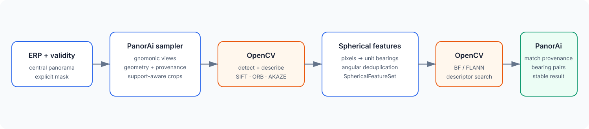
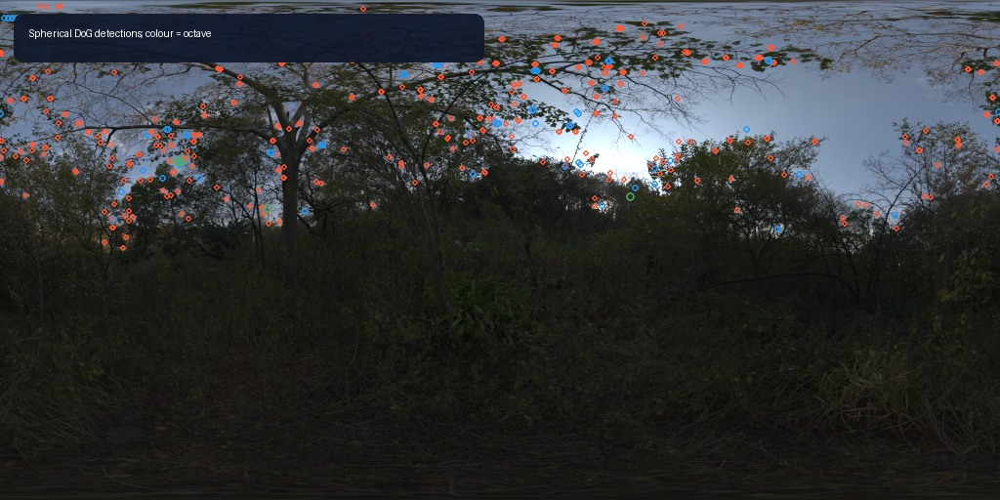

# Tutorial: spherical features and matching

This tutorial extracts local features from an equirectangular panorama,
expresses every keypoint as a panorama-frame unit bearing, and matches two
panoramas without leaking OpenCV objects into the application.

The face-based extraction/matching core is Stable as
`panorai-spherical-features/v1`. An additional direct spherical DoG detector is
Experimental as `panorai-spherical-dog-sift/v1`. Both routes reuse OpenCV
descriptors and nearest-neighbor search; PanorAi owns the sphere geometry,
masks, deduplication, provenance, and public results.

See the {ref}`capability-map-features` theme in the spherical computer-vision
guide for the precise difference between Stable face-based detection, direct
spherical DoG detection, descriptor-only tangent patches, and matching over
descriptor arrays and bearings.

**PanorAi-specific:** virtual-camera geometry or direct spherical DoG,
keypoint-to-bearing conversion, angular deduplication, masks and provenance.
OpenCV still owns SIFT/ORB/AKAZE descriptors and BF/FLANN search.

If the input needs denoising or contrast normalization first, complete
{doc}`spherical_image_processing`. Filtering the ERP with spherical
neighbourhoods avoids introducing an artificial border before virtual-camera
feature extraction.

## 1. Why not detect directly on the ERP?

An ERP stretches the poles and joins the left and right edges. A conventional
planar detector sees that distortion and does not know the seam is periodic.
PanorAi samples overlapping gnomonic views, lets OpenCV work on local pinhole
rasters, maps keypoints back to unit rays, and removes overlap duplicates by
angular distance.



## 2. Compare SIFT, ORB, and AKAZE

The figure below is generated by
`scripts/generate_documentation_figures.py` from the CC0 panorama used in the
previous tutorial. Each panel shows real features returned through PanorAi;
color identifies the originating virtual face. The plotted subset is limited
for readability, while the metadata records full counts.


| Preset | Key idea | Descriptor / distance | Good starting point | Main trade-off |
| --- | --- | --- | --- | --- |
| `sift-flann` | scale-space extrema and orientation-normalized gradients | float / L2, approximate FLANN | accuracy-first matching | slower and larger descriptors |
| `sift-bf` | same SIFT features, exhaustive matcher | float / L2, BF | smaller sets and deterministic search | exhaustive comparison cost |
| `orb-hamming` | FAST corners plus oriented BRIEF | binary / Hamming, BF | speed and compact storage | less scale/appearance tolerance |
| `akaze-hamming` | nonlinear scale space with binary MLDB | binary / Hamming, BF | a middle ground for textured scenes | thresholds remain scene-dependent |

Technical background:

- SIFT: [OpenCV tutorial](https://docs.opencv.org/4.10.0/da/df5/tutorial_py_sift_intro.html)
  and [Lowe, 2004](https://doi.org/10.1023/B:VISI.0000029664.99615.94).
- ORB: [OpenCV tutorial](https://docs.opencv.org/4.6.0/d1/d89/tutorial_py_orb.html)
  and [Rublee et al., 2011](https://ieeexplore.ieee.org/document/6126544/).
- AKAZE: [OpenCV tutorial](https://docs.opencv.org/4.12.0/dc/d16/tutorial_akaze_tracking.html)
  and [Alcantarilla et al., 2013](https://encov.ip.uca.fr/publications/pubfiles/2013_Alcantarilla_etal_BMVC_akaze.pdf).

No detector is universally best. Measure repeatability, match precision,
runtime, and memory on the deployment domain.

## 3. Use the relative-pose reference profile

When the next operation is spherical Essential-matrix estimation, use the
versioned reference profile instead of copying individual knobs:

```python
pipeline = SphericalFeaturePipeline.for_relative_pose()
matches = pipeline.extract_and_match(
    erp_a,
    erp_b,
    panorama_id_a="capture-a",
    panorama_id_b="capture-b",
    validity_mask_a=valid_a,
    validity_mask_b=valid_b,
)
```

The v1 profile freezes six cube faces at 1024×1024 and 95° FOV, SIFT with a
4096-feature global cap, FLANN (`trees=5`, `checks=50`), Lowe ratio 0.72,
16-pixel face-edge exclusion, scale-aware validity exclusion at 1.5× keypoint
scale, and 0.15° overlap/match deduplication. It also records
`preset_name="relative-pose-reference"` in `pipeline.describe()`.

The benchmark calibration used 4096×2048 ERPs. That is the evidence-backed operating
point for 1024-pixel/95° faces: a face should not ask for more average angular
samples than the ERP contains. PanorAi does not silently resize the source,
because the minimum useful resolution depends on scene detail, optics, and the
accuracy target. Use the source resolution when it is higher, and run a
resolution ablation for a new camera/domain before reducing it.

Pass real validity masks. Black pixels are not automatically invalid. The
scale-aware guard rejects a keypoint when its descriptor footprint reaches
invalid support, which prevents missing-data boundaries from forming a false
consensus. CLAHE is not part of the profile: in the paired benchmark ablation it
reduced match count without improving the 5° pose-success rate.

This is a reproducible reference, not a universal optimum. Its ten-pair benchmark
calibration reached 9/10 rotation successes within 5° at 4096×2048, with
0.099° mean and 0.080° median rotation error. Always inspect the downstream
pose quality report.

## 4. Select the minimum adequate resolution

`for_relative_pose()` deliberately freezes the validated operating point; it
does not silently resize the ERP. When deployment cost requires a smaller
raster, evaluate the same pair at an explicit increasing ladder and ask the
Experimental selector whether the evidence has converged:

```python
from panorai.features import (
    ResolutionSelectionObservation,
    ResolutionSelectionPolicy,
    select_feature_resolution,
)

# Application code evaluates each explicit ERP/face level and retains the
# real feature sets, matches, accepted pose result, and measured runtime.
observations = [
    ResolutionSelectionObservation(
        erp_shape_hw=level.erp_shape_hw,
        face_shape_hw=level.face_shape_hw,
        features_a=level.features_a,
        features_b=level.features_b,
        matches=level.matches,
        pose=level.pose,
        runtime_seconds=level.runtime_seconds,
    )
    for level in evaluated_levels
]
report = select_feature_resolution(
    observations,
    policy=ResolutionSelectionPolicy(target_rotation_accuracy_deg=0.15),
)
print(report.decision, report.selected_erp_shape_hw)
```

The selector compares mutual bearing repeatability, effective-inlier
retention, spherical coverage and rotation change between adjacent levels. It
chooses a lower level only when that transition and every remaining
higher-resolution transition converge. Otherwise a usable highest level is
reported as `highest-resolution-fallback`, with `converged_plateau=False`.

This report is Experimental. Its defaults are dataset-agnostic ratios and a
caller-owned angular accuracy target, not a universal guarantee. Resolution
levels must use the same masks, preprocessing policy, feature/matching profile
and pose-quality policy; changing several variables at once invalidates the
comparison. Translation-direction error should be inspected separately when
ground truth is available.

## 5. Configure a general feature pipeline

```python
from PIL import Image
import numpy as np
from panorai.features import SphericalFeaturePipeline

erp = np.asarray(Image.open("nature-reserve-forest-erp.jpg").convert("RGB"))
pipeline = SphericalFeaturePipeline.from_preset(
    "sift-flann",
    face_sampler="icosahedron",
    face_fov_deg=82.0,
    face_overlap_deg=8.0,
    face_shape_hw=(256, 256),
    edge_margin_px=8,
    max_features=700,
)
features = pipeline.extract(erp, panorama_id="forest-a")

print(features.describe())
print(features.source_erp_xy.shape, features.bearings.shape)
```

Each `SphericalFeature` retains its virtual-face pixel, optional ERP source
pixel, unit `bearing_xyz`, response, scale, orientation, octave, descriptor
row, projection specification, and duplicate provenance. Geometric support,
input validity, an optional caller mask, and `edge_margin_px` are combined
before OpenCV sees the image. Pixel color never determines validity.

The compact executable example used by CI is:

```{literalinclude} ../../scripts/run_documentation_examples.py
:language: python
:start-after: DOCS_FEATURES_START = None
:end-before: DOCS_FEATURES_END = None
:dedent: 4
```

### Optional contrast preprocessing

Solid-angle histogram equalization is useful to test when illumination leaves
few repeatable keypoints. Apply the same preprocessing policy to both members
of a matching pair and retain an unprocessed baseline; more contrast is not
automatically better geometry.

```{literalinclude} ../../scripts/run_documentation_examples.py
:language: python
:start-after: DOCS_SPHERICAL_PREPROCESSING_START = None
:end-before: DOCS_SPHERICAL_PREPROCESSING_END = None
:dedent: 4
```

The real-image comparison and explanation of the latitude weighting are in
{doc}`spherical_image_processing`.

## 6. Detect DoG extrema directly on the sphere

Use `SphericalDoGSIFTPipeline` when the detector itself must cross the ERP seam
and retain one angular scale across latitude. Its Gaussian scale space uses
spherical convolution; each 3D DoG extremum is compared with tangent neighbours
on the sphere and receives an angular scale in degrees. There is no grid of
overlapping virtual cameras and therefore no face-overlap duplicate to remove.



The descriptor is deliberately hybrid. PanorAi projects one small gnomonic
patch centred on each accepted bearing, estimates a dominant tangent
orientation, then calls `cv2.SIFT.compute()` at its centre. We do **not**
reimplement the 128-value SIFT descriptor. Projection is local to description;
it does not decide where keypoints exist.

```{literalinclude} ../../scripts/run_documentation_examples.py
:language: python
:start-after: DOCS_SPHERICAL_DOG_SIFT_START = None
:end-before: DOCS_SPHERICAL_DOG_SIFT_END = None
:dedent: 4
```

The default descriptor is ordinary float SIFT with L2 matching. Set
`root_sift=True` to L1-normalize and square-root each descriptor, while keeping
the same L2 matcher. This API is Experimental: benchmark repeatability, match
precision, runtime, and high-latitude behaviour before selecting it over the
Stable face-based pipeline.

## 7. Match two panoramas

The example figure compares the panorama with a known 56-pixel cyclic
longitude shift. This is a controlled seam demonstration, not an independent
capture or an accuracy benchmark.


```python
features_a = pipeline.extract(erp, panorama_id="forest-a")
features_b = pipeline.extract(np.roll(erp, 56, axis=1), panorama_id="forest-b")
matches = pipeline.match(features_a, features_b)

bearings = matches.to_bearing_correspondences()
assert bearings.bearings_a.shape == bearings.bearings_b.shape
assert bearings.bearings_a.shape[1] == 3
```

### What the matcher parameters mean

- `ratio_test`: keep a nearest neighbor only when its distance is sufficiently
  smaller than the second-nearest distance. Lower is stricter. PanorAi presets
  use 0.75 for SIFT and 0.8 for binary descriptors.
- `cross_check`: require reciprocal descriptor assignments A→B and B→A. It
  can improve precision but reduces recall. It is **off** in the validated
  relative-pose profile; enabling it creates a different, unvalidated setup.
- `max_distance`: optional absolute cutoff in the descriptor's own metric.
  L2 and Hamming distances are not comparable or calibrated probabilities.
- `deduplicate_matches`: applies bilateral spherical NMS after descriptor
  matching. A lower-distance match suppresses another only when their
  bearings are within the angular threshold in **both** panorama A and
  panorama B. This is on in the reference profile and is not `cross_check`.
- FLANN `trees` and `checks`: trade index/search work for approximate-neighbor
  quality. See the [OpenCV FLANN guide](https://docs.opencv.org/4.12.0/d5/d6f/tutorial_feature_flann_matcher.html).

Descriptor filtering is not geometric verification. A visually plausible
match may still violate all physically possible camera motions. The next
tutorial estimates a spherical Essential matrix from the aligned bearings.

## 8. Reproducibility checklist

Save `pipeline.describe()`, panorama IDs and checksums, feature/match
`describe()` output, masks, and the chosen preset overrides. PanorAi does not
turn descriptor distance into a universal confidence weight; the bearing
correspondence adapter deliberately uses uniform valid weights.

Continue to {doc}`04_two_view_geometry`.
