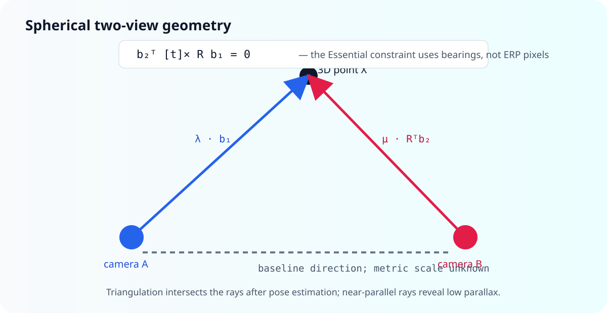

# Tutorial: spherical Essential matrix and two-view triangulation

Two central panoramas observe the same 3D scene from different centers. The
previous tutorial produced matched unit bearings $(\mathbf b_1,\mathbf b_2)$.
This tutorial turns them into relative rotation, translation direction, and
arbitrary-scale 3D points.

`panorai.estimators` is Experimental. It is useful research software with
explicit diagnostics, not yet part of the Stable 3.x contract.



## 1. The spherical epipolar constraint

PanorAi defines relative pose by

$$
\mathbf x_2 = R_{21}\mathbf x_1 + \mathbf t_{21}.
$$

For a correct correspondence, the two bearings and the baseline lie in one
epipolar plane:

$$
\mathbf b_2^T E\mathbf b_1 = 0,
\qquad E=[\mathbf t_{21}]_\times R_{21}.
$$

The input is a pair of 3D unit bearings in the two panorama frames—not a pair
of ERP pixels and not a mixture of pixels from different virtual cameras. This
removes the planar camera matrix from the residual while retaining the same
calibrated Essential geometry.

## 2. Estimate relative pose

```python
from panorai.estimators import RelativePoseOptions, SphericalRelativePoseEstimator

estimator = SphericalRelativePoseEstimator(
    RelativePoseOptions(
        max_angular_error_deg=0.5,
        random_seed=7,
    )
)
pose = estimator.estimate(matches.to_bearing_correspondences())
if pose is None or not pose.quality_report.accepted:
    raise RuntimeError("relative pose was not trustworthy")

R_21 = pose.R
t_21_direction = pose.t
inliers = pose.inlier_mask
```

The estimator builds five-correspondence Essential hypotheses, uses a
spatially weighted but non-filtering RANSAC sampler, scores spherical
tangent-Sampson error, refines rotation and translation direction, and selects
the cheirally valid decomposition. A private C++ kernel may accelerate the
same solver and residuals; Python retains policy, diagnostics, and fallback.

The CI-sized contract check is:

```{literalinclude} ../../scripts/run_documentation_examples.py
:language: python
:start-after: DOCS_RELATIVE_POSE_START = None
:end-before: DOCS_RELATIVE_POSE_END = None
:dedent: 4
```

Always inspect `quality_report.accepted`, `rejection_reasons`, angular
coverage, residual percentiles, cheirality, parallax, stability, and competing
rotation/projective models. A returned pose may intentionally carry a rejected
quality report so experiments can audit it.

## 3. What is PanorAi and what is OpenCV here?

| Stage | PanorAi route | OpenCV route |
| --- | --- | --- |
| local features and descriptor neighbors | PanorAi façade, OpenCV implementation | `SIFT`, `ORB`, `AKAZE`, `BFMatcher`, `FlannBasedMatcher` |
| coordinates entering geometry | global panorama-frame unit bearings | normalized pinhole pixels/bearings chosen by caller |
| Essential hypothesis and robust policy | PanorAi five-point + spherical scoring | `findEssentialMat` for a calibrated planar-camera model |
| pose decomposition | PanorAi cheirality and quality report | `recoverPose` |
| public result | PanorAi `RelativePoseResult` + diagnostics | OpenCV arrays and masks |

Both use calibrated Essential geometry. The PanorAi estimator is not a wrapper
around `cv2.findEssentialMat`, and OpenCV feature extraction does not make the
geometry itself OpenCV-owned. For the established planar APIs, consult
[OpenCV Camera Calibration and 3D Reconstruction](https://docs.opencv.org/4.x/d9/d0c/group__calib3d.html).
The five-point foundation is [Nistér, 2004](https://doi.org/10.1109/TPAMI.2004.17).

## 4. Triangulate one inlier pair

Monocular relative pose observes only the direction of translation. PanorAi
normalizes `pose.t`; choosing that unit baseline fixes an arbitrary scale.
Camera B's center in frame A is

$$
\mathbf C_2^{(1)}=-R_{21}^T\mathbf t_{21},
$$

and B's bearing expressed in frame A is
$\mathbf d_2^{(1)}=R_{21}^T\mathbf b_2$. Solve the closest points on

$$
\lambda\mathbf b_1
\quad\text{and}\quad
\mathbf C_2^{(1)}+\mu\mathbf d_2^{(1)},
$$

then use their midpoint. Positive $\lambda$ and $\mu$ enforce cheirality;
the angle between rays measures triangulation strength.

The following educational NumPy helper is executable, but is not a new public
PanorAi API:

```{literalinclude} ../../scripts/run_documentation_examples.py
:language: python
:start-after: DOCS_TRIANGULATION_START = None
:end-before: DOCS_TRIANGULATION_END = None
:dedent: 4
```

For many correspondences, reject non-inliers first, then reject non-positive
depth, very small ray angle, large closest-ray gap, or excessive angular
reprojection error. Any recovered distance is expressed in the arbitrary unit
baseline unless an external metric observation supplies scale.

## 5. Two images are not yet a reconstruction system

Two-view triangulation cannot resolve weak parallax, repeated texture, dynamic
objects, or metric scale by itself. With three or more panoramas, tracks can
corroborate points across views and global optimization can distribute error.
Continue to {doc}`05_multiview_reconstruction`.
