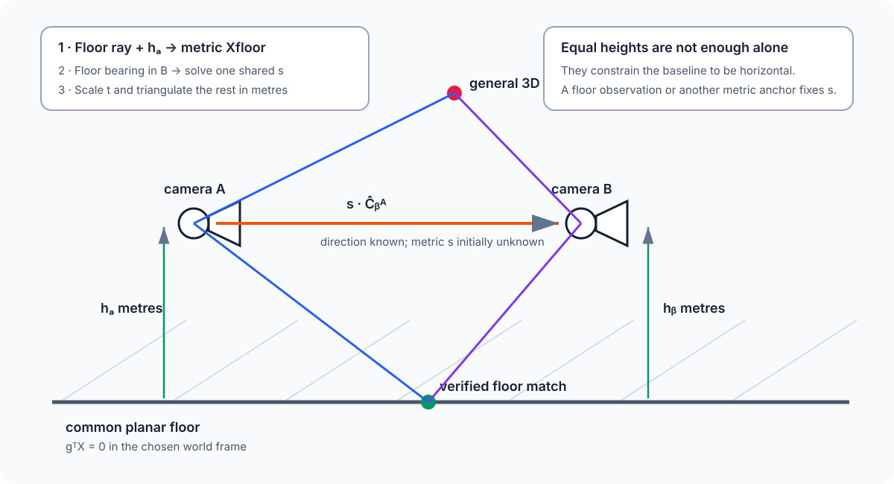

# Tutorial: spherical Essential matrix and two-view triangulation

Two central panoramas observe the same 3D scene from different centers. The
previous tutorial produced matched unit bearings $(\mathbf b_1,\mathbf b_2)$.
This tutorial turns them into relative rotation, translation direction, and
arbitrary-scale 3D points.

See the {ref}`capability-map-two-view` theme in the spherical computer-vision
guide. Once features have become panorama-frame unit bearings, this tutorial
uses no image convolution, gnomonic raster, or backprojection to ERP.

**PanorAi-specific:** five-bearing hypotheses, spherical tangent-Sampson
scoring, panorama-frame pose conventions, cheirality selection and explicit
quality/degeneracy diagnostics.

`panorai.estimators` is Experimental. It is useful research software with
explicit diagnostics, not yet part of the Stable 3.x contract.

For an image-to-pose workflow, construct matches with the frozen feature
profile rather than manually recreating the P74 setup:

```python
from panorai.features import SphericalFeaturePipeline

pipeline = SphericalFeaturePipeline.for_relative_pose()
matches = pipeline.extract_and_match(
    erp_1,
    erp_2,
    validity_mask_a=valid_1,
    validity_mask_b=valid_2,
)
```

This profile includes the adaptive invalid-boundary guard and bilateral
spherical match NMS. Bilateral here means duplicate suppression on both sets
of bearings; it does not mean reciprocal FLANN `cross_check`, which remains
disabled in the validated setup.


## 1. The spherical epipolar constraint

PanorAi defines relative pose by

$$
\mathbf x_2 = R_{21}\mathbf x_1 + \mathbf t_{21}.
$$

For a correct correspondence, the two bearings and the baseline lie in one
epipolar plane:

$$
\mathbf b_2^T E\mathbf b_1 = 0,
\qquad E=[\mathbf t_{21}]_\times R_{21}.
$$

The input is a pair of 3D unit bearings in the two panorama frames—not a pair
of ERP pixels and not a mixture of pixels from different virtual cameras. This
removes the planar camera matrix from the residual while retaining the same
calibrated Essential geometry.

## 2. The five-point kernel used by PanorAi

Five calibrated bearing correspondences give five homogeneous linear
equations in the nine entries of $E$. For correspondence $i$, PanorAi places

$$
\operatorname{vec}(\mathbf b_{2i}\mathbf b_{1i}^{T})^T
$$

in row $i$ of a $5\times9$ design matrix $A$. In the generic case,
$\operatorname{null}(A)$ has dimension four. If
$E_1,\ldots,E_4$ are its basis matrices, every linear solution is

$$
E=x_1E_1+x_2E_2+x_3E_3+x_4E_4.
$$

Most matrices in this nullspace are not Essential matrices. A calibrated
Essential matrix must also satisfy the Demazure cubic constraints

$$
2EE^TE-\operatorname{tr}(EE^T)E=0,
\qquad \det(E)=0.
$$

The implementation substitutes the four-dimensional nullspace into these nine
matrix equations plus the determinant equation, giving ten cubic polynomials.
For each of the four projective charts, one coefficient $x_k$ is fixed to one.
The remaining three variables use the 20-monomial ordering of all terms up to
degree three. Gaussian elimination expresses the ten cubic monomials through
the ten-monomial quotient basis

$$
(x^2,xy,y^2,xz,yz,z^2,x,y,z,1).
$$

Multiplication by $z$ in that quotient ring produces a $10\times10$ action
matrix. Its real eigensolutions recover $(x,y,z)$ and therefore candidate
Essential matrices. PanorAi tries all four charts so a valid solution whose
chosen constant coefficient is zero is not silently discarded. Roots are
checked against the original epipolar and calibrated-E constraints, normalized
to unit Frobenius norm, and deduplicated up to the unavoidable $E\sim-E$
projective sign. If every polynomial chart is singular, a separately named
deterministic nonlinear root search is used as a fallback.

```text
FIVE_POINT(b1[1:5], b2[1:5]):
    A[i] <- vec(b2[i] b1[i]^T)^T
    N <- four-dimensional right nullspace of A
    candidates <- empty
    for constant coefficient k in {1,2,3,4}:
        substitute E = sum_j x[j] N[j], with x[k] = 1
        C <- coefficients of 9 Demazure cubics and det(E)
        if the cubic elimination block of C is well-conditioned:
            Mz <- 10x10 action matrix for multiplication by z
            for each real eigensolution of Mz:
                reconstruct E
                retain E only if the original constraints pass
                deduplicate E and -E
    if candidates is empty:
        run the declared numerical chart fallback
    return candidates
```

This is the calibrated five-point formulation introduced by
[Nistér (2004)](https://doi.org/10.1109/TPAMI.2004.17), implemented here with
an explicit nullspace/action-matrix construction. See also
[Hartley and Zisserman, *Multiple View Geometry*, second edition](https://www.robots.ox.ac.uk/~vgg/hzbook/)
and [Szeliski, *Computer Vision: Algorithms and Applications*, second
edition](https://szeliski.org/Book/). The source implementation is
`panorai/estimators/_five_point.py`.

Hartley image-point normalization is not applied at this stage. Its purpose is
to condition homogeneous pixel coordinates in planar eight-point estimation.
Here the inputs are already calibrated, unit-length 3D bearings. PanorAi
instead validates bearing norms, distributes minimal samples over the sphere,
checks the condition of $A$, tries four coefficient charts, and validates every
root in the original equations.

## 3. Robust estimation around the minimal solver

The five-point kernel can return several algebraically valid roots, and any
five matches can include an outlier. The complete estimator therefore wraps it
in a spatially sampled, locally optimized robust loop:

```text
SPHERICAL_RELATIVE_POSE(all bearing pairs):
    normalize valid bearings to unit length
    repeat the conservative RANSAC trial budget:
        draw five spatially diverse pairs without removing any scoring pair
        for E in FIVE_POINT(the five pairs):
            score tangent-Sampson residuals on every valid pair
            decompose E into (R1,+t), (R1,-t), (R2,+t), (R2,-t)
            choose the translation orientation using parallax-weighted cheirality
            form the provisional inlier set
            locally refine R and unit t with scale-marginal robust weights
            retain the best full-set hypothesis
    refine the winning consensus nonlinearly
    report residual, coverage, parallax, cheirality, stability,
        competing-model, and translation-orientation evidence
    return R and unit t; never claim translation scale
```

The nonlinear variables are three local rotation coordinates and two tangent
coordinates on the unit sphere of translation directions. The objective is a
robustly weighted signed spherical tangent-Sampson residual. It is a
first-order epipolar objective rather than full two-view bundle adjustment;
the quality report therefore remains part of the result contract.

### 3.1 Residual, robust score, and inlier update

For $q_i=\mathbf b_{2i}^{T}E\mathbf b_{1i}$ and the tangent projector
$P_{\mathbf b}=I-\mathbf b\mathbf b^T$, the signed residual used by the
optimizer is

$$
r_i(E)=
\frac{q_i}
{\sqrt{
\lVert P_{\mathbf b_{1i}}E^T\mathbf b_{2i}\rVert^2+
\lVert P_{\mathbf b_{2i}}E\mathbf b_{1i}\rVert^2
}}.
$$

It is approximately an angular error in radians. A pair is provisionally
consistent when $|r_i|\leq\tau$, where `max_angular_error_deg` supplies
$\tau$. Cheirality is tested separately; the public inlier mask is the
intersection of the residual test, explicit input validity, and positive
depth under the selected pose.

PanorAi does not optimize a single hard-threshold count. For scales
$s_k$ linearly distributed from
`scale_marginal_min_fraction * tau` through $\tau$, it computes

$$
\omega_i=
\frac{1}{K}\sum_{k=1}^{K}
\left[\max\!\left(1-\left(\frac{|r_i|}{s_k}\right)^2,0\right)\right]^2.
$$

The default MSAC-first path orders hypotheses lexicographically by:

1. smaller normalized truncated-quadratic MSAC cost;
2. larger inlier count;
3. larger scale-marginal robust score;
4. smaller sum of inlier residuals.

Consequently, RANSAC selects a candidate using all available correspondences,
not only the five rays that generated it. The dynamic trial bound is used only
when the injected sampler satisfies the assumptions of uniform sampling.

`hypothesis_ranking="msac-first"` is the default and minimizes the normalized
truncated-quadratic cost

$$
C_{\mathrm{MSAC}}(E)=
\sum_i\min\left(\frac{r_i(E)^2}{\tau^2},1\right),
$$

before using inlier count and the scale-marginal score as tie breakers. The
`"count-first"` option preserves the former maximum-consensus ordering, and
the scale-marginal-first variant promotes the existing continuous score ahead
of hard inlier count. The estimator and these controls remain Experimental.

### 3.2 Optional all-inlier Essential refit

`nonminimal_refit_max_steps` optionally inserts the non-minimal counterpart of
the normalized eight-point refit after a five-point consensus has been found.
For the current inlier set $\mathcal I$, it constructs

$$
A_i=\operatorname{vec}(\mathbf b_{2i}\mathbf b_{1i}^{T})^T,
\qquad i\in\mathcal I,
$$

takes the last right singular vector of $A$ as a linear matrix estimate, and
projects it onto the calibrated Essential manifold:

$$
E_0=U\operatorname{diag}(\sigma_1,\sigma_2,\sigma_3)V^T,
\qquad
E=U\operatorname{diag}(s,s,0)V^T,
\qquad
s=\frac{\sigma_1+\sigma_2}{2}.
$$

The pose is rescored over every valid correspondence and the operation repeats
until the inlier mask is unchanged, a previous mask recurs, the fit becomes
rank deficient, or the configured cap is reached. The best hypothesis seen
along the bounded trajectory is retained. Fewer than eight inliers skip this
step. Hartley image-point recentering is not applied: the inputs are already
calibrated unit bearings and affine translation of a spherical direction would
change its geometry. The default cap is 100; the loop normally stops much
earlier on a stable or repeated mask. Setting
`nonminimal_refit_max_steps=0` restores the former no-refit path.
`RelativePoseResult.consensus_refit_steps` records the number of linear refits
executed for the returned search path.

#### Real calibrated-pair guidance

For real feature correspondences with adequate support, the tested default is:

```python
RelativePoseOptions()
```

The cap is deliberately loose: refitting stops earlier when the inlier mask
stabilizes or cycles. A metadata-separated Hilti cam0 experiment froze
predictions before opening the LiDAR-derived trajectory. In its 12-pair
held-out phase, this combination reduced median oriented-translation error
from 12.93 to 5.93 degrees, increased strict successes from 4 to 6, and
reduced median rotation error from 1.01 to 0.90 degrees. The preregistered
25% rotation-reduction target was not met, so the API remains Experimental
even though this is now the product default. Across both the development and
held-out phases (30 pairs, descriptive only), median R/t errors fell from
0.785/8.396 to 0.398/5.933 degrees.

To reproduce the former compatibility behavior explicitly:

```python
RelativePoseOptions(
    hypothesis_ranking="count-first",
    nonminimal_refit_max_steps=0,
)
```

One 33-match held-out pair returned no MSAC+refit pose, and translation was
poorly observable for nearly stationary pairs. Always inspect
`quality_report.accepted`; do not turn these observations into a universal
match-count threshold. Full hashes, the OpenCV-to-PanorAi frame conversion,
raw derived measurements and limitations are recorded under
`benchmarks/real_pair_relative_pose/`.

### 3.3 Experimental decoupled rotation and translation

`pose_refinement_method="decoupled"` addresses a weak-parallax failure mode
in which one Essential-matrix score selects an accurate rotation but an
incorrect translation. It is opt-in; `"joint"` preserves the compatibility
path.

The first stage estimates a rotation-only consensus from three-ray Wahba
proposals,

$$
R^*=\arg\min_{R\in SO(3)}\sum_i
\|\mathbf b_{2i}-R\mathbf b_{1i}\|^2,
$$

and ranks proposals by truncated angular MSAC cost. Its threshold is
$2.5\tau$, where $\tau$ is `max_angular_error_deg`. The inlier set is refit
until stable, cyclic, or `decoupled_refit_max_steps` is reached. If fewer than
half of the valid correspondences support a common rotation, the scene is not
treated as far-background dominated and the estimator retains the joint pose.

For an applicable rotation, correspondences not explained by the
rotation-only model form the translation pool. Each ray pair defines plane
normals and a translation-axis proposal,

$$
\mathbf n_i=(R\mathbf b_{1i})\times\mathbf b_{2i},
\qquad
\mathbf t_{ij}\propto\mathbf n_i\times\mathbf n_j.
$$

Every proposal is evaluated over seven residual scales from $0.8\tau$ to
$2.5\tau$. Support is accumulated only when the correspondence is epipolar,
has positive-depth evidence, and has non-negligible parallax. Linear
all-consensus refits use normalized plane normals and repeat to stabilization.

The selected direction must beat every candidate more than 10 degrees away by
the relative score margin configured by
`decoupled_translation_min_score_margin` (default 0.15). Fewer than five
translation-pool rays are reported as unobservable; insufficient margin is
reported as ambiguous. Both cases explicitly reject the two-stage result
instead of presenting an unsupported translation as reliable.

`RelativePoseResult.decoupled_pose_report` records whether the method was
applied, its rotation consensus, translation-pool and consensus sizes, score
margin, iteration counts and fallback/abstention reason.

### 3.4 Nonlinear refinement of rotation and translation direction

Starting from $(R_0,\mathbf t_0)$, the optimizer uses a five-dimensional local
parameter $\delta=(\delta\boldsymbol\omega,\delta\mathbf u)$:

$$
R(\delta)=\exp([\delta\boldsymbol\omega]_\times)R_0,
\qquad
\mathbf t(\delta)=
\frac{\mathbf t_0+B_{\mathbf t_0}\delta\mathbf u}
{\lVert\mathbf t_0+B_{\mathbf t_0}\delta\mathbf u\rVert},
$$

where the two columns of $B_{\mathbf t_0}$ span the tangent plane of the unit
sphere at $\mathbf t_0$. Translation therefore retains unit norm and no metric
scale variable is introduced. With robust weights frozen during one inner
least-squares solve, the minimized objective is

$$
\min_{\delta\in\mathbb R^5}
\sum_{i\in\mathcal I}\omega_i\,
r_i\!\left([\mathbf t(\delta)]_\times R(\delta)\right)^2.
$$

After an inner solve, the pose is rescored on the full valid set and accepted
only if it improves the lexicographic rule above. Robust weights are then
recomputed for the configured number of IRLS steps. Local optimization stops
when a step does not improve the hypothesis or when
`local_optimization_steps` is exhausted; one final refinement is attempted on
the winning consensus. This is a bounded LO-RANSAC/IRLS procedure, not an
unbounded nonlinear loop. When the optional non-minimal refit is enabled, its
separate stabilization loop is bounded by `nonminimal_refit_max_steps`.

The optimizer's internal SciPy scalar `cost` is not exposed as a public field.
The inspectable result instead reports residual median/P90 and the normalized
robust evidence under `quality_report.model_competition.essential`, together
with inlier count, parallax, cheirality, stability, and rejection reasons.

## 4. Estimate relative pose

```python
from panorai.estimators import RelativePoseOptions, SphericalRelativePoseEstimator

estimator = SphericalRelativePoseEstimator(
    RelativePoseOptions(
        max_angular_error_deg=0.5,
        random_seed=7,
    )
)
pose = estimator.estimate(matches.to_bearing_correspondences())
if pose is None or not pose.quality_report.accepted:
    raise RuntimeError("relative pose was not trustworthy")

R_21 = pose.R
t_21_direction = pose.t
inliers = pose.inlier_mask
```

The estimator builds five-correspondence Essential hypotheses, uses a
spatially weighted but non-filtering RANSAC sampler, scores spherical
tangent-Sampson error, refines rotation and translation direction, and selects
the cheirally valid decomposition. The default orientation policy discounts
depth signs supported only by nearly parallel rays; the historical raw-count
policy remains available for reproducible A/B studies:

```python
baseline_options = RelativePoseOptions(
    translation_orientation_method="positive-depth-count"
)
weighted_options = RelativePoseOptions(
    translation_orientation_method="parallax-weighted",
    translation_orientation_parallax_scale_deg=1.0,
)
```

A private C++ kernel may accelerate the
same solver and residuals; Python retains policy, diagnostics, and fallback.

The CI-sized contract check is:

```{literalinclude} ../../scripts/run_documentation_examples.py
:language: python
:start-after: DOCS_RELATIVE_POSE_START = None
:end-before: DOCS_RELATIVE_POSE_END = None
:dedent: 4
```

Always inspect `quality_report.accepted`, `rejection_reasons`, angular
coverage, residual percentiles, cheirality, parallax, stability, and competing
rotation/projective models. A returned pose may intentionally carry a rejected
quality report so experiments can audit it.

## 5. What is PanorAi and what is OpenCV here?

| Stage | PanorAi route | OpenCV route |
| --- | --- | --- |
| local features and descriptor neighbors | PanorAi façade, OpenCV implementation | `SIFT`, `ORB`, `AKAZE`, `BFMatcher`, `FlannBasedMatcher` |
| coordinates entering geometry | global panorama-frame unit bearings | normalized pinhole pixels/bearings chosen by caller |
| Essential hypothesis and robust policy | PanorAi five-point + spherical scoring | `findEssentialMat` for a calibrated planar-camera model |
| pose decomposition | PanorAi cheirality and quality report | `recoverPose` |
| public result | PanorAi `RelativePoseResult` + diagnostics | OpenCV arrays and masks |

Both use calibrated Essential geometry. The PanorAi estimator is not a wrapper
around `cv2.findEssentialMat`, and OpenCV feature extraction does not make the
geometry itself OpenCV-owned. For the established planar APIs, consult
[OpenCV Camera Calibration and 3D Reconstruction](https://docs.opencv.org/4.x/d9/d0c/group__calib3d.html).
The feature backend does not alter the calibrated bearing equations above.

## 6. Resolve the orientation of translation

SVD of an Essential matrix produces two rotations and one translation axis,
which means four pose hypotheses. Epipolar residuals cannot distinguish $t$
from $-t$ because $E$ and $-E$ describe the same epipolar planes. The missing
orientation comes from triangulation and positive radial depth.

Concretely, after projecting $E$ to singular values $(s,s,0)$, let
$E=U\operatorname{diag}(s,s,0)V^T$ and

$$
W=\begin{bmatrix}0&-1&0\\1&0&0\\0&0&1\end{bmatrix}.
$$

The candidates are $R_1=UWV^T$, $R_2=UW^TV^T$, and
$\mathbf t=\pm U_{:,3}$, with determinant corrections ensuring
$R\in SO(3)$. The epipolar equation alone cannot choose among these four
poses; the following cheirality evidence performs that selection.

The historical policy gave every correspondence one binary vote. That is
fragile when $\theta_i$, the angle between the two triangulation rays, is close
to zero: depth uncertainty grows approximately as $1/\sin\theta_i$, so tiny
angular noise can reverse the depth sign of a distant point. The default policy
now uses the bounded weight

$$
w_i=\frac{\sin^2\theta_i}
          {\sin^2\theta_i+\sin^2\theta_0},
\qquad \theta_0=1^\circ,
$$

and selects the decomposition with the largest
$\sum_i w_i\,\mathbf1[\lambda_i>0\land\mu_i>0]$. Each reliable point is still
capped at one vote, while an almost parallel pair contributes almost zero.
If fewer than the five correspondences of a minimal calibrated solution reach
$w_i\geq0.5$, PanorAi keeps the historical axis representative for
compatibility but reports `positive-depth-count-fallback`, forces the
orientation margin to zero, and therefore makes the quality policy abstain.
`translation_orientation` records both weighted support and the historical raw
counts, their separate margins, the scale $\theta_0$, and the selected method.

Weighting cannot create information. Pure rotation, uniformly distant scenes,
or a baseline much smaller than scene depth must still be rejected through
low parallax, competing rotation-only evidence, an ambiguous orientation
margin, or unstable re-estimation. In those cases the axis $\{t,-t\}$ may be
meaningful even when its orientation is not.

The reproducible comparison and raw samples live under
`benchmarks/translation_orientation/`. It includes an isolated decomposition
experiment and an end-to-end synthetic run on identical seeds. It is
development evidence, not a replacement for a new outcome-blind VAL-002
real-image replay.

For an article-style, self-contained description of the estimator, see
`benchmarks/translation_orientation/ALGORITHM_PAPER.md`. The numerical tables,
environment, hashes, and measured comparison remain in
`results/TECHNICAL_REPORT.md`.

## 7. Triangulate one inlier pair

Monocular relative pose observes only the direction of translation. PanorAi
normalizes `pose.t`; choosing that unit baseline fixes an arbitrary scale.
Camera B's center in frame A is

$$
\mathbf C_2^{(1)}=-R_{21}^T\mathbf t_{21},
$$

and B's bearing expressed in frame A is
$\mathbf d_2^{(1)}=R_{21}^T\mathbf b_2$. Solve the closest points on

$$
\lambda\mathbf b_1
\quad\text{and}\quad
\mathbf C_2^{(1)}+\mu\mathbf d_2^{(1)},
$$

then use their midpoint. Positive $\lambda$ and $\mu$ enforce cheirality;
the angle between rays measures triangulation strength.

The following educational NumPy helper is executable, but is not a new public
PanorAi API:

```{literalinclude} ../../scripts/run_documentation_examples.py
:language: python
:start-after: DOCS_TRIANGULATION_START = None
:end-before: DOCS_TRIANGULATION_END = None
:dedent: 4
```

For many correspondences, reject non-inliers first, then reject non-positive
depth, very small ray angle, large closest-ray gap, or excessive angular
reprojection error. Any recovered distance is expressed in the arbitrary unit
baseline unless an external metric observation supplies scale.

## 8. Add the known tripod-height premise

Suppose the user records, for each photo, the distance from the **camera's
optical center** to one common, locally planar floor. Call those positive
heights $h_A$ and $h_B$, in metres. A tripod-leg or tripod-head measurement
must first be corrected by the fixed offset to the optical center.

We also need the floor-up unit vector $\mathbf g_A$ in camera A's frame. It is
`[0, 1, 0]` only when the ERP has been levelled to PanorAi's `+Y`-up frame.
Otherwise obtain it from an IMU, a trusted levelling step, or a separately
estimated floor plane. The floor in camera A coordinates is

$$
\mathbf g_A^T\mathbf X_A+h_A=0.
$$

This premise creates several different observability cases:

| Available evidence | What becomes observable |
| --- | --- |
| spherical matches only | $R_{BA}$ and translation direction; structure has arbitrary scale |
| equal known heights, known up, no identified floor point | horizontal-baseline constraint and a useful consistency check; **scale is still unknown** |
| different known heights and known up | scale from the vertical baseline component, if that component is safely non-zero |
| at least one verified floor match plus a known height | metric baseline scale, including the common equal-height case |
| many floor matches or a floor mask | robust metric scale, metric floor points, and a plane-consistency diagnostic |

The equal-height distinction is essential. If both centers are 1.60 m above the
same floor, then their relative displacement has zero vertical component, but
its horizontal length could still be 0.5 m, 2 m, or 20 m. Height alone does not
choose between them.



## 9. Intersect a floor ray in metres

For a bearing $\mathbf b_A$ known to hit the floor,

$$
\rho_A=-\frac{h_A}{\mathbf g_A^T\mathbf b_A},
\qquad
\mathbf X_A=\rho_A\mathbf b_A.
$$

The denominator must be negative. It approaches zero at the horizon, where a
small angular error creates a very large range error; practical code therefore
rejects a configurable horizon band. This operation already gives a metric 3D
floor point from one levelled central panorama.

The uncertainty in $h_A$ transfers linearly into $\rho_A$. Uncertainty in the
up vector and bearing grows nonlinearly near the horizon, so record the tripod
measurement tolerance and do not present distant floor intersections as exact.

## 10. Recover the two-camera metric scale

Write PanorAi's relative pose as

$$
\mathbf x_B=R_{BA}\mathbf x_A+s\widehat{\mathbf t}_{BA},
$$

where $\widehat{\mathbf t}_{BA}$ is the returned unit translation and $s>0$
is the unknown baseline length. For a verified floor correspondence, first
compute its metric $\mathbf X_A$ from camera A's height. Its prediction in B is

$$
\mathbf q_B+s\widehat{\mathbf t}_{BA},
\qquad \mathbf q_B=R_{BA}\mathbf X_A,
$$

and must be parallel to the measured bearing $\mathbf b_B$. With
$P_B=I-\mathbf b_B\mathbf b_B^T$, the one-dimensional least-squares solution
is

$$
s=-\frac{(P_B\widehat{\mathbf t}_{BA})^T(P_B\mathbf q_B)}
          {\lVert P_B\widehat{\mathbf t}_{BA}\rVert^2}.
$$

Use many spatially distributed floor matches, fit one shared positive $s$ with
a robust loss, and report its dispersion. A match whose denominator is small
does not constrain scale. Floor matches should establish scale **after** a
relative pose supported by non-coplanar scene evidence; using only one plane to
estimate the Essential geometry is a known degeneracy.

The executable educational implementation is intentionally not advertised as
a public PanorAi API:

```{literalinclude} ../../scripts/run_documentation_examples.py
:language: python
:start-after: DOCS_METRIC_FLOOR_START = None
:end-before: DOCS_METRIC_FLOOR_END = None
:dedent: 4
```

There is a second scale cue when $h_A\ne h_B$. Let
$\widehat{\mathbf C}_B^{(A)}=-R_{BA}^T\widehat{\mathbf t}_{BA}$ be camera B's
center direction in A. Then

$$
s=\frac{h_B-h_A}
        {\mathbf g_A^T\widehat{\mathbf C}_B^{(A)}}.
$$

This is ill-conditioned when the cameras are nearly at the same height, so the
floor-correspondence estimate should remain the primary route for normal
tripod captures. The height-difference equation is better used as an
independent check or as evidence in a joint robust fit.

## 11. Recover scene structure in metres

After scale is accepted, replace the unit translation by
$\mathbf t_{BA}^{metric}=s\widehat{\mathbf t}_{BA}$ and triangulate every
non-floor inlier with the same closest-rays or angular-reprojection method.
The resulting points and camera baseline are now in metres.

Use the geometry differently by point type:

- **floor points:** prefer direct ray-plane intersection; it uses the known
  metric plane and avoids unnecessary two-ray noise;
- **general static points:** triangulate with the scaled pose, then check
  positive depth, parallax, ray gap and angular reprojection in both cameras;
- **object contact points:** localize the contact on the floor, then use
  triangulated upper points to estimate metric object height;
- **camera trajectory:** camera B's center in A is
  $-R_{BA}^T\mathbf t_{BA}^{metric}$; validate its vertical coordinate against
  $h_B-h_A$.

Do not silently convert all matches into floor constraints. Shadows, rugs,
stairs, ramps, reflections, moving objects and incorrect semantic masks can
produce a plausible but false scale.

## 12. Acceptance diagnostics for a metric result

A future metric helper should return a result only with diagnostics, including:

- the height, tolerance and optical-center offset used for each image;
- the up vector source and levelling residual;
- number and angular spread of candidate/accepted floor matches;
- per-match scale estimates, robust median, MAD and rejected outliers;
- minimum horizon margin and scale denominator;
- agreement between floor-derived scale and height-difference scale when both
  are conditioned;
- positive-depth rate, triangulation-angle distribution and angular
  reprojection percentiles for non-floor points;
- an explicit failure when the floor is not common/planar or metric scale is
  underconstrained.

This is the recommended route for evolving the library: first keep the
closed-form example and synthetic oracle executable; then add an Experimental
`FloorPlanePrior`/metric-scale result; only promote it after real captures with
measured baselines and varied equal/different tripod heights.

## 13. Relation to standard two-view geometry

The derivation uses the calibrated Essential matrix, noisy-ray triangulation,
and plane-induced homography results developed in Hartley and Zisserman,
*Multiple View Geometry in Computer Vision*, second edition, sections 9.6,
12.1--12.3 and 13.1. For spherical cameras, ERP pixels are first converted to
unit bearings, so the geometry already operates in calibrated normalized
coordinates. The plane-induced bearing map is the same
$H=R-\mathbf t\mathbf n^T/d$ relation, followed by direction normalization.

## 14. Two images are not yet a reconstruction system

Two-view triangulation cannot resolve weak parallax, repeated texture, dynamic
objects, a misidentified floor, or metric scale without a valid external
anchor. With three or more panoramas, tracks can corroborate points across
views and global optimization can distribute error. Known heights can then be
added as metric plane/center residuals instead of rescaling each pair
independently.
Continue to {doc}`05_multiview_reconstruction`.
