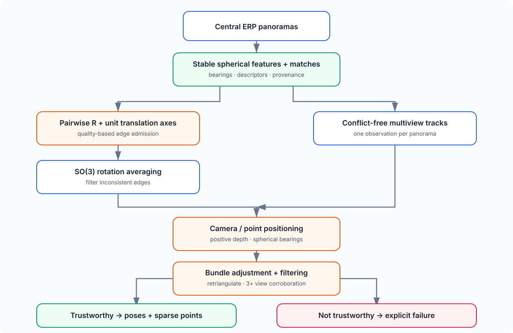

# Tutorial: from matched panoramas to a multiview reconstruction

Two views estimate one relative pose. Three or more overlapping central
panoramas let observations form tracks, rotations become globally consistent,
and camera centers and points can be optimized together.

`panorai.reconstruction` is an Experimental, arbitrary-scale mapper. Its
failure result is part of the design: insufficient or inconsistent geometry
must not become fabricated camera poses.

## 1. The reconstruction graph



The public camera convention is

$$
\mathbf x_i = R_i(\mathbf X-\mathbf C_i),
$$

where $R_i$ is `rotation_world_to_panorama` and $\mathbf C_i$ is
`center_world`. The reference camera fixes the global frame. A depth/scale
anchor fixes only the numerical gauge; it does not create metric scale.

## 2. Build pairwise evidence with stable IDs

```python
from panorai.features import SphericalFeaturePipeline

pipeline = SphericalFeaturePipeline.from_preset(
    "sift-flann",
    face_sampler="icosahedron",
    face_fov_deg=80.0,
    face_shape_hw=(512, 512),
)
panoramas = {"p0": pano0, "p1": pano1, "p2": pano2}
pairs = (("p0", "p1"), ("p1", "p2"), ("p0", "p2"))
pairwise_matches = [
    pipeline.extract_and_match(
        panoramas[a], panoramas[b], panorama_id_a=a, panorama_id_b=b
    )
    for a, b in pairs
]
```

IDs are not decoration: they let pairwise observations of the same panorama
join into conflict-free tracks. In production, select pairs using capture
order, retrieval, or known overlap rather than constructing every possible
pair blindly.

## 3. Run the PanorAi mapper

```python
from panorai.reconstruction import SphericalGlobalMapper

mapper = SphericalGlobalMapper()
result = mapper.reconstruct(matches=pairwise_matches)
if not result.success:
    raise RuntimeError(result.failure_reasons)

pose_p1 = result.pose("p1")
R_world_to_p1 = pose_p1.R
center_p1_world = pose_p1.center
points_world = result.points_xyz
assert result.scale == "arbitrary"
```

If pairwise estimation is expensive and should be reused:

```python
edges = mapper.estimate_pairwise(pairwise_matches)
result = mapper.reconstruct(edges=edges)
```

Exactly one of `matches=` and `edges=` is accepted. The executable
insufficient-geometry contract is:

```{literalinclude} ../../scripts/run_documentation_examples.py
:language: python
:start-after: DOCS_RECONSTRUCTION_START = None
:end-before: DOCS_RECONSTRUCTION_END = None
:dedent: 4
```

## 4. Understand the stages

1. **Edge admission.** By default, only pairwise poses accepted by their
   quality report enter the graph.
2. **Rotation averaging.** Relative rotations are reconciled on $SO(3)$; bad
   edges can be filtered before translation is trusted.
3. **Tracks.** Descriptor matches are unioned only when a component contains at
   most one observation from each panorama.
4. **Positioning and triangulation.** Camera centers and point depths are
   initialized from spherical bearings and translation axes with positive-depth
   constraints.
5. **Spherical bundle adjustment.** The residual is the two-dimensional
   tangent-plane log map between measured and predicted bearings.
6. **Filtering and retriangulation.** Weak tracks and angular outliers are
   removed, then geometry is solved again.
7. **Multiview corroboration.** An independent solve using tracks observed in
   at least three panoramas must agree with the primary camera-center
   directions.

A first-party C++ kernel can evaluate bundle residuals and analytic Jacobian
blocks. NumPy/SciPy still own the readable reference, graph policy, robust
optimization, filtering, gauges, provenance, and result construction.

## 5. Add per-photo tripod heights as one global metric prior

Do not estimate and apply an independent scale to every pair. That produces
incompatible loops. Instead, first build one arbitrary-scale connected map,
then introduce a shared floor plane and one height $h_i$ for every camera
center $\mathbf C_i$:

$$
\mathbf g^T\mathbf C_i=h_i,
\qquad
\mathbf g^T\mathbf X_j=0\quad\text{for verified floor tracks }j.
$$

The floor tracks connect the metric plane to the visual reconstruction. If all
heights are equal but no observation is known to lie on the floor, the camera
centers are merely constrained to one horizontal plane and the horizontal map
scale remains free. With verified floor tracks, one shared similarity scale can
be estimated robustly and then refined together with cameras and points.

For a practical first implementation:

1. estimate rotations, translation directions and tracks exactly as today;
2. estimate a common up direction from trusted levelling/IMU metadata;
3. label floor observations and intersect well-conditioned rays using their
   camera's measured optical-center height;
4. fit one global positive scale from all floor observations, rejecting
   near-horizon and inconsistent samples;
5. rerun spherical bundle adjustment with camera-height and floor-plane
   residuals, keeping measurement tolerances explicit;
6. report both metric residuals and the existing angular reprojection metrics.

This metric extension is not currently a public `SphericalGlobalMapper` option.
The existing mapper remains Experimental and correctly reports
`result.scale == "arbitrary"`.

## 6. Inspect before consuming the map

At minimum inspect:

- pairwise accepted/rejected edges and all rejection reasons;
- rotation- and translation-filtered edges and translation sign flips;
- active tracks per panorama and track lengths;
- positive-depth and triangulation-angle support;
- angular reprojection median/P90/P95;
- multiview corroboration status and disagreement;
- excluded panoramas, gauges, backend, and `failure_reasons`.

The current promotion decision is negative. In the latest recorded 423-set
metadata-blind census, the conservative mapper produced 131 complete maps and
all 131 met the strict accuracy criterion, but coverage remained only 31.0%.
That is strong selective precision and insufficient unattended reliability.
The surface therefore remains Experimental and applications need explicit
failure/recapture behavior.

## 7. PanorAi mapper or PyCOLMAP/COLMAP?

| Need | Recommended route |
| --- | --- |
| inspect PanorAi-owned spherical equations and diagnostics | `SphericalGlobalMapper` |
| use a mature general SfM lifecycle, image registration, and established tooling | build a virtual rig and export to PyCOLMAP/COLMAP |
| compare methods | freeze the same features/matches and record each system's frames and gauges |

The PanorAi mapper does not call OpenCV, PyCOLMAP, or COLMAP for geometry. The
optional exporter writes known gnomonic cameras, features, and matches; COLMAP
then owns registration, triangulation, bundle adjustment, and its own result
conventions. Export remains Experimental.

See {doc}`../how_to/spherical_reconstruction` for the concise recipe and
{doc}`../reference/reconstruction` for every option, frame, diagnostic, native
backend, and known limitation.
