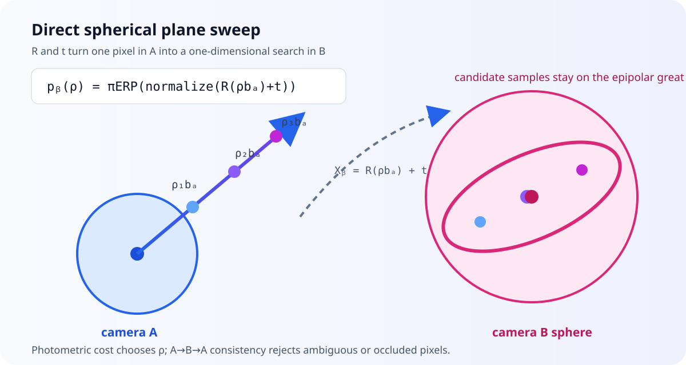
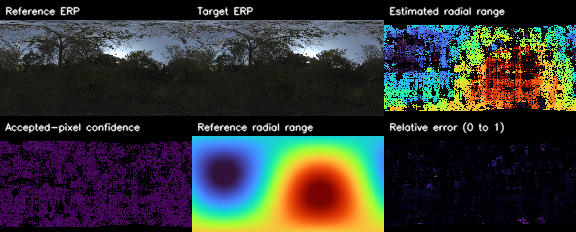

# Tutorial: dense stereo from two spherical images

`panorai.stereo` estimates a radial-range map from two central
equirectangular panoramas (ERPs) when their relative pose is already known.
The API is **Experimental**: it is suitable for controlled evaluation and
research integration, but real-scene accuracy and coverage are not yet part of
PanorAi's Stable contract.

This tutorial assumes that you already have

- two central ERPs with the same `(height, width)`;
- a rotation $R_{BA}$ and translation $\mathbf t_{BA}$ satisfying
  $\mathbf X_B=R_{BA}\mathbf X_A+\mathbf t_{BA}$;
- a useful near/far range interval for the scene; and
- metric translation if the output must be expressed in metres.

If your pose contains only a unit translation direction, read
[the two-view tutorial](04_two_view_geometry.md) before continuing. The
detailed objective and derivation are in
[Direct spherical dense stereo: geometry and optimization](../explanation/spherical_dense_stereo.md).



## 1. Check the pose convention

PanorAi maps a point from camera A to camera B with

$$
\mathbf X_B=R_{BA}\mathbf X_A+\mathbf t_{BA}.
$$

The center of camera B, expressed in camera A, is therefore

$$
\mathbf C_B^{(A)}=-R_{BA}^{T}\mathbf t_{BA}.
$$

This sign is easy to reverse accidentally. For example, when camera B is
0.35 m to the right of A and the cameras have equal orientation,
$\mathbf C_B^{(A)}=[0.35,0,0]^T$ but
$\mathbf t_{BA}=[-0.35,0,0]^T$.

The magnitude of $\mathbf t_{BA}$ fixes the output scale:

| Translation supplied to the estimator | Meaning of `result.range` |
| --- | --- |
| metres | radial range in metres |
| centimetres | radial range in centimetres |
| unit translation direction | range in arbitrary baseline units |

Dense stereo cannot recover the missing baseline magnitude from two central
images alone. Known tripod height helps only when it produces an observable
metric constraint, as described in the two-view tutorial.

## 2. Load same-shape central ERPs

`uint8` RGB and grayscale images are accepted directly. Floating inputs must
be finite and in $[0,1]$.

```python
import numpy as np
from PIL import Image

erp_a = np.asarray(Image.open("erp-a.png").convert("RGB"))
erp_b = np.asarray(Image.open("erp-b.png").convert("RGB"))

if erp_a.shape != erp_b.shape:
    raise ValueError("dense stereo requires equal ERP shapes")

# Replace these values with the pose from your calibrated pipeline.
R_b_from_a = np.eye(3, dtype=np.float64)
t_b_from_a_m = np.array([-0.35, 0.0, 0.05], dtype=np.float64)
```

Both images must use PanorAi's canonical central-camera frame. Resizing,
cropping, changing the longitude origin, or levelling only one ERP invalidates
the supplied pose unless the corresponding geometric transformation is also
applied to the camera model.

## 3. Choose the search interval before thresholds

The estimator samples uniformly in inverse range. Start by choosing the
narrowest interval that still contains the expected surfaces:

```python
from panorai.stereo import SphericalStereoOptions

options = SphericalStereoOptions(
    min_range=0.5,
    max_range=15.0,
    num_hypotheses=128,
    window_size=7,
    bidirectional_consistency=True,
    filter_backend="auto",
    pyramid_levels=3,
    refinement_hypotheses=9,
    refinement_radius_steps=4.0,
)
```

The matching window is angular: local means, variances, east/north gradients,
and cost aggregation are evaluated in each ERP ray's tangent plane. ``auto``
uses PanorAi's C++ spherical-convolution kernel for compatible NumPy arrays and
falls back to the NumPy reference. Use ``native`` to require C++ or ``numpy``
for explicit reference validation. This stage does not project to gnomonic
images and back.

For $D$ hypotheses, the inverse-range step is

$$
\Delta q =
\frac{1/\rho_{\min}-1/\rho_{\max}}{D-1},
\qquad q=\frac{1}{\rho}.
$$

The approximate radial spacing around range $\rho$ is
$\Delta\rho\approx\rho^2\Delta q$. Increasing `max_range` without increasing
`num_hypotheses` therefore makes distant geometry increasingly coarse.

`pyramid_levels=1` runs that full global lattice at the input resolution.
Values above one enable PanorAi's adaptive coarse-to-fine search. For an
8192x4096 ERP, `pyramid_levels=3` runs the broad `num_hypotheses` sweep at
2048x1024, then refines a local inverse-range interval with
`refinement_hypotheses` labels at 4096x2048 and 8192x4096. Low-confidence and
boundary regions receive wider intervals; every local interval is shifted
inside the global near/far bounds so clipped duplicate labels cannot create a
false optimum.

This pyramid changes only the dense range search. The supplied $R,t$ is never
re-estimated or downsampled. If pose comes from PanorAi feature matching, run
that pipeline at the resolution and gnomonic face size required by the scene,
then pass its high-resolution pose to dense stereo.

Do not begin by weakening confidence or consistency thresholds. First verify
pose convention and scale, then the search interval, then image alignment and
photometric compatibility.

## 4. Estimate radial range

```python
from panorai.stereo import estimate_spherical_range

result = estimate_spherical_range(
    erp_a,
    erp_b,
    R_b_from_a,
    t_b_from_a_m,
    options=options,
)

range_m = result.range
valid = result.validity_mask

print(result.describe())
print(f"accepted coverage: {valid.mean():.1%}")
```

The same public contract is exercised by the installed-documentation smoke
runner:

```{literalinclude} ../../scripts/run_documentation_examples.py
:language: python
:start-after: DOCS_STEREO_START = None
:end-before: DOCS_STEREO_END = None
:dedent: 4
```

The output quantity is **radial range**, not pinhole Z-depth:

$$
\mathbf X_A(p)=\rho(p)\,\mathbf b_A(p).
$$

`result.range` contains `NaN` at rejected pixels. Always transport
`result.validity_mask` with it instead of filling holes silently.

## 5. Inspect the result before using it

```python
from panorai.stereo import (
    colorize_spherical_range,
    render_spherical_stereo_result,
)

range_rgb = colorize_spherical_range(range_m, valid)
Image.fromarray(range_rgb).save("radial-range.png")

diagnostic_rgb = render_spherical_stereo_result(
    erp_a,
    result,
    target_erp=erp_b,
    # reference_range=reference_range_m,  # optional ground truth
)
Image.fromarray(diagnostic_rgb).save("stereo-diagnostic.png")
```

The helpers return RGB `uint8` arrays and do not modify the numeric result.
Confidence is the normalized separation between the best and second-best
costs. It is useful for ranking ambiguity, but it is not a calibrated
probability.

The figure below uses a real CC0 Poly Haven panorama as scene texture. The
second camera and reference range are rendered from analytic geometry so the
visual comparison has exact ground truth without redistributing an evaluation
dataset.



## 6. Convert accepted range to 3D points

```python
from panorai.geometry import erp_pixels_to_rays

height, width = range_m.shape
y, x = np.indices((height, width), dtype=np.float32)
pixels_xy = np.stack((x, y), axis=-1)
rays_a = erp_pixels_to_rays(pixels_xy, (height, width))

points_a_m = rays_a[valid] * range_m[valid, None]
```

The points are expressed in camera A's frame. Transform them to B with the
same $R_{BA},\mathbf t_{BA}$ supplied to stereo, or into a world frame using
the pose convention of your reconstruction.

## 7. Understand every result field

| Field | Shape/type | Meaning |
| --- | --- | --- |
| `range` | `HW float32` | refined radial range; invalid entries are `NaN` |
| `validity_mask` | `HW bool` | pixels accepted by all enabled checks |
| `confidence` | `HW float32` | best-versus-second-best cost separation |
| `matching_cost` | `HW float32` | winning aggregated appearance cost |
| `hypothesis_index` | `HW int32` | winning inverse-range lattice index |
| `inverse_range_hypotheses` | `D float32` | increasing $1/\rho$ lattice |
| `hypothesis_mode` | string | absolute global lattice or normalized local offsets |
| `inverse_range_center` | optional `HW float32` | adaptive per-pixel interval center |
| `inverse_range_radius` | optional `HW float32` | adaptive per-pixel interval half-width |

Result arrays are read-only. This prevents a visualization or post-processing
step from silently changing the evidence associated with the result.

## 8. Tune in a controlled order

1. **Pose and frame:** verify $R,t$, their direction, translation sign, and
   longitude convention using a few known 3D points.
2. **Metric scale:** confirm the baseline independently. A unit translation
   produces baseline units, not metres.
3. **Range bounds:** inspect how many winners land on the first or last
   hypothesis. Boundary winners are rejected because the true surface may lie
   outside the interval.
4. **Hypothesis density:** increase `num_hypotheses` or narrow the interval
   before relaxing validity.
5. **Adaptive schedule:** for large ERPs, compare `pyramid_levels=3` with the
   global `pyramid_levels=1` baseline. More levels are faster but propagate a
   weaker coarse prior; increase `refinement_radius_steps` when winners often
   hit a local boundary.
6. **Angular appearance window:** increase `window_size` for weak texture, but
   expect more bleeding across depth boundaries. The support remains
   angularly consistent at every latitude.
7. **Acceptance:** adjust `min_texture_std`, `min_confidence`, and
   `max_matching_cost` only while reporting accuracy and coverage together.
8. **Consistency:** tune absolute tolerance in the translation unit and
   relative tolerance as a range fraction.

Runtime and peak memory are proportional to $DHW$. Bidirectional consistency
runs the one-way estimator twice. Adaptive mode replaces the full-resolution
$D$ volume with one coarse $D$ volume plus smaller local-refinement volumes;
the final result is still evaluated at the input ERP resolution.

## 9. Diagnose common failure modes

| Symptom | Likely cause | First check |
| --- | --- | --- |
| depth has the right shape but wrong scale | unit translation direction was used | baseline magnitude and unit |
| almost all pixels choose near/far bound | interval or translation sign is wrong | pose convention and range bounds |
| repeated pipes produce confident false surfaces | ambiguous local appearance | confidence, Census/ZNCC experiment, multiscale evidence |
| textureless walls disappear | no discriminative photometric evidence | texture threshold; do not invent depth |
| poles are unstable | ERP oversampling and compressed longitude | pole margin |
| seam becomes a vertical hole | upstream resampling did not wrap longitude | canonical ERP generation |
| moving objects split or vanish | static-scene assumption is violated | mask dynamics before stereo |
| consistency leaves very little coverage | occlusion, ambiguity, or pose error | compare one-way and bidirectional results |

## 10. Current real-scene evidence

In the study metrics, `coverage` divides accepted depth pixels by eligible
scanner-reference pixels (finite, inside the search interval, and outside the
pole margin). `valid_fraction_of_full_erp` divides by every ERP pixel. The
denominator must be named when comparing runs.

The original ten-pair Matterport360/Stanford2D3D development set gave
pixel-weighted AbsRel 0.180 with the reference baseline magnitude. That set was
post-hoc and is not a promotion-quality claim.

A harder outcome-blind industrial-scanner baseline selected ten disjoint,
high-overlap pairs at 512×1024. Even with scanner reference pose, the median
per-case results were:

- AbsRel 0.914;
- RMSE 3.80 m;
- median absolute error 1.85 m;
- $\delta<1.25$ of 0.109; and
- accepted one-way coverage 0.639.

The study treated scanner translation as metres, consistent with the corpus
baseline fields; formal unit provenance is still marked pending in its raw
report.

Bidirectional consistency reduced median coverage to 0.0165. Separately, none
of the ten visual-pose (RGB-only) five-point/RANSAC estimates met the strict
$5^\circ$ rotation and $10^\circ$ translation-direction criterion. These are
negative but useful results: repetitive industrial appearance is not solved
by the current local photometric cost, and C++ acceleration alone would only
make the same failure faster.

A subsequent native-resolution smoke comparison used one industrial pair at
8192×4096 and the scanner reference pose. The global 96-hypothesis sweep took
273.1 s (AbsRel 0.878, coverage 0.385). A three-level adaptive run started its
wide sweep at 2048×1024 and refined at 4096×2048 and 8192×4096; it took 64.0 s
(AbsRel 0.807, coverage 0.342). This is a preliminary single-pair result, not a
replacement for the disjoint ten-pair study, but it demonstrates the intended
4.3x compute/coverage trade-off at the actual industrial delivery resolution.

The next accuracy experiments are Census/ZNCC or learned descriptors,
explicit occlusion reasoning, and calibration of adaptive confidence. Read the
[method article](../explanation/spherical_dense_stereo.md) for the exact
objective, refinement, rejection policy, complexity, and promotion gates.
