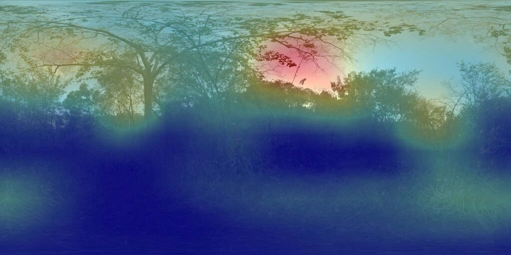
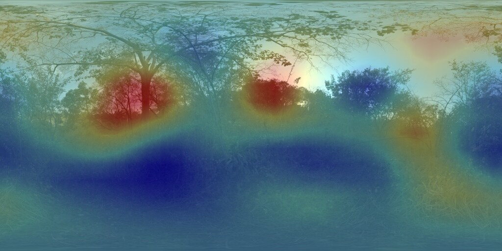
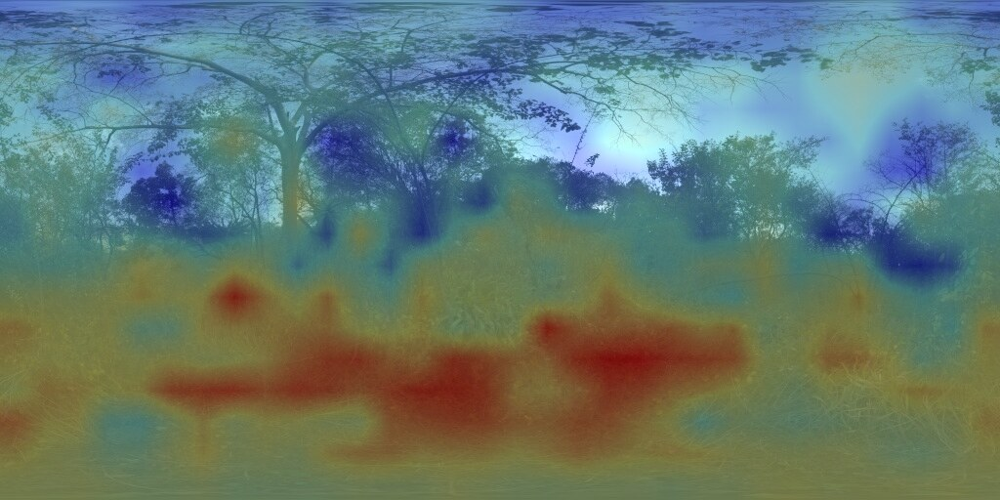
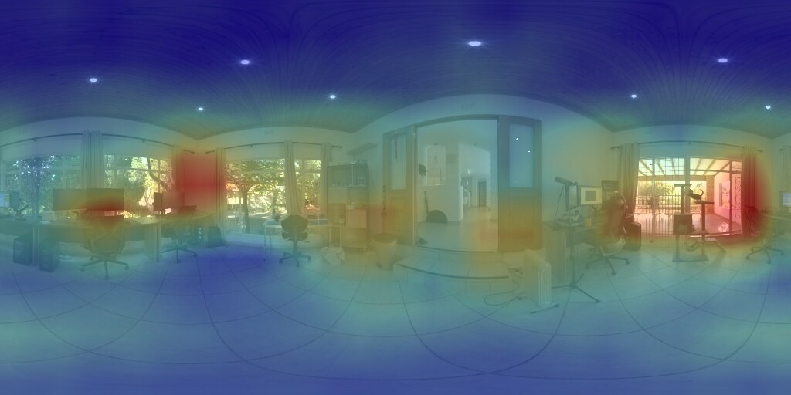
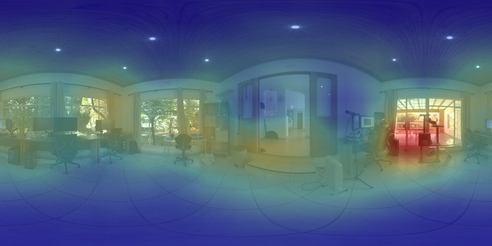
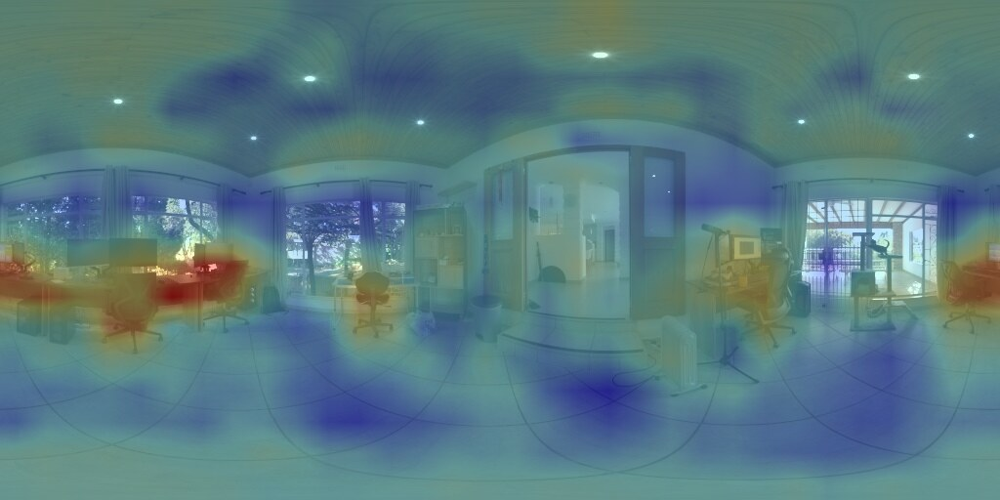

# Tutorial: pretrained spherical FCN and class-activation maps

This tutorial ports three Torchvision ImageNet classifiers to differentiable
spherical inference while preserving their learned parameters. The API is
**Experimental** and opt-in under `panorai.experimental.deep_learning`; it is
not part of the stable projection contract.

See the {ref}`capability-map-image-processing` theme for the distinction
between sphere-native sampling and planar models evaluated through projected
views.

**PanorAi-specific:** full spatial-layer inventory, exact parameter reuse,
longitude-wrapped tangent sampling, spherical-area score pooling, checkpoint
provenance, and explicit separation between CAM localization and semantic
segmentation.

## Choose the semantic source by the question

The experiment exposes three semantic sources, but they answer different
questions:

| source | label space | question answered | principal output |
| --- | --- | --- | --- |
| ImageNet-1K | 1,000 fixed, mostly object-oriented labels | Can a conventional classifier be converted exactly to planar FCN form and then use the same frozen weights with spherical sampling? Where is the evidence for a predeclared ImageNet class? | classical dense class-evidence/CAM channels |
| Places365 | 365 fixed scene and place labels | Does the portability strategy generalize from objects to environments and scene semantics? Which directions support labels such as forest, corridor, or bedroom? | dense scene-evidence channels |
| OpenCLIP | text prompts supplied at inference | Can we query a concept missing from both fixed taxonomies without retraining? Which direction is locally most similar to the prompt? | dense local image-text similarity channels |

This gives each family a specific role in the dissertation component:

- **ImageNet is the controlled baseline.** AlexNet, VGG16, and ResNet18 share
  the same 1,000-label ontology. They enable architectural comparison, exact
  planar classifier/FCN parity, and a frozen mapping to Stanford semantic
  masks for the small set of genuinely aligned object labels.
- **Places365 is the scene-domain control.** Its fixed 365-way classifier
  tests whether success is tied to ImageNet object categories and makes
  environment-level directions observable without changing the protocol.
- **OpenCLIP is the vocabulary-expansion probe.** The caller chooses prompts,
  so it can examine objects, materials, activities, or scenes absent from the
  closed vocabularies. Repeated prompt templates and negative/competing prompts
  are needed because wording is part of the measurement.

Do not compare raw scores across these families. ImageNet and Places365 have
different learned classifier heads and calibrations; OpenCLIP optimizes an
image-text contrastive objective. Compare peak directions, solid-angle map
statistics, rotation consistency, runtime, or performance against a common
independent annotation instead.

The claim is deliberately limited: frozen planar weights can generate useful
directional semantic evidence after the spatial layers are ported to the
sphere. None of the three outputs is a calibrated pixel segmentation mask.
For OpenCLIP in particular, the dense adapter reuses its learned value/output
projections pointwise but omits global query/key attention and the fixed
positional embedding. It therefore does not reproduce the original global
CLIP classifier score.

All classifier loaders and adapters are exposed only from
`panorai.experimental.deep_learning`—the module name includes the underscore.
They are not re-exported from `panorai` or `panorai.experimental`. The namespace
reuses differentiable spherical sampling operators implemented in
`panorai.image_processing.torch`, but the model-portability surface and its
stability classification remain Experimental.

## Visual comparison on two panoramas

The following outputs use tracked CC0 outdoor and indoor ERPs at their native
`512×1024` resolution. All three backbones generated a `16×32` dense lattice.
The overlays interpolate that lattice back to the ERP for inspection;
interpolation does not create additional spatial evidence. Red means larger
min-max-normalized evidence within that channel, not per-pixel probability.

### Outdoor: Nature Reserve Forest

### ImageNet ResNet18: fixed class `lakeside`



This is a classical fixed ImageNet class channel. It demonstrates the
object-oriented closed-vocabulary path and ranked third on this panorama; the
map is weak evidence, not a claim that the panorama contains a labelled lake.

### Places365 ResNet18: fixed scene `forest/broadleaf`



The Places365 scene channel concentrates on several vegetation masses. This is
the closed-vocabulary scene extension, using the same frozen-weight spherical
portability strategy.

### OpenCLIP RN50: prompt `a photo of a path`



The prompt-defined channel shifts its stronger responses toward the ground.
It is local image-text similarity from the dense reinterpretation, not the
original global CLIP score and not a segmentation mask.

### Indoor: Poly Haven Studio

| ImageNet ResNet18 — `studio couch` | Places365 ResNet18 — `lobby` | OpenCLIP RN50 — `a photo of a desk` |
| --- | --- | --- |
|  |  |  |

This second scene prevents the visual evidence from being a single-panorama
anecdote. It also reveals the semantic roles more clearly. The present
ImageNet class `studio couch` ranked 28th, so its map is a requested fixed
channel rather than a top prediction. Places365 ranked `lobby` first. OpenCLIP
ranked `a photo of a desk` third among seven declared prompts. These ranks are
global summaries; the displayed colors still represent independently
normalized directional evidence and are not comparable as probabilities.

## 1. Install the optional stack

Install Torch and Torchvision only when this experiment is required:

```bash
pip install "panorai[deep-learning]"
```

The ordinary `panorai`, `panorai.geometry`, and
`panorai.experimental` imports remain independent of Torchvision. Importing
the explicit deep-learning submodule requires Torch, while Torchvision is
loaded lazily when a pretrained model is requested.

Supported official `DEFAULT` weights are:

| architecture | perspective crop | FCN head conversion |
| --- | ---: | --- |
| AlexNet | `224×224` | first linear layer → valid `6×6` convolution |
| VGG16 | `224×224` | first linear layer → valid `7×7` convolution |
| ResNet18 | `224×224` | final linear layer → `1×1` convolution |

## 2. Download automatically or prefetch

No checkpoint is stored in the repository or PanorAi distribution. The first
inference request downloads a missing checkpoint through Torchvision into the
user-controlled Torch cache. PanorAi verifies the URL hash prefix and records
the complete SHA-256, path, size, URL, and whether the file was already cached.

Prefetch all three models before an offline run:

```bash
python benchmarks/spherical_fcn_cam/download_models.py
```

Or prefetch a subset:

```bash
python benchmarks/spherical_fcn_cam/download_models.py \
  --model resnet18 --model vgg16
```

The command emits JSON with schema
`panorai-pretrained-imagenet-cache/v1`. A cached file whose SHA-256 no longer
matches the hash prefix in the official URL is rejected rather than silently
used or deleted. Remove or replace such a file deliberately before retrying.

The same behavior is available from Python through
`prefetch_imagenet_weights()` and `load_pretrained_imagenet_model()`. These
helpers contact the network only when their explicit model-loading operation
finds a missing checkpoint.

```python
from panorai.experimental.deep_learning import prefetch_imagenet_weights

records = prefetch_imagenet_weights(("alexnet", "vgg16", "resnet18"))
for record in records:
    print(record.model_name, record.cache_path, record.sha256)
```

Checkpoint licenses and terms remain those of their upstream publishers. The
prefetch command is acquisition by the user, not redistribution by PanorAi.

## 3. What is ported

For AlexNet and VGG16, `ImageNetFCN` reshapes each linear classifier parameter
into the corresponding convolution parameter. For ResNet18, the final linear
classifier becomes a `1×1` convolution and the global average is moved after
dense prediction.

`port_module_with_report()` then recursively performs:

```text
Conv2d    → SphericalConv2d
MaxPool2d → SphericalMaxPool2d
```

Every convolution reuses the exact source `Parameter` objects. Batch
normalization, activation, dropout, and residual addition remain unchanged
because they do not define a planar spatial neighbourhood. Final class scores
use a cosine-latitude solid-angle average instead of ordinary pixel averaging.

At each output ray, kernel offsets lie in its local tangent basis, are carried
to the unit sphere with the exponential map, and sample the ERP bilinearly with
longitude wrapping. This operation is differentiable with respect to inputs
and weights.

## 4. Run the tracked CC0 example

The repository includes a checksum-pinned, CC0 Poly Haven panorama for the
documentation examples. Run one model per process:

```bash
python benchmarks/spherical_fcn_cam/run_experiment.py \
  --model resnet18 \
  --output-dir /private/tmp/panorai-spherical-fcn-cam \
  --preserve-input-resolution
```

Repeat with `alexnet` and `vgg16`. A missing model is downloaded automatically.
Each model directory contains the input ERP, top-class CAM overlays, a compact
16-bit grayscale heatmap for each top class, and a `result.json` containing:

- checkpoint URL, cache path, size, SHA-256 and cache status;
- canonical planar FCN parity error;
- input, feature and dense-logit shapes;
- every replaced layer and parameter-identity result;
- class scores and solid-angle CAM concentration;
- runtime, peak process memory, versions and input provenance.

The grayscale heatmap, rather than the colored overlay, is the input to any
subsequent localization evaluator. This prevents display colors from leaking
the experimenter's visualization choices into the oracle.

For a custom ERP, provenance is mandatory:

```bash
python benchmarks/spherical_fcn_cam/run_experiment.py \
  --model resnet18 \
  --input /path/to/panorama.jpg \
  --input-license "dataset name and applicable terms" \
  --output-dir /private/tmp/my-spherical-cam \
  --preserve-input-resolution
```

The input must be a `2:1` ERP. Generated outputs should remain outside the
repository unless their redistribution rights and provenance are separately
established.

## 5. Why the dense map is smaller than the panorama

Fully convolutional means that the network accepts spatial dimensions other
than its training crop. It does **not** mean that the output stride becomes one
pixel.

ResNet18 reduces the input by a total factor of 32. Therefore:

```text
1024×2048 ERP → 32×64 feature grid → 32×64 class grid
2048×4096 ERP → 64×128 feature grid → 64×128 class grid
```

VGG16 also produces a stride-32 terminal grid, followed by the valid `7×7`
convolution converted from `fc6`:

```text
1024×2048 ERP → 32×64 features → 26×58 class logits
2048×4096 ERP → 64×128 features → 58×122 class logits
```

CAM overlays are interpolated back to the ERP only for display. That
interpolation does not add spatial evidence. A denser intrinsic map requires a
smaller output stride, skip features, or repeated tangent-view evaluation.

## 6. Resolution is not angular scale

A `3×3` kernel on a `2048×4096` ERP covers a smaller angular neighbourhood
than the same raster kernel on a `224×448` ERP. Running at native resolution
therefore changes both the number of output positions and the angular context
seen by every layer.

This does not imply that spherical weight transfer requires training. It means
that a controlled experiment must declare:

- ERP resolution;
- angular spacing of kernel taps;
- effective receptive field;
- output stride;
- perspective FoV used by any tangent-view reference.

An explicit angular-scale policy or spherical scale pyramid should be tested
before attributing scale differences to a need for fine-tuning.

## 7. Interpret a CAM correctly

The dense class channel is evidence used by an ImageNet classifier. A bright
region means that it contributed strongly to a class score; it is not a
calibrated per-pixel probability and does not necessarily cover the complete
object.

Use **spherical class-activation map** rather than unqualified “saliency map.”
In 360° literature, saliency often denotes predicted human gaze or fixation,
which is a different task. ImageNet labels also do not directly match all
Matterport3D or Stanford2D3D semantic classes.

## 8. Three controlled comparison scenarios

The current implementation supplies scenario 1. The proposed study keeps the
same pretrained weights and compares:

1. **Original spherical FCN, output stride 32.** Preserve the classification
   topology and measure its native dense lattice.
2. **Dilated spherical FCN, output stride 8.** Remove late strides and replace
   them with spherical dilation so the receptive field is retained while the
   class lattice becomes denser.
3. **Independent gnomonic oracle.** Evaluate the unmodified perspective model
   on `224×224` tangent views at declared centers and FoV, then reproject its
   responses to the sphere.

A conventional planar FCN applied directly to the ERP is the
distortion-unaware control. Compare maps before visualization upsampling using
solid-angle-weighted error, correlation, top-fraction IoU, peak geodesic
distance, class-rank agreement, rotation-equivariance error, runtime and peak
memory. Repeat across multiple ERP resolutions while holding angular support
fixed.

The current exponential-map neighbourhood is not yet proven numerically
equivalent to a perspective gnomonic view. Scenario 3 is the independent
oracle required to make or reject that claim.

## 9. Run the licensed public-dataset protocol

Given a locally prepared and licensed manifest, the batch runner selects at
most one development panorama per spatial group, runs every model in a fresh
process, and generates contact sheets:

```bash
python benchmarks/spherical_fcn_cam/run_public_datasets.py \
  --inputs /path/to/prepared-inputs.jsonl \
  --output-dir /private/tmp/panorai-spherical-fcn-public \
  --preserve-input-resolution \
  --include-semantic-pair-classes
```

Matterport3D and Stanford2D3D are not distributed with PanorAi. Their bytes,
derived visualizations and applicable terms remain outside the source and
release artifacts. Current real-data results demonstrate executable
localization, not semantic-segmentation accuracy.

## 10. Evaluate frozen ImageNet/Stanford pairs

Use the native Stanford semantic annotations as the primary evaluator. The
versioned `semantic_pairs.json` maps nine ImageNet classes into five Stanford
coarse classes in the default tier:

| Stanford class | ImageNet class evidence |
| --- | --- |
| `bookcase` | `bookcase` |
| `chair` | `barber chair`, `folding chair`, `rocking chair` |
| `door` | `sliding door` |
| `sofa` | `studio couch` |
| `table` | `desk`, `dining table`, `pool table` |

An extended tier maps `window screen` and `window shade` to `window`, but it is
reported separately because a component or covering is not the same ontology
relation as an exact label or subtype.

The batch option above saves these target CAMs in addition to top-k. This does
not change inference, class probabilities, weights, or training; it only
persists additional channels from the same dense 1,000-class logit tensor.

The official Stanford `pano_semantic` directories and
`assets/semantic_labels.json` must be present locally. Check all inputs first:

```bash
python benchmarks/spherical_fcn_cam/evaluate_semantic_pairs.py \
  --summary /private/tmp/panorai-spherical-fcn-public/summary.json \
  --semantic-root /path/to/stanford2d3d/raw \
  --semantic-labels /path/to/stanford2d3d/assets/semantic_labels.json \
  --output /private/tmp/panorai-semantic-preflight.json \
  --preflight-only
```

The preflight verifies the frozen mapping, semantic-label metadata hash,
per-view semantic file, every requested CAM, and ImageNet index/name. When it
reports `ready: true`, run the same command without `--preflight-only` and with
a result output path.

Metrics use exact ERP pixel solid angles. Presence is assessed from the global
ImageNet probability/rank; positive localization uses CAM mass inside the
native mask, lift over a uniform-solid-angle baseline, peak hit, geodesic
peak-to-mask distance, and top-area IoU. Invalid Stanford semantic pixels are
excluded explicitly. Black RGB or zero depth never defines validity.

An all-zero positive CAM keeps its global class score, probability, and rank,
but has no defined localization peak, mass fraction, or IoU. This prevents an
arbitrary first pixel from becoming a false direction.

The first locally prepared Stanford copy has only RGB, depth, and pose. It does
not contain `pano_semantic`, so its preflight correctly blocks metric
generation. This is missing ground truth, not a model failure, and no semantic
localization score should be claimed from that copy.

## 11. Current limits

- No ImageNet or panoramic fine-tuning is performed.
- Batch-normalization statistics remain perspective-trained.
- The ImageNet path has explicit AlexNet, VGG16, and ResNet18 adapters; the
  separate classifier path adds Places365 ResNet18 and OpenCLIP RN50.
- Native inference is CPU/reference code, not an optimized throughput claim.
- Unsupported image regions require explicit masks; black pixels are never
  inferred to be invalid.
- Exact gnomonic equivalence and output-stride-8 dilation remain future
  experimental scenarios, not current capabilities.

## 12. Add scene and open-vocabulary classifiers

The experimental adapter also supports two frozen public model families:

- Places365 ResNet18, with 365 scene labels and an exact FCN reinterpretation
  of its final linear classifier;
- OpenCLIP RN50, with caller-supplied text prompts and pointwise reuse of the
  trained visual attention pool's value/output projections.

Install the OpenCLIP option and prefetch both checksum-pinned assets:

```bash
python -m pip install -e '.[deep-learning-openclip]'
python benchmarks/spherical_fcn_cam/download_selected_classifiers.py \
  --accept-upstream-terms
```

The runners also acquire missing assets automatically after the same explicit
terms opt-in. Checkpoints stay in the user cache, never in the PanorAi source,
wheel, or sdist.

```bash
python benchmarks/spherical_fcn_cam/run_selected_classifier.py \
  --model places365-resnet18 \
  --output-dir /private/tmp/panorai-selected-classifiers \
  --preserve-input-resolution \
  --accept-upstream-terms

python benchmarks/spherical_fcn_cam/run_selected_classifier.py \
  --model openclip-rn50 \
  --output-dir /private/tmp/panorai-selected-classifiers \
  --preserve-input-resolution \
  --prompt 'a photo of a forest' \
  --prompt 'a photo of a tree' \
  --prompt 'a photo of a path' \
  --accept-upstream-terms
```

At the tracked panorama's native `512x1024` resolution, both networks yield a
`16x32` feature/logit grid. The full-resolution PNG is an interpolation for
inspection; it does not increase the network's spatial evidence. Places365's
planar FCN score agrees with the unchanged classifier to floating-point
tolerance. OpenCLIP's local projection agrees exactly with the same `v_proj`
and `c_proj` operations applied token by token, but it intentionally omits the
global attention query/key path and fixed `7x7` positional embedding. Thus the
OpenCLIP result is a dense image-text similarity map, not the original global
CLIP classification score and not a segmentation mask.

Continue with the implementation-oriented
`benchmarks/spherical_fcn_cam/README.md` in the source checkout, the
{doc}`spherical_image_processing` tutorial, and the exact {doc}`../geometry-v1`
coordinate contract.
