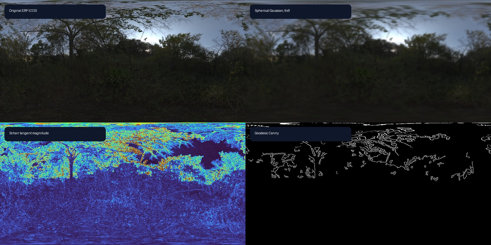
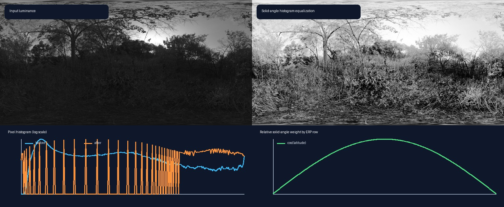

# Tutorial: image processing on the sphere

This tutorial applies familiar OpenCV-style stages directly to an
equirectangular panorama while keeping a constant angular footprint on the
sphere. The API is Experimental as `panorai-spherical-image-processing/v1`.

The real panorama and derived figures use the online
[Nature Reserve Forest](https://polyhaven.com/a/nature_reserve_forest) HDRI,
published by Poly Haven under CC0. The exact URL, authors, checksum, and figure
generation command are recorded in the downloadable
{download}`image provenance <../_static/tutorials/ATTRIBUTION.md>`.

## 1. Why a planar kernel is not spherical

In an ERP, longitude wraps at the left/right seam and the horizontal angular
scale represented by a raster neighbourhood changes with latitude. Applying a
planar kernel with ordinary image borders therefore creates a discontinuity at
the seam and gives the poles a different angular footprint from the equator.

PanorAi places a kernel in the local east/down tangent frame of every output
ray. Each tap is carried to the unit sphere with the exponential map, then
sampled from the ERP with longitude wrapping. The default tap spacing is one
vertical ERP pixel, or `180 / H` degrees.



The Gaussian result above uses one angular kernel everywhere. The Scharr panel
shows the magnitude of derivatives in the local east/north frame. Canny uses
those directions for non-maximum suppression and uses spherical neighbours for
hysteresis, including across the longitude seam.

## 2. Run a complete processing chain

The executable example below creates a low-contrast ERP, equalizes it, applies
a custom sharpening kernel and Gaussian smoothing, computes gradients and
Canny edges, rotates the sphere, and constructs a scale pyramid.

```{literalinclude} ../../scripts/run_documentation_examples.py
:language: python
:start-after: DOCS_SPHERICAL_PROCESSING_START = None
:end-before: DOCS_SPHERICAL_PROCESSING_END = None
:dedent: 4
```

`spherical_filter2d` follows OpenCV's correlation convention: the supplied
kernel is not flipped. Compatible NumPy `float32` and `float64` HW/HWC arrays
use the first-party C++ implementation when available. Set `backend="numpy"`
for the reference path or `backend="native"` when native execution is a hard
requirement.

Use the operators according to the noise and structure in the data:

| Operator | Use it for | Main caution |
| --- | --- | --- |
| box or Gaussian | denoising before gradients or keypoints | smooths real detail |
| median | isolated salt-and-pepper noise | nonlinear and currently NumPy-only |
| bilateral | denoising while retaining intensity edges | slower and parameter-sensitive |
| custom `filter2d` | sharpening or domain-specific linear kernels | non-finite taps are not renormalized |

## 3. Equalize by spherical area

Near the poles, an ERP allocates many pixels to a small solid angle. A raw
pixel-count histogram therefore lets polar rows influence the mapping more
than the same surface area near the equator. Spherical equalization uses
`weight[y] = cos(pi / 2 - pi * (y + 0.5) / H)`,

which is proportional to the exact solid angle of that latitude band.



The aggressive contrast change in this example makes the mapping visible; it
does not imply that equalization always improves matching. Validate keypoint
repeatability and geometric inlier rate on the deployment domain. Use
`area_weighted=False` when exact ordinary `cv2.equalizeHist` behavior is
required, and use `mask=` to exclude invalid samples from construction of the
lookup table.

## 4. Use preprocessing before spherical keypoints

The feature pipeline still detects descriptors on gnomonic virtual cameras.
Preprocessing changes the central ERP first, then PanorAi projects the enhanced
signal and maps detections back to panorama-frame bearings. It does not make a
planar detector itself seam-aware.

```{literalinclude} ../../scripts/run_documentation_examples.py
:language: python
:start-after: DOCS_SPHERICAL_PREPROCESSING_START = None
:end-before: DOCS_SPHERICAL_PREPROCESSING_END = None
:dedent: 4
```

Keep the same preprocessing configuration for both images in a matching pair,
record it with the feature-pipeline parameters, and compare against the
unprocessed baseline. Histogram equalization can amplify sensor noise, while
excessive smoothing can remove the corners the detector needs.

## 5. Transformations and scale space

`spherical_rotate` takes a proper 3×3 active rotation in PanorAi's canonical
`+X` right, `+Y` up, `+Z` forward frame. Reverse mapping covers every output
pixel without an artificial border. `spherical_resize` samples the exact rays
of the new raster.

Gaussian pyramids smooth on the sphere before each reduction. Laplacian
pyramids retain the residual against the expanded coarser level and can be
reconstructed with `reconstruct_laplacian_pyramid`. This is the appropriate
starting point for future scale-aware spherical detectors; it is not yet a
claim of SIFT scale-space equivalence.

## 6. Continue the workflow

- Continue to {doc}`03_features_and_matching` for SIFT, ORB, AKAZE, and
  descriptor matching on spherical virtual cameras.
- Use {doc}`../how_to/spherical_image_processing` for the compact API guide and
  current limitations.
- Return to {doc}`02_projection_foundations` for the exact ERP ray convention.
- Treat {doc}`../reference/stability` as the authoritative stability boundary.
